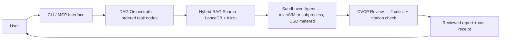

# Beagle — Autonomous AI Workflow Engine

**Beagle coordinates teams of AI agents to analyze codebases, execute tasks, and
run workflows — all within a strict, predefined budget and with zero-trust
isolation.**

[](LICENSE)

> **AI-assisted development disclosure:** This codebase was developed with
> substantial assistance from AI agents and tooling. AI was used for code
> generation, analysis, refactoring, documentation, and testing throughout the
> project's lifecycle. All AI-generated contributions were reviewed, validated,
> and integrated by the maintainers, who are responsible for the final code.

---

## Overview

Running autonomous AI agents can quickly become expensive and risky. Left
unmonitored, they can burn through API credits, access the wrong files, or
produce unverified, hallucinated results.

Beagle acts like an automated project manager for AI agents. You give Beagle a
prompt, and it:

1. **Plans** the task as a structured, ordered workflow.
2. **Searches** your real codebase for code relationships and semantics.
3. **Executes** sub-agents in secure, isolated sandboxes.
4. **Adversarially reviews** the findings. It then returns the reviewed report
   with a cost receipt.

> **Security-first:** Beagle enforces a zero-trust model. For details on microVM
> isolation, fail-closed policies, and the threat model, see
> [`docs/SECURITY.md`](docs/SECURITY.md).

Beagle builds on LangGraph's durable graph execution and layers on hard cost
governance, sandboxed isolation, hybrid code grounding, and adversarial
verification.

---

## Key Concepts & Acronyms Explained

If you are new to the codebase, here is what the technical terms actually mean in
plain English:

| Concept / Acronym | Plain-English Meaning | Why Beagle Uses It |
|---|---|---|
| **DAG** (Directed Acyclic Graph) | A structured to-do list. Tasks flow forward in one direction (A → B → C). | Keeps execution ordered. A retry loop has a maximum attempt count, so it stops. |
| **CVCP** (Cross-Verification Collaboration Protocol) | A three-agent peer-review panel: one primary agent drafts the answer, and two independent critic agents cross-examine it. | Finds hallucinations and false claims before you see the final report. |
| **Hybrid RAG** (Retrieval-Augmented Generation) | Intelligent code search that combines semantic vector search (LanceDB) with code-relation graphs (Kùzu). | Finds relevant code by meaning (e.g. `login`) and by structure (e.g. what calls `validate_token`). |
| **MCP** (Model Context Protocol) | The universal plug for AI tools — an open standard that connects frontends to backend tools. | Lets tools like Goose CLI, Claude Code, or Cursor connect to Beagle seamlessly. |
| **Sandboxes & MicroVMs** (Firecracker) | A locked execution room: untrusted code runs in hardware-isolated virtual machines or restricted subprocesses. | Limits the effect of agent code on your host machine. |
| **Goose Runtime** | The worker agent — a local subprocess runtime that executes the tasks Beagle assigns. | Provides an isolated execution environment for sub-agent tasks. |

---

## Key Features

- **Deterministic Workflows (DAGs)** — Tasks run as structured, step-by-step
  graphs with checkpointing, pause/resume, and replay support.
- **Hard Cost Governance** — Every model call is metered against a strict USD
  limit. Execution stops immediately when the budget is reached.
- **Sandboxed Isolation** — Untrusted code runs inside Firecracker microVMs, or
  inside deny-by-default subprocess sandboxes. See
  [Isolation modes](#isolation-modes).
- **Hybrid RAG Search** — Combines vector search (LanceDB) and AST graph
  traversal (Kùzu) to ground agents in real code context.
- **Human-in-the-Loop** — A workflow node that sets `require_approval: true`
  pauses for your approval. The default value of that flag is false.
- **Adversarial Review (CVCP)** — Two reviewer agents examine each primary
  output. A ground-truth check then tests the file citations. The reviewers
  decrease the number of false claims. They do not remove all errors.

---

## Quick Start

### Prerequisites

Install all of this software before installation step 1.

- **Python 3.12 or later.** `pyproject.toml` sets `requires-python = ">=3.12"`.
  The lint gate and the type gate target Python 3.13.
- **`uv`.** Beagle uses it for the locked install.

  ```bash
  curl -LsSf https://astral.sh/uv/install.sh | sh
  ```

- **Node.js 22.19.0 or later.** The bundled `pi` frontend is JavaScript. Its
  `vendor/pi-prebuild/package.json` declares `"node": ">=22.19.0"`. The `beagle`
  command with no subcommand starts `pi`.
- **The Goose CLI.** The wheel does not contain the Goose binary. The default
  sub-agent runtime is `goose_cli`, which starts a local `goose` process. Put
  `goose` on your `PATH`, or set `GOOSE_BIN` to the path of the binary. The
  repository does not declare a minimum Goose version.
- **An LLM provider.** Use an OpenAI-compatible API key, or a local Ollama
  endpoint.
- **Firecracker (optional).** Install it only for microVM isolation. See
  [Isolation modes](#isolation-modes) for the four conditions.
- **Docker (optional).** Docker builds and runs the packaged Beagle image. It is
  not an isolation mode. See [Isolation modes](#isolation-modes).

### Installation

```bash
# 1. Clone the repository
git clone https://github.com/MattCreigh/beagle.git
cd beagle

# 2. Install locked dependencies (single source of truth from uv.lock)
uv sync --frozen --no-dev

# 3. Initialize configuration (~/.config/beagle)
uv run beagle config init

# 4. Set your LLM provider API key
export OPENAI_API_KEY="your-api-key-here"

# 5. Launch the interactive frontend (bundled in the wheel)
uv run beagle
```

> **Tip:** After installation you can either prefix commands with
> `uv run beagle …` or activate the virtual environment:
>
> ```bash
> source .venv/bin/activate
> beagle config init
> ```

**Default frontend.** The wheel contains a vendored, prebuilt copy of the
[`pi`](https://github.com/earendil-works/pi) TUI coding agent. The wheel also
contains a bridge that connects `pi` to Beagle's MCP server over stdio. The
`beagle` command with no subcommand starts `pi`. The bridge calls Beagle's
agents over MCP without more setup. See `src/beagle/frontends/pi/README.md`.

---

## Usage Example

Run a research workflow against your codebase with a hard $5.00 budget ceiling.
The default runtime (`goose`) runs sub-agents as local sandboxed processes.

```bash
beagle run research "What does the authentication module do?" --budget 5.0
```

**Expected output:**

```text
⠦ Routing query and building workflow DAG...
⠦ Hydrating context via hybrid RAG (LanceDB + Kùzu)...
⠦ Executing sandboxed agent node (goose runtime)...
⠦ Running CVCP adversarial review...
✔ Final report generated.

Final Report:
The authentication module provides JWT session validation (HS256) and
Casbin-backed role-based access control (RBAC). It enforces multi-tenant
isolation and requires `exp` and `iat` claims on all tokens.

Total Cost: $0.15 / $5.00
```

---

## Isolation modes

Beagle runs sub-agent code in one of two modes.

### MicroVM mode (Firecracker)

This mode gives hardware isolation with KVM. The microVM sandbox starts only
when all four conditions are true:

```text
microvm_available = firecracker_on_path
                    ∧ kvm_device_present
                    ∧ kernel_image_present
                    ∧ rootfs_image_present

where:
  firecracker_on_path   a `firecracker` binary is on PATH
  kvm_device_present    /dev/kvm exists
  kernel_image_present  the kernel image at $BEAGLE_MICROVM_KERNEL exists
                        (default /usr/share/beagle/vmlinux)
  rootfs_image_present  the root filesystem at $BEAGLE_MICROVM_ROOTFS exists
                        (default /usr/share/beagle/rootfs.ext4)
```

Beagle logs the first failed condition and does not start the microVM. It then
uses subprocess mode only when you set `allow_fallback` to true. The default is
false. A silent loss of hardware isolation is therefore not possible.

### Subprocess mode

This mode needs no additional software. Beagle starts each sub-agent with
`asyncio.create_subprocess_exec` in a new session. Beagle applies POSIX
resource limits with `resource.setrlimit`. Network access is off by default.

### What Docker gives you

Docker is not an isolation mode. Docker builds and runs the packaged Beagle
image from `docker/Dockerfile`. Docker does not supply Firecracker or KVM. The
compose file sets `BEAGLE_EXECUTION_ENV=docker`. That value changes the MCP
transport from stdio to streamable-http, which requires `BEAGLE_MCP_TOKEN`.

---

## The semantic firewall

Beagle checks every query with a semantic firewall before the workflow starts.
The firewall is on by default. Only a caller that passes `mock_firewall=True`
skips it.

The firewall uses two passes:

1. A pattern pass searches the query for dangerous patterns. This pass does no
   I/O.
2. A model pass starts a `goose` subprocess. The model must answer with one
   word: `SAFE` or `MALICIOUS`.

Beagle uses the second pass only when the sub-agent runtime is `goose_cli`. For
a remote runtime, the verdict of the pattern pass stands.

The firewall stops the query when a check fails. It also stops the query after
an error. A timeout, an answer it cannot parse, and an invalid binary all give a
block. The firewall is fail-closed: an error never becomes an allow.

- **Timeout.** The model pass has a timeout of 15 seconds
  (`SEMANTIC_FIREWALL_TIMEOUT`).
- **Model.** The default provider is `ollama_cloud`. The default model is
  `gemma4:31b`. Change them with `FIREWALL_PROVIDER` and `FIREWALL_MODEL`. The
  model must be on `[models.allowed]`. If it is not, Beagle raises an error at
  startup.
- **Binary.** The model pass needs the `goose` binary. Beagle validates the
  binary first. The binary must exist, be executable, and belong to you or to
  root. Beagle also rejects a world-writable binary. Beagle rejects a
  world-writable parent directory that has no sticky bit.

---

## Configuration

Run `beagle config init` to create the configuration file. The command writes
`config.toml` and prints the path. The default path is
`~/.config/beagle/beagle_core_config/config.toml`. Set `BEAGLE_CONFIG_ROOT` to
move the configuration root. Set `BEAGLE_CONFIG_TOML` to select one specific
file.

The generated file has 20 sections: `[orchestrator]`, `[goose]`, `[models]`,
`[budget]`, `[cache]`, `[rate_limit]`, `[mcp]`, `[logging]`, `[node_timeout]`,
`[pool]`, `[context_threshold]`, `[memory]`, `[security]`, `[output]`,
`[circuit_breaker]`, `[orpheus]`, `[paths]`, `[behavior]`, `[mcp_auth]`, and
`[mcp_cors]`.

Beagle reads the file first. Beagle then applies the environment variables. An
environment variable therefore overrides the value in the file.

| Variable | Description | Default |
|---|---|---|
| `BEAGLE_BUDGET_USD` | Hard-stop spending limit per workflow run | `10.0` |
| `BEAGLE_DATA_ROOT` | Directory for writable state (tracking DB, checkpoints) | XDG state root |
| `BEAGLE_MCP_TOKEN` | Bearer token for the `streamable-http` MCP transport. The `stdio` transport does not use it. | *(not set)* |
| `BEAGLE_LOG_LEVEL` | Logging verbosity (`DEBUG`, `INFO`, `WARNING`, `ERROR`) | `INFO` |
| `FIREWALL_PROVIDER` | Provider for the semantic firewall. Beagle reads it from the environment only. | `ollama_cloud` |
| `FIREWALL_MODEL` | Model for the semantic firewall. It must be on `[models.allowed]`. | `gemma4:31b` |

The MCP servers use the `stdio` transport by default. That transport needs no
token. They change to `streamable-http` when you set
`BEAGLE_EXECUTION_ENV=docker`, or when you set `MCP_TRANSPORT`. The
`streamable-http` transport refuses to start without a token.

> **Generate a secure MCP token:**
>
> ```bash
> export BEAGLE_MCP_TOKEN=$(openssl rand -hex 32)
> ```

For every tunable default, see
[`docs/CONFIG_DEFAULTS.md`](docs/CONFIG_DEFAULTS.md). For the full environment
variable list, see [`docs/CLI.md`](docs/CLI.md).

---

## How It Works

```text
   ┌────────────────────────────────────────────────────────┐
   │                          User                          │
   └────────────────────────────────────────────────────────┘
                                │
                                ▼
   ┌────────────────────────────────────────────────────────┐
   │                  CLI / MCP Interface                   │
   └────────────────────────────────────────────────────────┘
                                │
                                ▼
   ┌────────────────────────────────────────────────────────┐
   │         DAG Orchestrator — ordered task nodes          │
   └────────────────────────────────────────────────────────┘
                                │
                                ▼
   ┌────────────────────────────────────────────────────────┐
   │           Hybrid RAG Search — LanceDB + Kùzu           │
   └────────────────────────────────────────────────────────┘
                                │
                                ▼
   ┌────────────────────────────────────────────────────────┐
   │  Sandboxed Agent — microVM or subprocess, USD metered  │
   └────────────────────────────────────────────────────────┘
                                │
                                ▼
   ┌────────────────────────────────────────────────────────┐
   │        CVCP Review — 2 critics + citation check        │
   └────────────────────────────────────────────────────────┘
                                │
                                ▼
   ┌────────────────────────────────────────────────────────┐
   │             Reviewed report + cost receipt             │
   └────────────────────────────────────────────────────────┘
                     (returned to the User)
```



---

## Troubleshooting

| Error / Symptom | Cause | Solution |
|---|---|---|
| `Permission denied: /var/run/docker.sock` | Docker permissions | Add your user to the docker group: `sudo usermod -aG docker $USER`, then restart the shell |
| `BEAGLE_MCP_TOKEN environment variable is REQUIRED for streamable-http transport` | The MCP server starts on the `streamable-http` transport with no token. The `stdio` transport does not need one. | `export BEAGLE_MCP_TOKEN=$(openssl rand -hex 32)`, or start the server on `stdio` |
| Workflow fails: "Budget exhausted" | Hit the maximum USD ceiling | Raise the limit: `beagle run … --budget 20.0`, or check the model-routing config |
| `ModuleNotFoundError` after installation | Virtual environment inactive | Activate it: `source .venv/bin/activate`, or prefix commands with `uv run` |
| `Query blocked by semantic firewall (failed security check)` | The `goose` binary is missing, or it fails the ownership and permission check | Install Goose. Put `goose` on `PATH`, or set `GOOSE_BIN` to the binary. Make sure the binary and its parent directories are not world-writable |

---

## Extensibility & Proprietary Add-Ons

**Orpheus** is a shared-memory transport for Beagle. It comes as the separately
licensed `beagle-orpheus` wheel. The open-source distribution contains no
proprietary transport code.

Orpheus adds two functions:

- **Throughput.** Orpheus sends FlatBuffers frames over lock-free ring buffers.
  The default ring directory is `/run/orpheus_ring`. This transport replaces
  HTTP for outbound connections between Beagle processes.
- **Process separation.** The agent harness does not start agent processes
  itself. It dispatches each task over Orpheus IPC to the OpenClaw controller,
  which runs the agent in a container. The harness also pauses, resumes, and
  cancels a task through that client.

You need Orpheus in these two conditions:

1. You select Orpheus as the active transport. Set `BEAGLE_TRANSPORT=orpheus`,
   or set `[connections] transport` in the configuration file.
2. You give the agent harness an Orpheus client for containerized dispatch.
   Without the wheel, the stub client raises an error when you construct it.

Beagle detects the wheel automatically after you install it. Beagle does not
activate it automatically. Activation is always an explicit operator decision.

**Fallback path.** Beagle runs fully without Orpheus. The built-in HTTP
transport is the default. An install with no configuration reports `http` as the
active transport.

---

## Licence

The Beagle core is MIT-licensed. The [`LICENSE`](LICENSE) file gives the full
terms. The MIT licence covers the Beagle source code, the documentation, and
the vendored `pi` frontend fork. The `license` field in `pyproject.toml`
declares the same licence.

Optional add-ons have a different licence. The `beagle-orpheus` transport wheel
is separately licensed proprietary software. Beagle does not install it. Read
the licence of that distribution before you install it.
