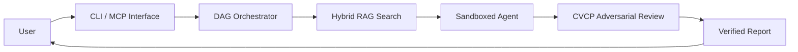

# Beagle — Autonomous AI Workflow Engine

**Beagle coordinates teams of AI agents to analyze codebases, execute tasks, and
run workflows — all within a strict, predefined budget and with zero-trust
isolation.**

[](LICENSE)

> **AI-assisted development disclosure:** This codebase was developed with
> substantial assistance from AI agents and tooling. AI was used for code
> generation, analysis, refactoring, documentation, and testing throughout the
> project's lifecycle. All AI-generated contributions were reviewed, validated,
> and integrated by the maintainers, who are responsible for the final code.

---

## Overview

Running autonomous AI agents can quickly become expensive and risky. Left
unmonitored, they can burn through API credits, access the wrong files, or
produce unverified, hallucinated results.

Beagle acts like an automated project manager for AI agents. You give Beagle a
prompt, and it:

1. **Plans** the task as a structured, ordered workflow.
2. **Searches** your real codebase for code relationships and semantics.
3. **Executes** sub-agents in secure, isolated sandboxes.
4. **Adversarially reviews** findings before returning a verified report with an
   exact cost receipt.

> **Security-first:** Beagle enforces a zero-trust model. For details on microVM
> isolation, fail-closed policies, and the threat model, see
> [`docs/SECURITY.md`](docs/SECURITY.md).

Beagle builds on LangGraph's durable graph execution and layers on hard cost
governance, sandboxed isolation, hybrid code grounding, and adversarial
verification.

---

## Key Concepts & Acronyms Explained

If you are new to the codebase, here is what the technical terms actually mean in
plain English:

| Concept / Acronym | Plain-English Meaning | Why Beagle Uses It |
|---|---|---|
| **DAG** (Directed Acyclic Graph) | A structured to-do list that never loops. Tasks flow forward in one direction (A → B → C). | Prevents agents from going in circles, getting stuck in loops, or burning budget. |
| **CVCP** (Cross-Verification Collaboration Protocol) | A three-agent peer-review panel: one primary agent drafts the answer, and two independent critic agents cross-examine it. | Eliminates hallucinations and false claims before you see the final report. |
| **Hybrid RAG** (Retrieval-Augmented Generation) | Intelligent code search that combines semantic vector search (LanceDB) with code-relation graphs (Kùzu). | Finds relevant code by meaning (e.g. `login`) and by structure (e.g. what calls `validate_token`). |
| **MCP** (Model Context Protocol) | The universal plug for AI tools — an open standard that connects frontends to backend tools. | Lets tools like Goose CLI, Claude Code, or Cursor connect to Beagle seamlessly. |
| **Sandboxes & MicroVMs** (Firecracker) | A locked execution room: untrusted code runs in hardware-isolated virtual machines or restricted subprocesses. | Protects your host machine from rogue commands, file deletions, or system changes. |
| **Goose Runtime** | The worker agent — a local subprocess runtime that executes the tasks Beagle assigns. | Provides an isolated execution environment for sub-agent tasks. |

---

## Key Features

- **Deterministic Workflows (DAGs)** — Tasks run as structured, step-by-step
  graphs with checkpointing, pause/resume, and replay support.
- **Hard Cost Governance** — Every model call is metered against a strict USD
  limit. Execution stops immediately when the budget is reached.
- **Sandboxed Isolation** — Untrusted code runs inside Firecracker microVMs
  (when `/dev/kvm` is available) or deny-by-default subprocess sandboxes.
- **Hybrid RAG Search** — Combines vector search (LanceDB) and AST graph
  traversal (Kùzu) to ground agents in real code context.
- **Human-in-the-Loop** — Pauses for your permission before consequential
  actions such as file writes or infrastructure changes.
- **Adversarial Review (CVCP)** — Primary outputs are audited by two reviewer
  agents to catch bugs and hallucinations.

---

## Quick Start

### Prerequisites

- Python 3.12 or later (3.13 recommended)
- `uv` — mandatory package manager for fast, reproducible builds

  ```bash
  curl -LsSf https://astral.sh/uv/install.sh | sh
  ```

- An LLM provider — an OpenAI-compatible API key or a local Ollama endpoint
- Docker (optional) — required for Firecracker microVM isolation; Beagle falls
  back to subprocess sandboxing when it is unavailable

### Installation

```bash
# 1. Clone the repository
git clone https://github.com/MattCreigh/beagle.git
cd beagle

# 2. Install locked dependencies (single source of truth from uv.lock)
uv sync --frozen --no-dev

# 3. Initialize configuration (~/.config/beagle)
uv run beagle config init

# 4. Set your LLM provider API key
export OPENAI_API_KEY="your-api-key-here"

# 5. Launch the interactive frontend (bundled in the wheel)
uv run beagle
```

> **Tip:** After installation you can either prefix commands with
> `uv run beagle …` or activate the virtual environment:
>
> ```bash
> source .venv/bin/activate
> beagle config init
> ```

**Default frontend.** Beagle ships a vendored, prebuilt copy of the
[`pi`](https://github.com/earendil-works/pi) TUI coding agent in the wheel, plus
a bridge that connects it to Beagle's MCP server over stdio. Running `beagle`
with no subcommand launches `pi`; it is pre-wired to call Beagle's agents over
MCP with no extra setup (requires Node.js >= 20 on `PATH`). See
`src/beagle/frontends/pi/README.md`.

---

## Usage Example

Run a research workflow against your codebase with a hard $5.00 budget ceiling.
The default runtime (`goose`) runs sub-agents as local sandboxed processes.

```bash
beagle run research "What does the authentication module do?" --budget 5.0
```

**Expected output:**

```text
⠦ Routing query and building workflow DAG...
⠦ Hydrating context via hybrid RAG (LanceDB + Kùzu)...
⠦ Executing sandboxed agent node (goose runtime)...
⠦ Running CVCP adversarial review...
✔ Final report generated.

Final Report:
The authentication module provides JWT session validation (HS256) and
Casbin-backed role-based access control (RBAC). It enforces multi-tenant
isolation and requires `exp` and `iat` claims on all tokens.

Total Cost: $0.15 / $5.00
```

---

## Configuration

Beagle is configured via environment variables (shell or `.env` file).

| Variable | Description | Default |
|---|---|---|
| `BEAGLE_BUDGET_USD` | Hard-stop spending limit per workflow run | `10.0` |
| `BEAGLE_DATA_ROOT` | Directory for writable state (tracking DB, checkpoints) | XDG state root |
| `BEAGLE_MCP_TOKEN` | Bearer token required for HTTP MCP connections (fail-closed) | *(not set)* |
| `BEAGLE_LOG_LEVEL` | Logging verbosity (`DEBUG`, `INFO`, `WARNING`, `ERROR`) | `INFO` |

> **Generate a secure MCP token:**
>
> ```bash
> export BEAGLE_MCP_TOKEN=$(openssl rand -hex 32)
> ```

---

## How It Works

```text
   ┌────────────────────────────┐
   │            User            │
   └────────────────────────────┘
                 │
                 ▼
   ┌────────────────────────────┐
   │    CLI / MCP Interface     │
   └────────────────────────────┘
                 │
                 ▼
   ┌────────────────────────────┐
   │      DAG Orchestrator      │
   └────────────────────────────┘
                 │
                 ▼
   ┌────────────────────────────┐
   │     Hybrid RAG Search      │
   └────────────────────────────┘
                 │
                 ▼
   ┌────────────────────────────┐
   │      Sandboxed Agent       │
   └────────────────────────────┘
                 │
                 ▼
   ┌────────────────────────────┐
   │  CVCP Adversarial Review   │
   └────────────────────────────┘
                 │
                 ▼
   ┌────────────────────────────┐
   │      Verified Report       │
   └────────────────────────────┘
            (returned to the User)
```



1. **DAG Orchestrator** — Breaks your prompt into an ordered, non-repeating
   to-do list of task nodes.
2. **Hybrid RAG Search** — Scans your codebase for both semantic concepts
   (LanceDB) and structural code links (Kùzu).
3. **Sandboxed Agent** — Runs tasks in isolated microVMs or subprocesses with
   continuous USD budget monitoring.
4. **CVCP Adversarial Review** — Two critic agents audit the primary output for
   errors before the verified report and cost receipt are returned.

---

## Troubleshooting

| Error / Symptom | Cause | Solution |
|---|---|---|
| `Permission denied: /var/run/docker.sock` | Docker permissions | Add your user to the docker group: `sudo usermod -aG docker $USER`, then restart the shell |
| `BEAGLE_MCP_TOKEN is not set` | Server refuses to boot unauthenticated | `export BEAGLE_MCP_TOKEN=$(openssl rand -hex 32)` |
| Workflow fails: "Budget exhausted" | Hit the maximum USD ceiling | Raise the limit: `beagle run … --budget 20.0`, or check the model-routing config |
| `ModuleNotFoundError` after installation | Virtual environment inactive | Activate it: `source .venv/bin/activate`, or prefix commands with `uv run` |

---

## Extensibility & Proprietary Add-Ons

Beagle is an independent, self-contained open-source engine (MIT).

For high-throughput, lock-free inter-process communication in production daemon
clusters, an optional proprietary shared-memory transport named **Orpheus**
(`beagle-orpheus`) is available. Beagle runs completely self-contained without
it, gracefully falling back to standard local Unix domain sockets and Redis
coordination paths by default.
