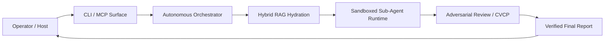

# Beagle — Autonomous AI Workflow Engine

**Beagle coordinates teams of AI agents to analyze codebases, execute tasks, and
run workflows — all within a strict, predefined budget and with zero-trust
isolation.**

[](LICENSE)

---

## Overview

Running autonomous AI agents can quickly become expensive and risky. Left
unmonitored, they can burn through API credits, access the wrong files, or
produce unverified, hallucinated results.

Beagle solves this by turning your prompt into a **structured workflow**. It
decomposes tasks into a Directed Acyclic Graph (DAG), meters every model call
against a hard USD ceiling, executes sub-agents inside secure sandboxes
(microVMs), and returns a verified report with a full cost summary.

> **Security-first:** Beagle enforces a zero-trust model. For details on microVM
> isolation, fail-closed policies, and the threat model, see
> [`docs/SECURITY.md`](docs/SECURITY.md).

---

## Key Features

- **Deterministic Workflows** — Tasks run as structured DAGs with checkpointing,
  resume support, and deterministic replay.
- **Hard Cost Governance** — Every model call is metered against a strict USD
  limit. Execution halts immediately when the budget is exhausted.
- **Sandboxed Isolation** — Untrusted code runs inside Firecracker microVMs (when
  `/dev/kvm` is available) or deny-by-default sandboxed subprocesses.
- **Hybrid Code Search** — Combines vector search (LanceDB) with property-graph
  traversal (Kùzu) to ground agents in your actual AST-parsed codebase.
- **Human-in-the-Loop** — Pauses for your approval before consequential actions
  such as file writes or infrastructure changes.
- **Adversarial Verification (CVCP)** — Primary agent output is independently
  critiqued by reviewer agents to catch hallucinations, logical gaps, and
  security issues.
- **Memory-Only Secrets** — Integrated Ghost Vault support keeps credentials in
  RAM; never written to disk unencrypted.

---

## Quick Start

### Prerequisites

- **Python** 3.12 or later (3.13 recommended)
- **`uv`** — mandatory package manager for reproducible builds

  ```bash
  curl -LsSf https://astral.sh/uv/install.sh | sh
  ```

- **Docker** (optional) — required only for Firecracker microVM isolation.
  Beagle falls back to strict subprocess sandboxing when unavailable.
- **`sops` + `age`** (optional) — required for Ghost Vault memory-only secret
  management

  ```bash
  brew install sops age          # macOS
  sudo apt install sops age      # Ubuntu/Debian
  ```

### Installation

```bash
# 1. Clone the repository
git clone https://github.com/MattCreigh/beagle.git
cd beagle

# 2. Install locked dependencies (single source of truth from uv.lock)
uv sync --frozen --no-dev

# 3. Initialize configuration (~/.config/beagle)
uv run beagle config init
```

> **Tip:** After installation you can either keep using `uv run beagle …` or
> activate the virtual environment:
>
> ```bash
> source .venv/bin/activate
> beagle config init
> ```

---

## Usage Example

Run a research workflow against your codebase with a hard $5.00 budget. The
default runtime (`goose`) executes sub-agents as local, sandboxed subprocesses.

```bash
beagle run research "What does the authentication module do?" --budget 5.0
```

**Expected output:**

```text
⠦ Routing query and building workflow DAG...
⠦ Hydrating context via hybrid RAG (LanceDB + Kùzu)...
⠦ Executing sandboxed agent node (goose runtime)...
⠦ Running CVCP adversarial review...
✔ Final report generated.

Final Report:
The authentication module provides JWT session validation (HS256) and
Casbin-backed role-based access control (RBAC). It enforces multi-tenant
isolation and requires `exp` and `iat` claims on all tokens.

Total Cost: $0.15 / $5.00
```

---

## Configuration

Beagle is configured via environment variables (shell or `.env` file).

| Variable | Description | Default |
|---|---|---|
| `BEAGLE_BUDGET_USD` | Hard stop budget per workflow run | `10.0` |
| `BEAGLE_DATA_ROOT` | Directory for writable state (tracking DB, checkpoints) | XDG state root |
| `BEAGLE_MCP_TOKEN` | Bearer token required for the HTTP MCP transport (fail-closed) | *(not set)* |
| `BEAGLE_LOG_LEVEL` | Logging verbosity (`DEBUG`, `INFO`, `WARNING`, `ERROR`) | `INFO` |

> **Generate a secure MCP token:**
>
> ```bash
> export BEAGLE_MCP_TOKEN=$(openssl rand -hex 32)
> ```

---

## How It Works

```text
   ┌──────────────────────┐
   │ Operator / Host      │
   └──────────────────────┘
              │
              ▼
   ┌──────────────────────┐
   │ CLI / MCP Surface    │
   └──────────────────────┘
              │
              ▼
   ┌──────────────────────┐
   │ Autonomous           │
   │ Orchestrator         │
   └──────────────────────┘
              │
              ▼
   ┌──────────────────────┐
   │ Hybrid RAG Hydration │
   └──────────────────────┘
              │
              ▼
   ┌──────────────────────┐
   │ Sandboxed Sub-Agent  │
   │ Runtime              │
   └──────────────────────┘
              │
              ▼
   ┌──────────────────────┐
   │ Adversarial Review   │
   │ (CVCP)               │
   └──────────────────────┘
              │
              ▼
   ┌──────────────────────┐
   │ Verified Final Report│
   └──────────────────────┘
              │
              ▼
    (returned to the operator)
```



1. The orchestrator turns your prompt into a structured DAG of tasks.
2. Agents are hydrated with relevant context from your codebase using hybrid
   search (vector + property graph).
3. Sub-agents execute inside isolated sandboxes under continuous budget
   enforcement.
4. **CVCP (Cross-Verification Collaboration Protocol)** runs an adversarial
   review: the primary agent's output is independently critiqued by two reviewer
   agents. This surfaces hallucinations, logical gaps, and security issues before
   the final report is returned — complete with a precise cost summary.

---

## Troubleshooting

| Error / Symptom | Solution |
|---|---|
| `sops: command not found` | Install sops: `brew install sops` (macOS) or `sudo apt install sops` (Ubuntu) |
| `Permission denied: /var/run/docker.sock` | Add your user to the Docker group: `sudo usermod -aG docker $USER`, then restart the terminal |
| `BEAGLE_MCP_TOKEN is not set` (server refuses to start) | `export BEAGLE_MCP_TOKEN=$(openssl rand -hex 32)` |
| Workflow fails with "Budget exhausted" | Raise the limit: `beagle run … --budget 20.0`, or review model routing in your config |
| `ModuleNotFoundError` after installation | Ensure you're using the virtual env: `source .venv/bin/activate` or `uv run beagle …` |

---

*Beagle is part of the [Tensegrity](https://github.com/Tensegrity-Systems)
ecosystem — tools for building self-healing, secure, AI-native infrastructure.
See also Skylon (Docker orchestrator), Ghost Vault (memory-only secrets), and
Orpheus (shared-memory IPC).*

---

## License

[MIT](LICENSE) — © 2026 Matthew David Calder Creigh. Beagle and the vendored
`pi` frontend fork are released under the MIT License; you may use, copy,
modify, merge, publish, distribute, sublicense, and sell copies under the
terms of [LICENSE](LICENSE).

The optional `beagle-orpheus` transport wheel is **not** part of the MIT
licensed distribution: it is separately licensed proprietary software (free
for evaluation; production/business use requires a paid licence). See
[LICENSE](LICENSE) for the scope note.
