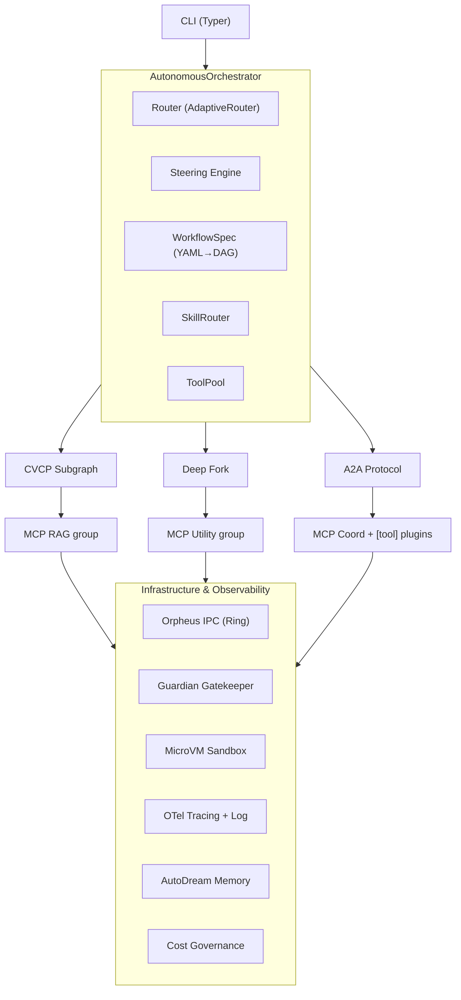
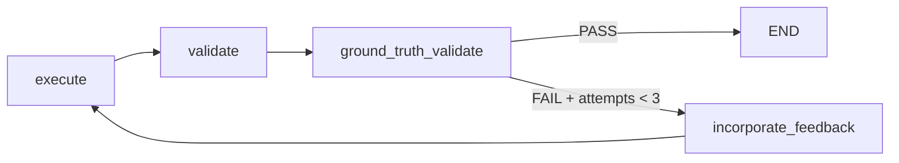

# Beagle

Multi-agent workflow orchestration engine

[](https://github.com/MattCreigh/beagle/actions/workflows/beagle-test.yml)
[](https://github.com/MattCreigh/beagle/actions/workflows/beagle-doctrine-gates.yml)
[](https://github.com/MattCreigh/beagle/actions/workflows/beagle-security-audit.yml)
[](https://github.com/MattCreigh/beagle/actions/workflows/beagle-sbom.yml)
[](https://github.com/MattCreigh/beagle/actions/workflows/beagle-version-check.yml)
[](pyproject.toml)
[](https://www.python.org/downloads/)
[](LICENSE)
[](https://docs.astral.sh/ruff/)
[](https://docs.astral.sh/ruff/)
[](tests/)

Beagle is a multi-agent orchestration framework. Beagle builds on
[LangGraph](https://github.com/langchain-ai/langgraph). Declarative YAML
workflows coordinate heterogeneous AI agents. The agents communicate through
cryptographic messages. They share structural state. They query semantic RAG.
Real-time cost governance controls spending. Sandboxed execution isolates
untrusted code.

This document describes the abstract capabilities of the Beagle engine: what
it does, how it is structured, and what it will orchestrate. This document
does not describe any particular deployment, model fleet, or host
configuration. Those configuration concerns live outside the codebase — all
user-editable configuration lives under `~/.config/beagle` (XDG).

**What makes Beagle different:**

- **Deep Forks** — `core/graph.py` branches state structurally.
  `pyrsistent.PMap`/`PVector` makes forks O(1). A fork copies only the
  modified path on write. `pyrsistent` is optional. Without `pyrsistent`, the
  engine falls back to a full `deepcopy`. Every branch of a DAG gets its own
  immutable world: parallel sub-agents never race on shared state,
  checkpoint/resume becomes trivial (states are values, not heaps), and a
  failed speculative branch costs one pointer drop — not a corrupted run.
- **TurboQuant** — TurboQuant compresses numeric KV-cache and embedding data
  in RAM at 3 bits per value. It applies rotation, per-coordinate scalar
  quantization, and 1-bit QJL residual correction (Zandieh et al., Google
  Research, ICLR 2026). See `core/turboquant.py` and `docs/TURBOQUANT.md`.
  TurboQuant never compresses string or bytes data. It compresses numeric
  vector workloads only. Against 16-bit storage that is ≈5× more context
  held per gigabyte — history gets *compressed*, not *truncated*, which is
  the difference between a 40-turn investigation and one that forgets its
  own findings at turn eight.
- **AdaptiveRouter** — AdaptiveRouter measures latency/quality tradeoffs at
  runtime. It escalates or downgrades the model per node (`core/router.py`).
  AdaptiveRouter routes models; it does not quantify vectors. The design keeps
  it deliberately distinct from TurboQuant. Spend therefore follows
  difficulty: trivial nodes resolve on small cheap models, and only nodes
  whose measured quality degrades escalate to the heavy fleet.
- **A2A Protocol v2** — Agents exchange Ed25519-signed inter-agent messages
  under role-based access control. Wildcards (`*`, `a2a:*`) form a matching
  syntax only. Unbound identities default to the read-only `observer` role.
  Agent identity is cryptographic, not conventional: a compromised or
  hallucinating agent cannot forge its neighbours, and the signed message
  log doubles as a tamper-evident audit trail of who-told-whom.
- **Hybrid RAG** — Hybrid RAG retrieves over a dense-embedding store by
  vector similarity. It traverses graphs for multi-hop structural retrieval.
  Ingest runs through the CAST pipeline (AST → chunk → graph → embed).
  Operators set the embedding model and dimension once in the config's
  `[embed]` section. Retrieval is AST-grounded: graph hops walk real code
  structure (callers, callees, imports, class hierarchies), so answers cite
  symbols that actually exist instead of plausible-sounding ones — and
  content-hash incremental ingest means redeploys cost seconds, not full
  re-embeds.
- **Context engineering that survives long runs** — a token-aware
  preprocessor, adaptive compressor, live window metrics, and a five-stage
  compaction ladder keep agents inside budget. TurboQuant folds compress
  evicted context to ~3 bits/value in RAM; semantic rehydration restores
  exactly what the next phase needs. Embedding-based dedup caches repeated
  prompt scaffolding across nodes. Context is a *managed resource* here,
  not string concatenation until the provider returns 400 — see
  *Context Engineering* below.
- **Orpheus IPC** — The optional `beagle-orpheus` transport adds native
  lock-free shared-memory ring-buffer IPC between MCP servers and the
  orchestrator. Packets are FlatBuffers-framed with CRC32 checksums; a
  stuck-slot watchdog guards every ring; rings stay bounded and
  pre-allocated. This is the high-throughput coordination plane that makes
  dense multi-agent fan-out practical — auto-detected when installed,
  activated only by explicit operator choice (see *Connection transports*).
- **Provider-neutral LLM access** — Beagle speaks the OpenAI-compatible
  chat/completions surface. No provider presets ship with the product; you
  choose the endpoint and models.
- **Semantic Firewall** — Three layers stack together: AST-based Python code
  validation, regex-based prompt-injection detection, and an LLM-powered
  semantic guard. The firewall fails closed. Any error, timeout, or missing
  binary blocks the query.
- **MicroVM Sandboxing** — `SandboxedExecutor` enforces configurable timeouts
  and resource limits on untrusted code. `MicroVMSandbox` adds hardware
  isolation **only when a hypervisor and `/dev/kvm` are present**. Without
  them, the sandbox **refuses to execute** by default. An operator must
  explicitly allow a fallback. A permitted degrade emits a loud WARNING.
- **CrewAI + AutoGen compatible** — in-repo adapter classes
  (`beagle.bridges.crewai`, `beagle.bridges.autogen`) expose
  CrewAI/AutoGen-style interfaces. These interfaces route LLM calls through
  Beagle's subprocess pool, tools through Guardian approval, and inputs
  through the semantic firewall.

> **Versioning:** Beagle single-sources the installed package version in
> `pyproject.toml [project].version`. `constants._resolve_package_version()`
> resolves it at import time. No version literal exists anywhere else in the
> tree.

---

## Architecture

Beagle runs headless as a back end. It orchestrates workflows through a CLI.
A set of Model Context Protocol (MCP) servers exposes the engine to MCP
clients and front ends.

```text
┌──────────────────────────────────────┐
│             CLI (Typer)              │
└──────────────────┬───────────────────┘
                   │
                   ▼
┌──────────────────────────────────────┐
│        AutonomousOrchestrator        │
│  ┌────────────────┐ ┌──────────────┐ │
│  │     Router     │ │   Steering   │ │
│  │  (Adaptive-    │ │    Engine    │ │
│  │   Router)      │ │              │ │
│  └────────────────┘ └──────────────┘ │
│  ┌────────────────┐ ┌──────────────┐ │
│  │  WorkflowSpec  │ │ SkillRouter  │ │
│  │   (YAML→DAG)   │ │              │ │
│  └────────────────┘ └──────────────┘ │
│  ┌────────────────────────────────┐  │
│  │            ToolPool            │  │
│  └────────────────────────────────┘  │
└──────────────────┬───────────────────┘
                   │
    ┌──────────────┼──────────────┐
    ▼              ▼              ▼
┌────────────┐ ┌────────────┐ ┌────────────┐
│    CVCP    │ │    Deep    │ │    A2A     │
│  Subgraph  │ │    Fork    │ │  Protocol  │
└─────┬──────┘ └─────┬──────┘ └─────┬──────┘
      │              │              │
      ▼              ▼              ▼
┌────────────┐ ┌────────────┐ ┌────────────┐
│   MCP RAG  │ │    MCP     │ │    MCP     │
│   group    │ │  Utility   │ │ Coord +    │
│            │ │   group    │ │ [tool]     │
│            │ │            │ │ plugins    │
└─────┬──────┘ └─────┬──────┘ └─────┬──────┘
      │              │              │
      └──────────────┼──────────────┘
                     │
                     ▼
┌──────────────────────────────────────┐
│      Infrastructure & Observability  │
│  ┌────────────────────────────────┐  │
│  │       Orpheus IPC (Ring)       │  │
│  └────────────────────────────────┘  │
│  ┌────────────────────────────────┐  │
│  │     Guardian Gatekeeper        │  │
│  └────────────────────────────────┘  │
│  ┌────────────────────────────────┐  │
│  │       MicroVM Sandbox          │  │
│  └────────────────────────────────┘  │
│  ┌────────────────────────────────┐  │
│  │     OTel Tracing + Log         │  │
│  └────────────────────────────────┘  │
│  ┌────────────────────────────────┐  │
│  │      AutoDream Memory          │  │
│  └────────────────────────────────┘  │
│  ┌────────────────────────────────┐  │
│  │       Cost Governance          │  │
│  └────────────────────────────────┘  │
└──────────────────────────────────────┘
```



See [docs/ARCHITECTURE.md](docs/ARCHITECTURE.md) for the full design document
with subsystem diagrams.

### Two replaceability axes

Beagle separates the **front end** from the **sub-agent execution runtime**:

- **Axis 1 — front end.** Beagle runs **headless**; it is a back end, not a
  UI. Any MCP client drives it. The render-target interface
  (`beagle render-hints --target …`) emits directives in the shape each front
  end needs.
- **Axis 2 — sub-agent execution runtime.** The `[runtime].plugin`
  configuration selects how Beagle spawns sub-agents. It picks a local
  subprocess (the default) or a remote agent over HTTP. The `AgentRuntime`
  protocol in `src/beagle/runtime/` is the seam.

### Portable configuration root

Beagle detaches configuration from the source tree entirely: the package
ships ZERO bundled configuration. Resolution follows one deterministic
priority order — explicit override (`$BEAGLE_CONFIG_ROOT`), then the platform
user-config directory (`~/.config/beagle`), then in-code defaults from the
typed schema. Run `beagle config init` to seed the user config root from the
programmatic defaults; until then Beagle runs fully configless.

---

## Subsystems

### Orchestration Layer

| Component | Module | Symbol | Description |
|---|---|---|---|
| **DAG Orchestrator** | `core/autonomous_orchestrator.py` | `DAGOrchestrator` | Top-level async workflow executor with signal handling, singleton management, and checkpoint recovery |
| **Workflow Spec** | `core/workflow_schema.py` | `WorkflowSpec`, `WorkflowPhase` | Declarative YAML → DAG compiler. Each phase maps to a `BeagleDAGNode` |
| **DAG Node** | `core/agent_spawner.py` | `BeagleDAGNode` | Execution unit with dependency edges, model hints, and retry policy |
| **State** | `core/state.py` | `BeagleState` | Global workflow state container with singleton/async-singleton registry |
| **Router** | `core/router.py` | `RouteResult` | Model selection via AdaptiveRouter (runtime latency/quality measurement) |
| **TurboQuant** | `core/turboquant.py` | `TurboQuantCompressor` | 3-bit vector quantization for KV-cache/embedding compression (Zandieh et al., ICLR 2026) |
| **Preflight Estimator** | `preflight/estimator.py` | `PreFlightEstimator`, `PreFlightEstimate` | Pre-execution cost and wall-clock estimation |
| **Skill Library** | `core/skill_library.py` | `SkillLibrary`, `SkillRouter` | Built-in skills indexed by `SkillMetadata`; router matches query → skill |
| **Tool Pool** | `core/tool_pool.py` | `ToolPool`, `ToolDefinition` | Dynamic tool registration and lookup for agent execution |

### Style Guides & Top-of-Mind

Beagle single-sources the orchestrator's behavioural doctrine in TOML. It
renders the doctrine to XML prompt-substrate. Nobody maintains the doctrine
by hand in Python or Markdown. The doctrine TOMLs live in the user config
root (`~/.config/beagle/style_guides/guides/*.toml`) — nothing doctrinal is
bundled in the package.

| Component | Module | Symbol | Description |
|---|---|---|---|
| **Style-guide TOMLs** | `<config_root>/style_guides/guides/*.toml` | — | The SSOT for behavioural, architectural, and project conventions |
| **Renderer** | `style_guides/render.py` | `GooseTopOfMindRenderer` | Pure, offline TOML → XML. Emits the per-turn Top-of-Mind, the system instruction, and the compaction prompt |
| **Bulk renderer** | `style_guides/bulk_render.py` | — | Batch rendering of all prompt-substrate targets (`beagle render-prompts`) |
| **Hydrator** | `style_guides/tom_hydrator.py` | `hydrate()` | The only network-bound surface — resolves placeholders against RAG / memory MCP and inlines compact summaries |
| **Injector** | `style_guides/injector.py` | `ContextInjector` | Per-file-edit style-guide XML injection on file-extension match |
| **XML escaping** | `style_guides/_xml.py` | `xml_escape()` | Single source of truth; renderer, hydrator, and injector all import it |

### Execution Layer

| Component | Module | Symbol | Description |
|---|---|---|---|
| **Deep Forks** | `core/graph.py` | via `pyrsistent.PMap`/`PVector` when available, else `deepcopy` | Structural state branching — fork entire workflow context. `pyrsistent` is optional |
| **A2A Protocol v2** | `core/a2a_protocol.py` | `A2AGateway`, `A2AAgent`, `A2AClient` | Ed25519-signed inter-agent messaging with `OIDCVerifier` and `RBACPolicy` (wildcard matching syntax; unbound identity defaults to read-only `observer` role) |
| **A2A Messages** | `core/a2a_types.py` (re-exported by `core/a2a_protocol.py`) | `A2AMessage`, `MessageType` (enum) | Typed messages: `HANDSHAKE`, `REQUEST`, `RESPONSE`, `STREAM`, `EVENT`, `COORDINATION` |
| **Agent Card** | `core/a2a_types.py` (re-exported by `core/a2a_protocol.py`) | `AgentCard` | Self-describing agent metadata (capabilities, endpoint, auth requirements) |

*Context management is its own subsystem — see [Context Engineering](#context-engineering) below.*

### Context Engineering

Long-horizon workflows die by context exhaustion, not by bad reasoning.
Beagle treats context as a *managed resource* with a full lifecycle —
measure → compress → fold → rehydrate — instead of string concatenation
until the provider returns 400.

| Component | Module | Symbol / surface | Description |
|---|---|---|---|
| **Token-aware chunking** | `context/context_preprocessor.py` | `ContextPreprocessor` | Splits inputs on token boundaries, never mid-construct |
| **Adaptive compression** | `context/context_optimizer.py` | `ContextOptimizer`, `CompressionLevel`, `ContextStrategy` | Picks a compression strategy per payload class instead of one blunt truncation |
| **Live window metrics** | `context/context_window.py` | `ContextWindowManager`, `ContextMetrics` | Real-time token accounting; alerts fire at budget thresholds |
| **Compaction trigger ladder** | `config/schema.py` + `context/trigger.py` | `ContextThresholdConfig` | Five thresholds — `warning` → `pre_compact` → `compact` → `hard_compact` → `critical` — escalate through fold cycles before anything is lost |
| **Compaction controller** | `context/compaction_controller.py`, `context/context_compaction_hook.py` | — | Owns the fold cycle; hooks into every node boundary |
| **Fold watchdog** | `context/watchdog_actor.py` | — | Bounded-timeout actor: a wedged compaction cannot stall the workflow (`[context].watchdog_seconds`) |
| **TurboQuant folds** | `context/compressed_store.py` | — | Evicted context persists as ~3-bit TurboQuant folds in RAM, not as deleted text |
| **Semantic rehydration** | `context/rehydration.py`, `context/post_compaction_rehydration.py` | — | After compaction, query the folds semantically and restore exactly what the next phase needs |
| **Static-part caching** | `context/prompt_cache.py` | `PromptCache`, `PromptMetadata` | Deduplicates repeated prompt scaffolding across nodes |
| **Embedding dedup** | `context/semantic_prompt_cache.py` | — | Near-duplicate prompts collapse to cached results (cosine-gated) |
| **Fork isolation** | `context/fork_context.py` | `ForkContext` | Parallel branches get isolated context scopes — no cross-branch bleed |
| **Fresh-index guarantee** | `context/rag_staleness.py` | `RAGStalenessTracker` | Fingerprint gate over the RAG index: rebuilds only when the target actually changed; bounded exit-join so CLI runs never hang on embeds |
| **Session accounting** | `context/session_usage.py`, `context/session_model.py` | — | Per-session token/cost ledgers feeding cost governance |

The ladder is the point: most frameworks have one cliff ("prompt too long →
truncate and pray"). Beagle has five graded responses, and even past the last
one the evicted material stays queryable in compressed form.

### CVCP — Cross-Verification Collaboration Protocol

Beagle implements CVCP as a LangGraph subgraph in `protocols/cvcp.py`
(`CVCPState`):

```text
execute → validate → ground_truth_validate ── PASS ──► END
                              │
                              │ FAIL + attempts < 3
                              ▼
                    incorporate_feedback → execute (retry)
```



Two adversarial attacker agents run **in parallel** to critique execution
results. Each attacker receives half the vertex budget. One slow attacker
will not starve its sibling. The `ground-truth-validator` recipe checks all
file citations. Hallucinated paths trigger FAIL with retry. Operators
configure the attempt cap (default 3). The `ground_truth_validate` node
defaults to `True`. Operators opt out of it; they do not opt in.

### Security Layer

Security functions live in the `beagle.security` package (`src/beagle/security/`).
Layered defense:

| Component | Module | Symbol | Description |
|---|---|---|---|
| **Semantic Firewall** | `security/validation.py` | `validate_query()`, `validate_query_async()` | Regex pattern pass, then the LLM guard. Fails closed on every error path |
| **AST Code Validation** | `security/ast_validator.py` | `validate_python_code_ast()` | Parses Python AST to detect `os.system()`, `subprocess`, `__import__`, eval/exec, and restricted imports in strict mode |
| **Path Validation** | `security/validation.py` | `validate_file_path()` | Blocks `..` traversal, null bytes, symlink escapes, and dangerous paths |
| **Secret Scrubbing** | `security/sanitization.py` | `scrub_secrets()` | google-re2 (linear-time, ReDoS-safe) redacts API keys, tokens, passwords, SSH/PGP/Age private keys, DB connection strings |
| **Deserialization Guard** | `security/deserialization_guard.py` | — | Rejects unsafe pickle/yaml loads at trusted boundaries |
| **Security Context** | `security/context.py` | `SecurityContext` | Thread-local security state holder |

**Threat model:** Beagle targets a trusted process on a trusted host under a
human operator's control. It defends against *errant or malicious model
output*: prompt injection, path traversal, secret exfiltration, and dangerous
subprocess calls. Input validation, AST checking, secret scrubbing, and the
semantic firewall provide that defense. By default, Beagle does **not** defend
against a genuinely malicious host or kernel. It also does **not** guarantee
hardware isolation of model-generated code. The MicroVM path isolates only
when Firecracker and `/dev/kvm` are present. Otherwise, it **refuses to
execute** by default. An operator must explicitly allow a fallback. Treat
model output as untrusted input, not trusted code. See
[docs/SECURITY.md](docs/SECURITY.md),
[docs/SECURITY_WHITEPAPER.md](docs/SECURITY_WHITEPAPER.md) and
[docs/threat-model.md](docs/threat-model.md).

### Guardian System

`guardian/` — Policy enforcement gatekeeper:

| Component | Module | Symbol | Description |
|---|---|---|---|
| **Gatekeeper** | `guardian/` | `Guardian` | Main gatekeeper; evaluates action requests against `ApprovalPolicy` |
| **Policy** | `guardian/` | `ApprovalPolicy` | Rule engine defining allowed/denied actions with risk levels |
| **Approval cache** | `guardian/` | `ApprovalCache` | Memoization for repeated approval decisions |
| **Risk level** | `guardian/` | `RiskLevel` | Enum: `LOW`, `MEDIUM`, `HIGH`, `CRITICAL` |
| **Decision** | `guardian/` | `ApprovalDecision` | Enum: `ALLOW`, `DENY`, `ESCALATE` |

### MicroVM Sandbox

`core/sandbox.py` — Isolated execution for untrusted code:

| Component | Module | Symbol | Description |
|---|---|---|---|
| **Executor** | `core/sandbox.py` | `SandboxedExecutor` | Main executor with timeout enforcement and resource limits |
| **Sandbox config** | `core/sandbox.py` | `SandboxConfig` | Dataclass: `timeout_seconds`, `max_memory_mb`, `max_output_bytes`, `allowed_commands` |
| **Result** | `core/sandbox.py` | `MicroVMResult` | Execution result: `stdout`, `stderr`, `exit_code`, `timed_out`, `sandbox_type` |
| **MicroVM config** | `core/sandbox.py` | `MicroVMConfig` | MicroVM-specific configuration: `vcpu_count`, `mem_size_mib`, `timeout_seconds`, `allow_fallback` (deny-by-default) |
| **MicroVM sandbox** | `core/sandbox.py` | `MicroVMSandbox` | Firecracker-style KVM sandbox; **deny-by-default** — when firecracker, `/dev/kvm`, kernel, or rootfs are unavailable, **refuses to execute** (exit 126) unless `allow_fallback=true` is set |
| **Timeout error** | `core/sandbox.py` | `SandboxTimeoutError` | Custom exception for timeout violations |
| **Resource error** | `core/sandbox.py` | `SandboxResourceError` | Custom exception for resource limit violations |

### Memory & AutoDream

| Component | Module | Symbol | Description |
|---|---|---|---|
| **Hierarchical memory** | `memory/hierarchical_memory.py` | `HierarchicalMemory` | Multi-tier memory (L1 working, L2 context, L3 archive) with `MemoryLevel` enum |
| **Memory index** | `memory/memory_index.py` | `MemoryIndex` | Semantic lookup over hierarchical memory entries |
| **AutoDream** | `memory/autodream.py` | `AutoDream` | Background consolidation: prunes stale entries, merges similar ones, refreshes aging knowledge — emits consolidation events |
| **Checkpointer** | `memory/checkpointer.py` | — | LangGraph checkpoint serialization for workflow state persistence |

### Event System (Orpheus IPC)

| Component | Module | Symbol | Description |
|---|---|---|---|
| **Event types** | `events/events.py` | `BeagleEvent` (base) + many subclasses | `WorkflowStarted`, `NodeStarted`, `NodeCompleted`, `NodeFailed`, `NodeSkipped`, `ToolCallEvent`, `BudgetWarning`, `ContextWarning`, `SteeringReceived`, daemon events, AutoDream events |
| **Event bus** | `events/bus.py` | `EventBus` | Thread-safe pub/sub with topic routing; `publish()` / `subscribe()` / `unsubscribe()` |
| **File emitter** | `events/file_emitter.py` | `NDJSONEmitter` | Writes event stream to rotating log files with `_rotate_if_needed()` |

The optional proprietary `beagle-orpheus` wheel adds native lock-free
shared-memory ring-buffer IPC (FlatBuffers-framed packets with CRC32
checksums and a stuck-slot watchdog). Beagle never requires, bundles, or
auto-activates it: installing the wheel registers a transport that an
operator activates explicitly (see *Connection transports* below). Without
it, everything runs over the built-in HTTP transport.

### Beacon — Ephemeral Coordination Store

Beacon provides a per-working-directory, JIT-spawned coordination store.
Concurrent Beagle agents see each other live through Beacon: who else is
active, which files the others hold, and who owns a contested lock. The
store backend is replaceable through the `[coord].backend` slot — the
default is `fakeredis` served over a unix domain socket (mode 0600, no TCP,
no `redis-server` binary required); see
[docs/COORD_BACKENDS.md](docs/COORD_BACKENDS.md).

| Component | Module | Symbol | Description |
|---|---|---|---|
| **Backend contract** | `beacon/backend.py` | Frozen `Protocol`s | `BackendDriver` / `StoreClient` contracts; fail-loud registry of backends |
| **Backends** | `beacon/backends/` | — | Shipped backend implementations (fakeredis default) selected by `[coord].backend` |
| **Journal** | `beacon/journal.py` | `Journal` | Write-behind durability: fsync timer thread, size/count rotation, crash-safe replay (schema-drift lines warn-and-skip) |
| **Server** | `beacon/server.py` | `BeaconServer` | Owns the store; serves the unix-socket RPC surface |
| **Spawn** | `beacon/spawn.py` | `ensure_running()` | JIT spawn: PING a live Beacon, or unlink a stale socket and launch a detached subprocess (`start_new_session=True`) |
| **Connector** | `beacon/connector.py` | `CoordSession` | The agent-side client session over the socket RPC path |
| **Contact / records / archive** | `beacon/contact.py`, `beacon/records.py`, `beacon/archive.py` | — | Roster contact records, op records, and journal archival/pruning |
| **Keys** | `beacon/keys.py` | `dirhash()`, `filehash()` | Directory- and file-scoped key derivation, real-path-resolved (never string-prefix) |

All Beacon artefacts are chmod 0600 inside 0700 directories. CLI visibility:
`beagle coord status` and `beagle coord watch`.

### Daemon

| Component | Module | Symbol | Description |
|---|---|---|---|
| **Daemon** | `daemon/daemon.py` | `BeagleDaemon` | Long-running background service. `run()` enters event loop; executes on file-change or schedule triggers. Reports via daemon events |
| **Scheduler** | `daemon/scheduler.py` | — | Cron-like recurring task scheduling |
| **Watcher** | `daemon/watcher.py` | — | Filesystem change watcher |

### Output & Tracking

| Component | Module | Symbol | Description |
|---|---|---|---|
| **Output parser** | `output/parser.py` | `OutputParser` | Extracts structured findings from agent output |
| **Output schema** | `output/schema.py` | `WorkflowOutput`, `Finding`, `OutputMetrics` | Standardized output schema with metrics |
| **Formatters** | `output/formatters.py` | — | SARIF, Markdown, Rich formatters |
| **Run recorder** | `tracking/` | `RunRecorder`, `WorkflowRun`, `NodeRun`, `Finding` | Per-run cost/time tracking with `TrackingDatabase` persistence |
| **Run differ** | `tracking/` | `RunDiffer`, `RunDiff` | Compare two workflow runs |

### TUI Dashboard

`tui/app.py` — Rich terminal UI (Textual):

| Component | Module | Symbol | Description |
|---|---|---|---|
| **Application** | `tui/app.py` | `BeagleApp` | Main TUI application — live workflow monitoring |
| **Steering modal** | `tui/app.py` | `SteeringModal` | Interactive constraint injection during workflow execution |
| **Data models** | `tui/app.py` | `DAGStatus`, `NodeUpdate`, `OutputUpdate`, `MetricUpdate`, `ContextUpdate` | Real-time data models for UI rendering |
| **Setup view** | `tui/app.py` | `WorkflowSetup` | Pre-execution configuration view |

---

## MCP Servers

ONE stdio surface, registered in your MCP client as `Beagle`:

```bash
python -m beagle.infrastructure.mcp_beagle_server
```

The unified server (`infrastructure/mcp_beagle_server.py`) absorbs two tool
groups plus management tooling: the RAG group (`rag_*`, `graph_*`), the
utility group (workflow orchestration, research/code/web tools, session and
context-compaction tooling), and two management tools: `plugin_status` and
`plugin_reload`. The standalone group servers (`mcp_rag_server.py`,
`mcp_utility_server.py`, `mcp_coord_server.py`) remain installable entry
points for clients that want a single group.

### [tool] standard — TOML-configured plugins with hotswap

Operators declare external MCP plugins (OpenClaw and future ones) in the
registry TOML at `<config_root>/plugins/tools.toml`. Beagle never hardcodes
plugins. Each `[[tool]]` entry names an entry point (group
`beagle.mcp_plugins`) or an importable module exposing `mcp: FastMCP`. An
optional `is_enabled()` self-gate inside the plugin combines with the registry
`enabled` flag through a logical AND. Operators edit the TOML and call
`plugin_reload()` once. That mounts or unmounts a plugin's commands at runtime
— no restart (`[meta].hotswap_enabled = true`). `plugin_status()` reports
detection without declaration. Undeclared detections never activate anything.

The OpenClaw task-queue controller ships as its own plugin repo. Operators
install it into the Beagle venv and list it in `tools.toml`; its commands
(`openclaw_create_task`, `openclaw_wait_for_task`, `openclaw_schedule_task`,
`openclaw_read_events`, …) are then included automatically.

### MCP RAG group (`infrastructure/mcp_rag_server.py`)

Hybrid semantic code search:

| Tool | Description |
|---|---|
| `rag_search` | Vector similarity + multi-hop graph traversal. Returns `semantic_anchors` + `structural_relations` |
| `rag_status` | Health check: vector store connectivity, graph connectivity, embedding model status, chunk count |
| `rag_ingest` | Trigger the CAST ingestion pipeline: AST parse → chunk → graph → vectors. Input: `target_directory` |
| `rag_hotswap_ingest` | Ingest a codebase using hot-swap to avoid Kùzu lock contention; stages to temp, atomically swaps into the live RAG dir |
| `rag_get_job_status` | Poll async ingest / hot-swap job status by job ID |
| `rag_hotswap_rollback` | Roll back to previous RAG data after a hot-swap |
| `rag_get_metrics` | RAG server request counts and latency percentiles |
| `rag_health_check` | Comprehensive health: vector store, graph, embedding model, cache, memory |
| `graph_callers` | Find all functions that call a given function |
| `graph_callees` | Find all functions called by a given function |
| `graph_imports` | Find all modules imported by a given module |
| `graph_dependents` | Find all modules that import a given module |
| `graph_class_hierarchy` | Get inheritance hierarchy for a class |

### MCP Utility group (`infrastructure/mcp_utility_server.py`)

Consolidated utility server — workflow orchestration, code tools, web search,
session management, and context compaction.

**Workflow orchestration:**

| Tool | Description |
|---|---|
| `run_beagle_workflow` | Execute a named workflow with steering prompt and budget |
| `route_query_to_workflow` | Classify a query → recommended workflow + confidence + alternatives |
| `list_available_workflows` | List all available workflows with descriptions and phase counts |
| `list_agents` | List all specialized agent recipes |
| `get_agent_recipe` | Retrieve an agent's prompt template |
| `validate_workflow_file` | Validate a workflow YAML without executing it |
| `estimate_workflow_cost` | Estimate token usage and cost for a query/workflow pair |
| `health_check` | Comprehensive health: MCP connectivity, workflow loader, config, memory |

**Code tools & web search:**

| Tool | Description |
|---|---|
| `code_search` | Regex search over the codebase with structured ripgrep results |
| `code_context` | AST-based file/symbol context extraction |
| `file_discovery` | Glob-based file finder with depth/type filters |
| `web_search` | Web search |
| `web_research` | Structured multi-source research report (shallow / standard / deep) |
| `arxiv_search` | arXiv academic paper search |

**Session management & context compaction:**

| Tool | Description |
|---|---|
| `beagle_session_bootstrap` | Single-call session resume — surfaces in-progress workflow state |
| `beagle_progress_update` | Atomically write structured progress markers |
| `report_context_usage` | Lightweight context heartbeat between fold cycles |
| `check_and_fold_context` | Trigger TurboQuant folding if past the pre-compact threshold |
| `enforce_post_final_answer_fold` | Unconditional post-task fold — writes a rehydration sidecar for the next session |
| `post_compaction_rehydrate` | Read the post-compaction rehydration sidecar after context was compacted |
| `query_fold` | Search compressed context folds for semantically relevant chunks |

### CAST Ingestion Pipeline (`infrastructure/cast_ingestion.py`)

Phases: **C**hunk → **A**ST → **S**emantic → **T**raverse

| Function | Description |
|---|---|
| `scan_codebase()` | Walk directory, collect source files |
| `_try_treesitter_parse()` | Tree-sitter AST parsing with per-language grammars |
| `extract_relations()` | Extract parent/child/dependency AST relations |
| `build_kuzu_graph()` | Populate the graph DB with AST nodes and edges |
| `build_lancedb_index()` | Embed chunks via the configured embedding model, store in the vector store |
| `ingest()` | Full pipeline orchestrator → returns `IngestionResult` |

Incremental ingestion is content-hash based: a per-target cache under the
data root (not beside the sources) survives redeploys, and mtime-only churn
is verified against persisted SHA-256 digests before anything is rebuilt.

---

## Workflows & Recipes

Workflow YAMLs, agent recipes, metaprompts, and preset fleet cards all
resolve from the **config root** — never from the package. `beagle config
init` seeds starter sets; run `beagle list` to see what your install actually
resolves.

The reference workflow catalogue covers these archetypes:

| Workflow | Phases | Purpose |
|---|---|---|
| `research` | 3 | Multi-source research with citation validation |
| `audit` | 3 | Codebase security and architecture audit |
| `security` | 7 | Dedicated security hardening workflow |
| `develop` | 6 | Feature implementation with CVCP validation |
| `incident` | 5 | Incident response with root-cause analysis |
| `db-migration` | 5 | Database schema migration planning |
| `devops` | 4 | Infrastructure and deployment automation |
| `deep-planning` | 5 | Strategic planning with scenario analysis |
| `self-improvement` | 7 | Meta-workflow: analyze and improve Beagle itself |
| `verify` | 2 | Cross-verification with adversarial validation |

Agent recipes follow the same detachment rule. Archetypes across categories:
orchestration, security, architecture, development, research, DevOps,
planning, self-improvement (`research-planner`, `synthesis-writer`,
`architecture-auditor`, `deep-planner`, …). Run `beagle agents` for the
catalogue your install resolves.

## Skills

XML files define skills in `src/beagle/skills/`. Each skill is a reusable
capability module. `SkillLibrary` reads and writes them as `{name}.xml`.

| Skill | Description |
|---|---|
| `code-write` | Targeted code generation and editing |
| `file-read` | Safe file reading with path validation |
| `docker-container-inspector` | Container analysis and health checks |
| `traefik-debug` | Reverse-proxy debugging |
| `traefik-route-config` | Reverse-proxy route configuration |
| `traefik-certificate-mgmt` | Certificate management |
| `web-search` | Web search integration |
| `web-search-integration` | Web search integration utilities |

---

## Project Structure

Standard src-layout: the importable `beagle` package lives at `src/beagle/`.

```text
beagle/                              # Repository root
├── src/beagle/                      # The `beagle` package
│   ├── ai/                          # AI provider abstractions & structured output
│   ├── auth/                        # Multi-tenancy + RBAC (disabled by default)
│   ├── beacon/                      # Ephemeral coordination store (see Subsystems)
│   ├── blocks/                      # Block composition framework for agents
│   ├── bridges/                     # External framework bridges
│   │   ├── a2a_server.py            # A2A v2 bridge (Ed25519 + RBAC, PyNaCl)
│   │   ├── crewai/                  # CrewAI runtime bridge (BeagleCrewAIAgent / Task / Crew / LLM / Tool)
│   │   └── autogen/                 # AutoGen runtime bridge (BeagleAutoGenAgent / Assistant / UserProxy / GroupChat)
│   ├── cli/                         # Typer CLI (see CLI Reference)
│   │   ├── cli.py                   # App assembly; command groups wired here
│   │   └── commands/                # Command groups: execution, workflows, runs,
│   │                                #   system, render, config, checkpoint, slo, coord
│   ├── config/                      # Typed TOML configuration
│   │   ├── loader.py                # load_config(), get_config()
│   │   ├── schema.py                # Typed dataclass sections (SSOT of defaults)
│   │   ├── defaults.py              # generate_default_config() for `config init`
│   │   ├── env_overrides.py         # BEAGLE_* env-var overrides
│   │   ├── model_routing.py         # Model resolution, task-complexity assessment
│   │   ├── registry.py              # Preset fleet-card registry
│   │   └── paths.py                 # Config-root resolution (XDG)
│   ├── context/                     # Context window management & hydration
│   │   ├── trigger.py               # Compaction trigger ladder
│   │   ├── turboquant.py (core)     # (see core/) — folds built here
│   │   ├── compressed_store.py      # Compressed fold storage
│   │   ├── post_compaction_rehydration.py  # Context restore after compaction
│   │   ├── rag_staleness.py         # Index freshness tracking + auto-reingest gate
│   │   └── ...                      # preprocessor, optimizer, window, caches
│   ├── core/                        # Core orchestration engine
│   │   ├── autonomous_orchestrator.py  # DAGOrchestrator
│   │   ├── agent_spawner.py            # BeagleDAGNode
│   │   ├── graph.py                    # Workflow DAG builder, Deep Forks, ensemble
│   │   ├── nodes.py                    # LangGraph node functions
│   │   ├── router.py                   # Model selection (AdaptiveRouter)
│   │   ├── turboquant.py               # 3-bit vector-quantization compressor
│   │   ├── state.py                    # BeagleState, Singleton, AsyncSingleton
│   │   ├── a2a_protocol.py             # A2A v2 protocol (+ a2a_types.py)
│   │   ├── sandbox.py                  # SandboxedExecutor, MicroVMSandbox
│   │   ├── skill_library.py            # Skill registration + SkillRouter
│   │   ├── transports.py               # Swappable connection transports (HTTP default)
│   │   ├── workflow_loader.py          # Workflow discovery from the config root
│   │   └── ...
│   ├── daemon/                       # Background services (daemon, scheduler, watcher)
│   ├── events/                       # Event system (bus, events, file emitter)
│   ├── guardian/                     # Policy enforcement gatekeeper
│   ├── hardening/                    # Post-registration MCP schema hardening
│   ├── health/                       # Self-health monitoring, alerts, trends
│   ├── infrastructure/               # MCP servers & tooling
│   │   ├── mcp_beagle_server.py     # Unified MCP surface (RAG + utility + plugins)
│   │   ├── mcp_rag_server.py        # Standalone RAG group server
│   │   ├── mcp_utility_server.py    # Standalone utility group server
│   │   ├── mcp_coord_server.py      # Coordination group server
│   │   ├── mcp_security.py          # TokenVerifier, Bearer auth middleware
│   │   ├── cast_ingestion.py        # CAST pipeline: AST → chunk → graph → embed
│   │   ├── hotswap_ingest.py        # Hot-swap RAG reindex without lock contention
│   │   ├── task_store.py            # SQLite-backed task persistence + audit trail
│   │   └── constraint_registry.py   # Policy engine with priority-based resolution
│   ├── lifecycle/                    # Graceful self-restart, checkpoint/shutdown
│   ├── memory/                       # HierarchicalMemory, MemoryIndex, AutoDream, checkpointer
│   ├── meta/                         # Meta-process registry (folding, budgets, routing)
│   ├── metaprompts/                  # Task loading & schemas for TOML task specs
│   ├── observability/                # Consolidated tracing, metrics, structured logging
│   ├── output/                       # Parser, formatters (SARIF/MD/Rich), schema
│   ├── preflight/                    # Pre-execution cost/time estimation
│   ├── prompts/                      # Prompt templates and analysis directives
│   ├── protocols/                    # cvcp.py — adversarial validation subgraph
│   ├── recipes/                      # Bundled reference recipe(s)
│   ├── reproducibility/              # Replay recording, deterministic mode
│   ├── resilience/                   # Degradation management, fallback chains
│   ├── runtime/                      # AgentRuntime seam (goose_cli, http_agent)
│   ├── security/                     # Security layer (firewall, AST, secrets, sandbox glue)
│   ├── skills/                       # Skill definitions ({name}.xml)
│   ├── slo/                          # SLI/SLO targets, error budget tracking
│   ├── startup/                      # Pre-flight validation and health checks
│   ├── steering/                     # Steering & constraint propagation
│   ├── style_guides/                 # Doctrine renderer/hydrator/injector (TOMLs in config root)
│   ├── templates/                    # Template library definitions
│   ├── tracking/                     # Cost & usage tracking (SQLite WAL)
│   ├── tui/                          # Terminal UI dashboard (Textual)
│   ├── utils/                        # Caches, circuit breaker, subprocess pool, safe file ops…
│   └── validation/                   # Output validation: tests, lints, regression checks
├── tests/                            # 3300+ collected tests (property-based via hypothesis)
├── docs/                             # Documentation (see Documentation table)
├── benchmarks/                       # Benchmark suites (rag, workflow, memory)
├── baselines/                        # Quality-ratchet baseline JSON + progress notes
├── beagle_containerisation/          # Dockerfile, compose stack, helper scripts
├── dist/                             # Tracked release wheels (beagle + beagle-orpheus)
├── examples/                         # Runnable pattern examples
├── scripts/                          # Operational + QA-gate scripts
├── pyproject.toml                    # Package config; sole version literal
├── CHANGELOG.md                      # Release history
├── CONTRIBUTING.md                   # Development workflow & doctrine gates
├── SECURITY.md                       # Vulnerability reporting policy
└── README.md                         # This file
```

---

## Configuration Reference

Beagle uses TOML-based configuration rooted at `~/.config/beagle`. Two
modules define the live config surface. `config/schema.py` holds typed
dataclasses with defaults. `config/loader.py` resolves and merges the
config. Use the CLI to inspect the effective values for your install:

```bash
beagle config show      # current merged config, all sections
beagle config schema    # the dataclass schema with defaults
beagle config init      # seed ~/.config/beagle from programmatic defaults
```

### Configuration Dataclasses

`config/schema.py` defines these surfaces (among ~25 more); `config/loader.py`
populates them:

| Config surface | Module | Symbol | Typical fields |
|---|---|---|---|
| **Budget** | `config/schema.py` | `BudgetConfig` | `default_usd`, `warn_threshold`, `hard_limit_usd` |
| **Cache** | `config/schema.py` | `CacheConfig` | `enabled`, `ttl_hours`, `max_size_mb` |
| **Connections/transports** | `config/schema.py` | `ConnectionsConfig` | `transport` (http default; hot-swappable) |
| **Coordination** | `config/schema.py` | `CoordConfig` | `backend`, probe/watch/connect timeouts, journal rotation |
| **Embedding** | `config/schema.py` | `EmbedConfig` | model, dimension, batch size |
| **Context thresholds** | `config/schema.py` | `ContextThresholdConfig` | `warning`, `pre_compact`, `compact`, `hard_compact`, `critical`, `max_tokens`, `watchdog_seconds` |
| **Models/fleet** | `config/schema.py` | `GooseConfig`, model routing types | default model slots (default/coding/orchestration/deep_analysis/writing) — no presets ship; you name the models |

### Environment Variables

Environment variables override configuration values. Key variables follow
(see `config/env_overrides.py` for the full set):

| Variable | Description |
|---|---|
| `BEAGLE_CONFIG_ROOT` | Override the config root directory |
| `BEAGLE_CONFIG_TOML` | Point directly at one config TOML |
| `BEAGLE_DATA_ROOT` | Override the data root (RAG stores, ingest caches) |
| `BEAGLE_TRANSPORT` | Explicitly select the connection transport (e.g. `http`, `orpheus`) |
| `BEAGLE_KNOWLEDGE_DIR` | RAG vector store directory |
| `BEAGLE_LOG_LEVEL` | Set the log level (DEBUG, INFO, WARNING, ERROR) |
| `BEAGLE_MULTI_TENANT` | Enable per-tenant rate limiting on MCP endpoints |
| `BEAGLE_BUDGET_USD` | Per-run budget override |
| `BEAGLE_CONTEXT_WARNING` / `_PRE_COMPACT` / `_COMPACT` / `_HARD_COMPACT` / `_CRITICAL` | Context-fold threshold ladder |
| `BEAGLE_REINGEST_EXIT_WAIT_SECONDS` | Bounded atexit join for in-flight RAG reingests (default 120s) |
| `BEAGLE_KUZU_BUFFER_POOL_MB` | Kùzu buffer-pool size override (default 512MB) |
| `ORPHEUS_RING_DIR` | Ring directory for the optional orpheus transport (`/run/orpheus_ring`) |

## Connection transports: HTTP default, hot-swappable

Every outbound connection goes through one seam
(`beagle.core.transports`). The built-in transport is plain HTTP:

- Selection order: `$BEAGLE_TRANSPORT` env → `[connections].transport` in
  the config root → `"http"` (built-in default).
- Alternative transports are **auto-detected but never auto-activated**:
  installing a transport wheel lists it in diagnostics; using it requires
  the explicit config step above (an informed decision). Hot-swap at runtime
  via `beagle.core.transports.activate_transport(name)` — in-flight clients
  finish on their old transport, new clients pick up the new one.

### The optional proprietary `beagle-orpheus` wheel

For deployments that want native high-throughput IPC, a separately licensed
wheel (`beagle-orpheus`) provides a FlatBuffers-framed transport over
shared-memory ring buffers, compiled to CPython extension modules:

- **Not included by default.** Beagle never requires it, bundles it, or
  activates it implicitly.
- Free for evaluation / limited single use; paid license required for
  production/business use (see the wheel's licence).
- A compiled CPython wheel ships alongside the main wheel in [`dist/`](dist/):

```bash
pip install --no-deps ./dist/beagle_orpheus-<ver>-<platform>.whl
# detected automatically; activate explicitly:
#   export BEAGLE_TRANSPORT=orpheus   OR   [connections] transport = "orpheus"
```

---

## CLI Reference

All commands via `beagle` (command groups defined in `cli/commands/`):
run `beagle --help` for the authoritative list on your install.

```bash
# ── Execution ──
beagle run research "..."                       # Run a workflow: WORKFLOW then QUERY, both positional
beagle interactive                              # Start interactive REPL
beagle goose-shell                              # Shell-oriented execution surface
beagle run-crewai crew.yaml --inputs '{"topic":"AI"}'   # Run a CrewAI crew through Beagle
beagle run-autogen agents.yaml --message "..."  # Run an AutoGen group chat through Beagle

# ── Workflow Management ──
beagle list                                     # List all available workflows
beagle info security                            # Show workflow phase breakdown
beagle validate develop                         # Validate workflow YAML structure
beagle new-workflow --description "..."         # Generate a new YAML workflow from a description
beagle visualize research                       # Render DAG as ASCII art

# ── Monitoring / Runs ──
beagle stats                                    # Aggregate workflow statistics
beagle history                                  # List past workflow runs
beagle findings <run-id>                        # Display structured findings for a run
beagle diff <run-id-a> <run-id-b>               # Compare two workflow runs
beagle replay <manifest>                        # Replay a previous run deterministically

# ── Checkpoints & SLOs ──
beagle checkpoint list                          # List saved checkpoints
beagle checkpoint resume <id>                   # Resume a checkpointed workflow
beagle slo status                               # SLO/error-budget snapshot
beagle slo report                               # Full SLO report

# ── Agent & Memory Inspection ──
beagle agents                                   # List agent recipes resolved from the config root
beagle dream                                    # Trigger AutoDream memory consolidation

# ── Daemon & Coordination ──
beagle daemon start | stop | status             # Background service lifecycle
beagle coord status                             # Beacon roster/status probes
beagle coord watch                              # Live coordination watch loop

# ── Configuration ──
beagle config show                              # Display current merged config
beagle config validate                          # Validate config against the schema
beagle config cards                             # List preset fleet cards in load order
beagle config init                              # Seed ~/.config/beagle from programmatic defaults
beagle config schema                            # Dump the config dataclass schema

# ── Health ──
beagle health                                   # Run startup health checks
beagle doctor                                   # Diagnose installation: deps, versions, config
beagle version                                  # Print the resolved version

# ── Prompt-Substrate Rendering ──
beagle render-hints                             # Refresh the per-turn Top-of-Mind XML (mtime-guarded)
beagle render-prompts                           # Render ALL prompt-substrate from the doctrine TOML SSOT
beagle render-prompts-all                       # Include stale/canonical-guarded targets
```

### CLI Internals

| Component | Module | Symbol | Description |
|---|---|---|---|
| **Entry point** | `cli/cli.py` | `app`, `main` | Typer app; command groups added via `add_typer` |
| **Command groups** | `cli/commands/*.py` | `*_app` | execution, workflows, runs, system, render, config, checkpoint, slo, coord |
| **Formatters** | `cli/cli_formatters.py` | — | Rich output formatters |
| **Shutdown** | `cli/cli_graceful_shutdown.py` | `GracefulShutdown` | SIGINT/SIGTERM handler for clean workflow termination |
| **Helpers** | `cli/helpers.py` | `persist_report`, `resolve_workflow`, `show_estimate` | Report persistence, workflow resolution, cost preview |

---

## Quick Start

### Installation

Installs require Python 3.12+. `uv` is the supported installer; bare `pip`
is rejected on PEP 668-marked systems.

```bash
# From a wheel (CPU-only torch pinned in dependencies — no GPU stack)
pip install dist/beagle-1.4.0-py3-none-any.whl

# Development checkout with dev tools
uv sync --extra dev

# Seed your config root (optional — Beagle runs fully configless)
beagle config init
```

> Never run `pip install <wheel>` without `--no-deps` when force-reinstalling
> into an existing venv — resolving deps from PyPI can pull the GPU torch
> stack (~3.5 GB). The dependency pins in `pyproject.toml` enforce CPU-only
> torch on normal installs.

### First Run

```bash
beagle doctor                                   # verify installation health
beagle list                                     # see the workflows your install resolves

beagle run research "Analyze the auth module for security vulnerabilities"
beagle run audit "..." --estimate               # estimate cost before running
beagle run security "Review payment processing" --tui   # live Textual dashboard
```

### Run CrewAI/AutoGen through Beagle

```bash
beagle run-crewai crew.yaml --inputs '{"topic": "AI safety"}' --verbose
beagle run-autogen agents.yaml --message "Discuss microservice patterns" --max-turns 10
```

### Python API (CrewAI + AutoGen)

The adapters implement the CrewAI and AutoGen interfaces themselves. They
have **no runtime dependency on the external `crewai` / `autogen` packages**.

```python
# CrewAI — agents and tasks run through Beagle's subprocess pool
from beagle.bridges.crewai import (
    BeagleCrewAIAgent,
    BeagleCrewAITask,
    BeagleCrewAICrew,
)

agent = BeagleCrewAIAgent(role="researcher", goal="Find facts", backstory="Expert")
task = BeagleCrewAITask(description="Research {topic}", agent=agent)
crew = BeagleCrewAICrew(agents=[agent], tasks=[task])
result = crew.kickoff(inputs={"topic": "AI safety"})

# AutoGen — group chat routed through Beagle's infrastructure
from beagle.bridges.autogen import BeagleAssistant, BeagleGroupChat

agents = [
    BeagleAssistant(name="researcher", system_message="Find information"),
    BeagleAssistant(name="writer", system_message="Write summaries"),
]
chat = BeagleGroupChat(agents=agents, max_round=5)
result = await chat.run("Discuss AI safety frameworks")
```

### Python API (orchestrator + RAG)

```python
from beagle.core.autonomous_orchestrator import DAGOrchestrator
from beagle.config.config import load_config
from beagle.infrastructure.cast_ingestion import ingest

config = load_config()
orchestrator = DAGOrchestrator(config)

result = await orchestrator.run(
    initial_query="Review the payment processing code for race conditions",
)

ingestion = ingest("/path/to/codebase")
# IngestionResult: files_processed, chunks_created, relations_extracted
```

---

## Development

```bash
uv sync --extra dev            # dev tooling
make lint                      # ruff
make typecheck                 # mypy (zero-error gate)
make vulture                   # dead-code detection
make test                      # full suite
make test-cov                  # coverage (floor: 60%)
make check                     # lint + vulture + typecheck
make build                     # wheel + sdist
pre-commit install             # doctrine hooks (also --hook-type push)
pytest tests/test_doctrine_*.py -v   # enforced coding doctrine
```

See [CONTRIBUTING.md](CONTRIBUTING.md) for the full workflow: doctrine rules
the codebase enforces on itself, conventional commits, PR process, CI gates
(`.github/workflows/`), and the quality ratchet (`baselines/` +
`scripts/check_quality_ratchet.py`).

---

## Documentation

| Document | Description |
|---|---|
| [docs/ARCHITECTURE.md](docs/ARCHITECTURE.md) | Full system architecture with layer diagrams |
| [docs/SYSTEM_SPECIFICATION_AND_OPERATIONS_MANUAL.md](docs/SYSTEM_SPECIFICATION_AND_OPERATIONS_MANUAL.md) | Complete operations manual |
| [docs/API.md](docs/API.md) | API reference for public classes and functions |
| [docs/CLI.md](docs/CLI.md) | CLI command reference |
| [docs/STEERING.md](docs/STEERING.md) | Mid-workflow steering: constraints, priorities, course correction |
| [docs/SECURITY.md](docs/SECURITY.md) | Security features and reporting policy |
| [docs/SECURITY_WHITEPAPER.md](docs/SECURITY_WHITEPAPER.md) | Deep-dive security whitepaper |
| [docs/threat-model.md](docs/threat-model.md) | Formal threat model |
| [docs/OBSERVABILITY.md](docs/OBSERVABILITY.md) | OpenTelemetry tracing, audit logging, and metrics |
| [docs/DEPLOYMENT_CHECKLIST.md](docs/DEPLOYMENT_CHECKLIST.md) | Production deployment checklist |
| [docs/HARDWARE_TUNING.md](docs/HARDWARE_TUNING.md) | Host tuning guide |
| [docs/TURBOQUANT.md](docs/TURBOQUANT.md) | Bit-packing algorithm documentation |
| [docs/CAST_INGESTION.md](docs/CAST_INGESTION.md) | CAST ingestion pipeline documentation |
| [docs/CONFIG_DEFAULTS.md](docs/CONFIG_DEFAULTS.md) | Where defaults live and how they're gated |
| [docs/COORD_BACKENDS.md](docs/COORD_BACKENDS.md) | Beacon coordination-store backend slot contract |
| [docs/DOCTRINE.md](docs/DOCTRINE.md) | Human-readable rendering of the style-guide doctrine |
| [docs/minimal-install.md](docs/minimal-install.md) | Fewest-setup-steps install |

---

## License

Proprietary — © 2026 Matthew David Calder Creigh. Free for personal,
non-commercial use (individuals, learning/research, non-profit internal use);
any entity may evaluate internally for 30 days. **Commercial use — including
internal company use, hosted services, client work, and bundling — requires
a paid licence** under a separate written agreement. Contributions are
granted to the Licensor per LICENSE §5.

Licensing enquiries: <matthewcreigh99@gmail.com>
Full terms: [LICENSE](LICENSE). The optional `beagle-orpheus` transport
wheel is separately licensed proprietary software (evaluation free;
production paid).
