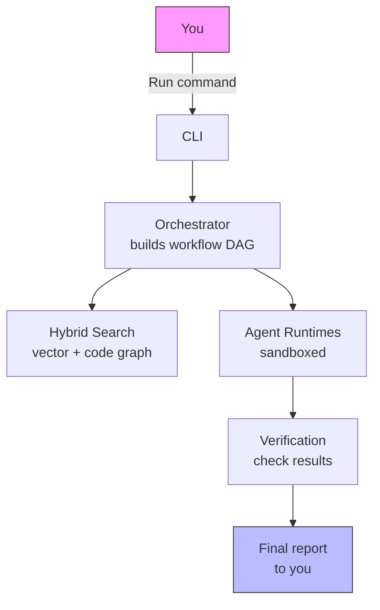

# Beagle — Autonomous AI Workflow Engine

**Turn complex AI tasks into reliable, auditable workflows.**

---

## Overview

Beagle lets you define AI workflows as simple YAML or TOML files, then executes
them as reliable, repeatable processes. It solves the problem of managing
multi-step AI tasks that require coordination between different models, tools,
and verification steps — without losing track of what happened or overspending
on API calls.

---

## Key Features

- **Run workflows, not one-off prompts** — Define your process once, then reuse
  it with full checkpointing and resume capabilities
- **Never overspend** — Hard USD budget limits stop execution automatically
- **Safe by default** — All untrusted code runs in sandboxed environments, with
  hardware isolation when available
- **Connect different AI systems** — Federate with other agent frameworks using
  signed, authorized messaging
- **Understand your codebase** — Built-in search that combines semantic vector
  search with code-structure analysis
- **Works on any CPU machine** — Heavy LLM inference happens remotely; only
  lightweight embedding models run locally
- **Built-in quality gates** — Automatic linting, type checking, and style
  validation keep your workflows clean and reliable

---

## Quick Start

**Requirements:**

- Python 3.12 or 3.13
- [uv package manager](https://astral.sh/uv/install.sh)

**Installation:**

```bash
git clone https://github.com/MattCreigh/beagle.git
cd beagle
uv sync --frozen --no-dev
uv pip install ".[dev]" --extra-index-url https://download.pytorch.org/whl/cpu --no-deps
```

**Verify your setup:**

```bash
make check          # Runs lint, type checks, and dead code detection
beagle config init  # Creates default configuration
beagle config show  # View your current settings
```

**Start a workflow:**

```bash
beagle run research "What does the auth module do?"
```

---

## Usage Example

**Analyze your codebase:**

```bash
beagle run research "How does the authentication system work?" --budget 5.0
```

**Expected output:**

```text
Workflow: research
Query: How does the authentication system work?
Status: Running...
---
[Research complete]

## Authentication System Overview

The auth module uses JWT tokens with HS256 signing. It requires...

Total cost: $2.47
Total tokens: 18,432
```

**Generate style-compliant prompts:**

```bash
beagle render-prompts    # Render style-guide prompt templates
beagle render-hints      # Get formatting hints for your workflows
```

---

## Configuration

| Variable | Purpose | Default |
|----------|---------|---------|
| `BEAGLE_BUDGET_USD` | Maximum spend per workflow | $10.00 |
| `BEAGLE_DATA_ROOT` | Where to store workflow state | XDG config directory |
| `BEAGLE_MCP_TOKEN` | Authentication for HTTP transport | *Required for HTTP MCP* |
| `BEAGLE_LOG_LEVEL` | Logging verbosity | INFO |
| `OLLAMA_BASE_URL` | Local embedding model endpoint | `http://ollama:11434` |

**Configuration file:** TOML-based with schema validation. Initialize with
`beagle config init` and edit `~/.config/beagle/config.toml`.

Set environment variables in your shell or `.env` file before running Beagle.

---

## Maintaining Quality

Beagle enforces consistent style and quality through automated checks:

```bash
make check            # Lint + type checking + dead code detection (zero-error gate)
make typecheck        # Run mypy type checking
make test             # Full test suite
```

Your workflows and code must pass these gates before merging. Use
`beagle config validate` to verify your configuration follows the schema.

---

## How It Works

```text
                  ┌───────┐
                  │  You  │
                  └───┬───┘
                      │  run command
                      ▼
                  ┌───────┐
                  │  CLI  │
                  └───┬───┘
                      │
                      ▼
            ┌─────────────────────┐
            │    Orchestrator     │
            │ builds workflow DAG │
            └────┬───────────┬────┘
                 │           │
                 ▼           ▼
        ┌───────────────┐  ┌──────────────┐
        │ Hybrid Search │  │    Agent     │
        │  vector +     │  │   Runtimes   │
        │  code graph   │  │ (sandboxed)  │
        └───────────────┘  └──────┬───────┘
                                  │
                                  ▼
                          ┌───────────────┐
                          │  Verification │
                          │ check results │
                          └───────┬───────┘
                                  │
                                  ▼
                          ┌───────────────┐
                          │ Final report  │
                          │    to you     │
                          └───────────────┘
```



You give Beagle a command. It builds a workflow graph, searches your codebase
for relevant context, runs each step in isolated sandboxes, verifies the
results, and delivers a final report. Every step is tracked, metered, and
auditable.
