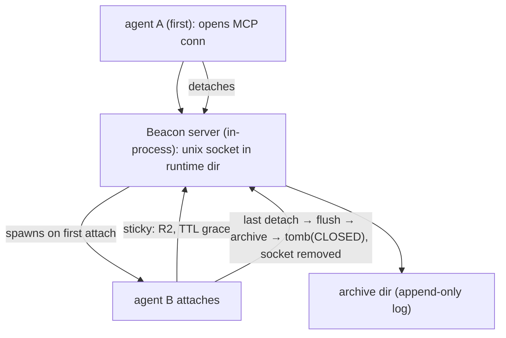
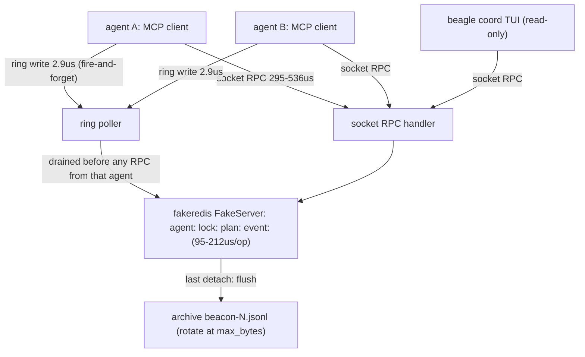

# Concept Spec — "Beacon": an ephemeral, JIT-spawned Redis coordination layer for Beagle agents

**Status:** Proposal (not yet accepted)
**Date:** 2026-08-21
**Author:** goose session (design discussion)
**Component:** a new Beagle plugin (`beagle-coord` / MCP server `beagle-coord`)
**Standards:** ASCII diagrams first (Mermaid source second), ASD-STE100 prose,
logic blocks with a `where:` legend, one notation per block.

---

## 1. Problem

Beagle runs many concurrent goose sessions against the same working directory
(observed 2026-08-21: 5+ live sessions in `/home/server/Projects/beagle` at
once). Today there is **no live inter-session coordination primitive**. The
coordination state is scattered across disk-backed, per-session, last-writer
wins stores:

| Store | Purpose | Live? | Cross-session? |
|---|---|---|---|
| `.beagle/progress.xml` | per-session progress markers | mtime only | overwritten by each session |
| `~/.beagle/tracking.db` (SQLite) | workflow/node runs, findings | query-time | shared file, no liveness |
| `~/.beagle/checkpoints/` (JSON) | restart / compaction state | no | per-session files |
| `src/beagle/infrastructure/task_store.py` (SQLite) | OpenClaw tasks | status column | shared, no liveness |
| `~/.local/share/goose/sessions/sessions.db` (SQLite) | goose session rows | updated_at | shared, read-only |
| `~/.cache/beagle/memory/sessions/*.json` | session memory | no | per-session |

Consequence: a session cannot see *what other agents are doing right now*,
*what they have done*, *which files they hold / touched*, *whether they are
still alive*, or *which plans/commits they are on*. The `plans/RUN_ORDER.xml`
is explicit: *"One plan in the tree at a time. Never start a stage while
another goose run is live."* That rule is enforced by **no mechanism**; the
2026-08-21 `check_hook_health.py` incident (two sessions editing the same file
concurrently, both trusting a stale read) is exactly what a coordination layer
prevents.

**No existing primitive solves this:**

- No `redis-server` on the host (`which redis-server` → empty).
- No `redis` / `fakeredis` Python package installed.
- No Docker socket allowed (`/var/run/docker.sock` must not be mounted) — we
  cannot get a Redis this way.
- The Orpheus ring buffer is a transport for fixed intents, not a general
  key/value coordination store.

This spec proposes **Beacon**: an ephemeral Redis datastore that is
JIT-spawned by the first agent that becomes active in a directory, sticks
around while any agent is connected, and tears down — archiving a full
copy of its state into a log — when the last agent disconnects.

---

## 2. Requirements

- **R1 — JIT spawn.** When the first agent activates in a directory (its
  working dir), Beacon spawns an in-process Redis server bound to a unix
  socket in that directory's runtime area. No daemon is required at rest; no
  boot-time service.
- **R2 — Sticky lifetime.** The Redis server lives while `>= 1` agent holds a
  connection, plus a short grace TTL. It does not die when a mid-session
  agent's connection drops unless it is the last one.
- **R3 — Last-detach teardown + archive.** When the last agent detaches,
  Beacon flushes the full key-space to a durable JSON log (an "archive"),
  stops the server, and cleans up the socket. A later session can replay or
  resume from the archive.
- **R4 — Connect via MCP.** The way agents attach is an MCP server
  (`beagle-coord`) exposing the coordination surface. Each session gets one
  MCP client → server connection that holds the sticky lease.
- **R5 — Multi-agent visibility.** Any connected agent can list the other
  connected agents, see what each has done, what each is doing now, which
  files they hold, their commits and plans — without polling the filesystem.
- **R6 — Presentable.** A CLI (subcommand of `beagle`) renders the live agent
  roster and activity, colour-coded, refreshing in real time (a small TUI).

---

## 3. Lifecycle model

```text
                        ┌─────────────────────────────┐
   agent A (first)      │  Beacon server (in-process) │
   opens MCP conn  ───▶ │  unix socket in runtime dir │
                        └──────────────┬──────────────┘
                                       │ spawns on first attach
                                       ▼
   agent B attaches  ───────────────►  │  sticky: R2, TTL grace
   agent A detaches  ───────────────►  │  stays alive (grace TTL)
   agent B detaches  ───────────────►  │  last detach → flush → archive
                                       │  tomb (CLOSED), socket removed
                                       ▼
                              archive dir (append-only log)
```



**Deciding the socket path.** A unix socket lives under
`beagle.config.paths.get_runtime_dir()`, but Beacon must scope to the
directory being worked in so different projects do not share a store. Use a
content-stable key:

```text
socket_dir  = runtime_dir / "coord" / sha256(resolved_workdir)[:16]
socket_path = socket_dir / "beacon.sock"
```

where `resolved_workdir` is the resolved absolute path of the agent's working
directory. Two sessions in the same directory compute the same socket path and
so join the same Beacon; two sessions in different directories never share.

**Membership lease.** A Redis key per agent, written with TTL refreshed by
heartbeat:

- key: `agent:<session_id>`
- value: JSON blob of agent metadata (see §5)
- TTL: `agent_heartbeat_ttl` (default 15 s)
- heartbeat: rewritten every `heartbeat_interval` (default 5 s)

The MCP connection holds the *ownership* lease (who owns the socket, when
does it become orphan-eligible); the per-agent TTL key drives *liveness*.
Grace TTL `grace_ttl_s` (default 20 s) is added before shutdown after the
last agent disconnects, to absorb a client reconnect after a transport
blip.

---

## 4. Architecture

### 4.1 Plugin shape

Beacon is delivered as a **Beagle plugin** following the existing plugin
convention:

- A python package (e.g. `beagle.beacon` or a standalone `beacon` dist).
- An MCP server entry point registered in `.mcp.json` alongside
  `beagle-rag` / `beagle-openclaw` / `beagle-utility`, wired through the same
  `setpriv --reuid=server --regid=server` pattern.
- A `beagle` subcommand (`beagle coord` / `beagle beacon`) rendering the CLI.
- Redis command surface comes from the **pure-Python** packages `redis` and
  `fakeredis` — no C extension, no `redis-server` binary, no Docker socket,
  no CUDA stack. This fits the "never install GPU torch / never mount docker
  socket" doctrine.

### 4.2 Two decoupled sides

- **Server side** — inside the Beacon process, an in-process
  `fakeredis.FakeServer()` exposed over a unix socket via a tiny async TCP
  shim, or optionally over a real `redis-server` when present
  (probe `redis-server --version`; fall back to `fakeredis`). The server owns
  the lifecycle FSM and the archive flush.
- **Client side** — every agent (including the first) attaches over MCP. The
  MCP tools are the only client surface; no agent talks Redis directly.

**Deferred choice (D1):** whether the Beacon *process* is a distinct
long-running subprocess (spawned by the first session, keeps running as a
standalone coordinator) or an in-process server thread inside the first
session's MCP server. The standalone subprocess is the better default because
the first session may exit/detach while others remain, so the server must not
die with it. Recommend the **standalone subprocess** model.

---

## 5. Data model (Redis keys)

All keys namespaced by directory socket; store only live ephemeral state.
Durable intent goes in the archive on flush. Entries carry TTL so a dead
agent never holds stale metadata.

| Key | Type | Value / meaning | TTL |
|---|---|---|---|
| `meta:dir` | string | canonical resolved working dir, one-per-beacon | none |
| `meta:created_at` | string | ISO-8601 spawn time | none |
| `meta:version` | string | beacon plugin version | none |
| `agent:<id>` | hash | see §5 | heartbeat TTL |
| `agent:list` | set | set of live agent ids | none (GC by TTL) |
| `lock:<filehash>` | string | the agent id that holds a file lock | lock TTL |
| `checkpoint:<id>` | hash | a named checkpoint (`workflow_id`, state) | none |
| `event:<seq>` | list | append-only activity stream | bounded (maxlen) |
| `lease:socket` | string | holder id + expiry (who is the socket owner) | grace TTL |

**Coordination primitives (in addition to metadata):**

1. **Liveness** — `agent:<id>` TTL drives "is alive".
2. **File locks** — `lock:<filehash>` guarded `SET NX`; lets agents see
   *which file another agent is editing and who* — the exact primitive that
   would have prevented the `check_hook_health.py` concurrent-write incident.
3. **Plan / checkpoint registry** — an agent registers the plan it is
   executing and the checkpoints it has reached, so `RUN_ORDER.xml`'s
   "one plan at a time" becomes enforceable.
4. **Commit feed** — agents push `(sha, subject, timestamp)` on each commit;
   visible as a colour-coded stream.
5. **Activity log** — an append-only `event:<seq>` stream (`action`, `file`,
   `ts`) used for the CLI's "what they're doing" view.

---

## 5. Agent metadata (the JSON in `agent:<id>`)

```json
{
  "agent_id": "20260821_13",
  "session_id": "20260821_13",
  "host": "mininas",
  "pid": 12345,
  "connected_at": "2026-08-21T15:30:58Z",
  "last_seen": "2026-08-21T15:33:46Z",
  "current_work": "concept-spec-beacon",
  "current_plan": "beacon-concurrency",
  "files": ["docs/CONCEPT-ephemeral-coordination-redis.md"],
  "model": "deepseek-v4-flash",
  "commit_heads": ["b3ebcf7"],
  "phase": "writing",
  "color": "green"
}
```

The `color` is a stable assignment (hash of agent_id into a palette) so every
observer draws the same agent with the same colour across their own session.

---

## 6. CLI / TUI

`beagle coord` (or `beagle beacon`) renders a live, colour-coded roster:

```text
 Coord (beagle) ─── 3 agents in /home/server/Projects/beagle ──────────────
 agent 20260821_13   ● active   model=deepseek-v4-flash  phase=writing
   plan : beagle-master-sequence (in-flight)
   head : b3ebcf7  "fix: suppress aeca-walltime-for-interval ..."
   files: docs/CONCEPT-ephemeral-coordination-redis.md (held)
   work : concept-spec-beacon
 agent 20260821_11   ● active   model=glm-5.2             phase=qa
   plan : beagle-qa-remediation (in-flight)
   head : 8c1c633  "fix: align AutoHydration logger name"
   files : src/beagle/context/auto_hydration.py (held)
   work : tranche-3-unsilence
 agent 20260821_6    ○ detached (heartbeat stale 2s ago)
 ────────────────────────────────────────────────────────────────
  [L] lock focus   [F] follow  [Q] quit    (poll: 2s)
```

- Each agent line colour-coded by its assigned `color`.
- A detached/stale agent is shown in a muted/dimmed style.
- Live updates by watching the Redis keys with a short poll or a pub/sub
  channel (`event:<seq>`), NOT by filesystem polling.
- It is the *only* component that reads the shared keys; ordinary sessions
  read via the MCP tools, never directly.

---

## 7. MCP tool surface (`beagle-coord`)

Mirrors the R5/R6 needs and the existing MCP server style:

| Tool | Purpose |
|---|---|
| `coord_attach` | Establish the sticky lease, register `agent:<id>`, mark socket ownership |
| `coord_detach` | Release the lease (marks last-agent teardown when applicable) |
| `coord_heartbeat` | Rewrite `agent:<id>` TTL (liveness) |
| `coord_list_agents` | Return the roster (who, what doing, last seen) |
| `coord_agent_info` | Full metadata JSON for one agent |
| `coord_lock_file(path, [wait])` | Acquire/reject a file lock; returns the holding agent |
| `coord_unlock_file(path)` | Release the lock |
| `coord_register_plan(plan_id, status)` | Announce the plan being executed |
| `coord_push_checkpoint(workflow_id, nodes)` | Record a checkpoint reached |
| `coord_publish_commit(sha, subject)` | Push a commit to the feed |
| `coord_activity(limit)` | Read the bounded event log |
| `coord_whoami` | Return own agent metadata |

**Attach points:** a session attaches via its MCP transport at start; a
pre/post tool hook (mirroring the existing `beagle_progress_update` /
`beagle_session_bootstrap` wiring) triggers `coord_attach` and
`coord_heartbeat`. Detach fires on session end / shutdown hook.

---

## 9. Failure semantics

| Failure | Behaviour |
|---|---|
| First agent spawns but another already has the socket | Detect existing socket; attach to it instead of spawning a duplicate |
| Server process dies unexpectedly | Socket disappears; remaining agents retry attach; a new first-detecting agent spawns a fresh server |
| Last agent's socket ownership is stale (owner dead) | Grace TTL expires the lease; next agent spawns a fresh server |
| Client loses connection mid-session | Heartbeat TTL expires agent: it appears stale; on reconnect re-register |
| Archive flush fails | Log the failure, keep a `.partial` archive, do NOT silently drop state |

**Detect a dead process, not a vanished one:** before spawning, the socket
must not exist; if it does, first verify it is actually owned by a live
Beacon (attempt a connect). A stale socket file from a crashed server is
removed and reused. This mirrors the "resolve real path, not string prefix"
doctrine.

---

## 10. Security

- Socket mode `0o700`, owned by the runtime user (`server` UID 1001), so no
  other local user can connect.
- The socket directory is under `get_runtime_dir()` (XDG-compliant private
  per-user runtime dir), never under a world-writable temp root.
- MCP transport is stdio (matching `ALLOWED_TRANSPORTS = {"stdio"}` in
  `mcp_security.py`); no network exposure.
- Redis commands are restricted; the store is a coordination cache, not a
  trust boundary. Anything that needs durability goes to the archive.
- No secrets are stored in Redis; secret material never enters `agent:<id>`
  or the event log (mirrors `scrub_secrets`).

---

## 11. Archive (durable on last detach)

On last-detach flush, Beacon writes an archive to the runtime dir:

```text
runtime_dir / "coord" / <dirhash> / "archive" / "beacon-<seq>.json"
```

Payload:

- `meta` (uid, spawn ts, version)
- full `agent:*` snapshots with disconnect time
- the bounded event log (`event:*`)
- the file-lock release record
- `plan` + `checkpoint` snapshots
- the commit feed

The archive is **append-only**: each Beacon incarnation appends a numbered
`beacon-<n>.jsonl`. A later session can run `beagle coord replay <archive>`
to rehydrate a read-only view of what previously ran in that directory —
answering "what has already been done here?" without requiring the previous
session to still be alive.

**Logic — should a fresh session rehydrate history on spawn?**
Let:

```text
spawn(p) = attach_ok(p) OR (missing(p) AND spawn_server(p))
rehydrate = last_archive_exists(dir) AND config.coord.rehydrate_on_spawn
```

The archive is a **read-only past**; the live server is the **present**. The
default is to *not* merge history into live keys (avoids resurrecting dead
agents), but to surface "N prior sessions archived here" in the CLI so a
session can choose to replay. `coord.rehydrate_on_spawn` is opt-in.

---

## 12. Configuration

```toml
[coord]
enabled = true
heartbeat_interval_s = 5
agent_ttl_s = 15
grace_ttl_s = 20
lock_ttl_s = 120
event_log_maxlen = 500
archive_dir = ""          # default: <data_root>/coord/<dirhash>/archive
rehydrate_on_spawn = false
store_backend = "fakeredis"   # "fakeredis" | "redis-server" (auto-probe)
socket_mode = "0700"
```

---

## 13. Open questions / decisions to settle before implementation

- **D1** — standalone process vs in-process server. (Recommend standalone
  process, §4.2.)
- **D2** — store backend: always `fakeredis` (zero OS dep, best fit for
  doctrine) vs probe-and-prefer a real `redis-server`. (Recommend `fakeredis`
  by default, `redis-server` opt-in.)
- **D3** — is the `redis` Python client + `fakeredis` acceptable as new
  pure-Python dependencies in the Beagle venv? They are small, no CUDA. This
  must be confirmed against the dependency-add policy.
- **D4** — attach lifecycle: should `coord_attach`/`detach` be wired through
  the existing session hooks (progress bootstrap) or a dedicated pre/post
  hook? (Recommend the same hook path as `beagle_session_bootstrap`.)
- **D5** — is machine-wide scope ever wanted? This spec is **directory-scoped**
  by design (§3). A machine-wide mode could be added later with a fixed
  socket under the shared runtime dir; not included now.
- **D6** — the MCP tool surface is large; which subset ships in v1? (v1 should
  cover liveness, roster, file-locks, plan/checkpoint registry; commit feed
  and replay are v1.1.)

---

## 14. Deliverables / definition of done

- A plugin package exposing an MCP server `beagle-coord` registered in
  `.mcp.json` via the standard `setpriv` wrapper.
- A `beagle coord` CLI subcommand (colour-coded live roster; replay).
- Session hook wiring: auto-attach on bootstrap, heartbeat, auto-detach on
  shutdown.
- Redis data model implemented over `fakeredis` (and opt-in `redis-server`).
- Lifecycle FSM: `spawning → sticky → (last-detach) → flushing → tomb`.
- Archive flush on last detach; `beagle coord replay <archive>`.
- File-lock coordination surfaced via MCP so the `check_hook_health.py`
  concurrent-write class of incident is prevented.
- Tests: unit (lifecycle, TTL, locks), integration (two sockets attach to one
  server, last-detach archive, replay), and no-GPU/no-docker-socket guard.
- Docs updated per the canonical-host-record obligation (this file + a
  `CHANGELOG.md` entry in the same session).

---

## 15. Terminology / legend

```text
attach    a session joins a Beacon (registers, holds a lease)
detach    a session leaves a Beacon (releases the lease)
grace     a time window after last detach before teardown
TTL       time-to-live; redis expiry driving liveness
heartbeat a periodic TTL rewrite = "I am alive"
archive   the durable JSONL copy flushed on teardown
```

---

## 16. Reusable-primitives survey — ghost_secrets_lib, orpheus_lib, ghost_secrets_vault

Survey date 2026-08-21. Three sibling projects were inspected for primitives
Beacon can reuse. The headline: **none of them is a key/value store**, so
none replaces Redis — but three of them contribute the *lifecycle, lease, and
audit* patterns Beacon otherwise has to design from scratch. Everything below
is a *pattern to adopt*, not a package to import into Beagle.

### 16.1 ghost_secrets_lib — lease and file-lock semantics (the big win)

`ghost_secrets_lib` depends on `filelock` 3.32.0, whose
`SoftFileLease` is the *exact* lease model Beacon needs for agent liveness
and file locks:

- A holder publishes a claim and refreshes it every
  `heartbeat_interval`; a contender may take it once the claim is
  `lease_duration` stale.
- A **lease is a hint about who should work, not a guarantee** — the
  expired holder keeps running and keeps using the protected resource; to
  reject it, the resource must be linearizable and fence on a generation
  it controls (`token` names a claim, does not fence one). This maps 1:1
  onto Beacon's agent-liveness TTL and file locks.
- A **LeaseSettingsMismatch** guard: every contender must agree on
  `lease_duration`, else the peer's expiry semantics differ. Beacon should
  mirror this — all agents joining one directory must agree on the TTL set.

`ghostsecrets.store.CachePolicy` (NONE = JIT decrypt-every-call,
MTIME = cache-keyed) is the same NONE/MTIME axis Beacon's `rehydrate_on_spawn`
sits on: live keys are the "present", archive is the "past"; never resurrect
dead agents into live keys by default.

`ghostsecrets.guard` (import-time AST security guard) is a pattern worth
mirroring if the Beacon MCP server ever handles restricted data; the Beacon
server holds no secrets, so it is optional.

`ghostsecrets.primitives.find_binary` — resolved-absolute-path executable
discovery — is the same convention as `beagle.config.paths.resolve_executable`
Beacon already inherits for its (absent) `redis-server` probe.

**Not reusable:** `tmpfs.py` is secret-specific and non-durable; Beacon's
archive must be durable, so this pattern is out.

### 16.2 orpheus (C++ engine) + orpheus_lib — transport, not a store

The `orpheus` wheel ships the C++ `OrpheusRing`, `OrpheusStreamRing`,
`OrpheusRingPoller`, `OrpheusStreamPolicy` (zero-copy ring buffers over
shared memory). `orpheus_lib` layers `daemon.UniversalDaemon`, `dispatch`,
`audit.AuditTrail`, `audit_reader`, `policy_engine`, and the `OrpheusPlugin`
interface.

- **What Beagle already uses:** `orpheus_startup.py`,
  `orpheus_ring_manager.py`, `openclaw_orpheus_client.py`, `rag_sync.py`,
  `orpheus_agent.py` — the ring is the IPC transport for the OpenClaw/Skylon
  bridge. **Correction (M-10, 2026-08-22):** at the time this section was
  written, `orpheus` was undeclared — it appeared in `pyproject.toml` only
  as a mypy override, not in `[project.dependencies]`. The 2026-08-21
  operator override (plans/beagle-beacon-coordination.xml, decision D-06)
  reversed that: `orpheus` is now a declared, required runtime dependency
  (`pyproject.toml`'s `[project.dependencies]`, resolved via
  `[tool.uv.sources]` from the local wheel). This applies to the bare
  `orpheus` ring package only. `orpheus_lib` (the daemon/dispatch/
  audit_reader/policy_engine application layer referenced below) remains
  neither installed nor declared — the "adopt as pattern, reimplement, do
  not import" guidance for it is unaffected.
- **Reusable patterns:**
  - `AuditTrail` + `audit_reader.py` is a ready-made *ring → JSONL + size
    rotation* pipeline. Beacon's archive flush (§11) and its bounded
    `event:<seq>` activity log can copy this shape: an append-only JSONL
    with rotation. `audit_reader` even shows the env-var configured
    `LOG_PATH` / `MAX_SIZE` / `MAX_FILES` contract Beacon should adopt for
    `beacon-<n>.jsonl`.
  - `UniversalDaemon` (a server-side event loop that reads intents, calls a
    policy engine, writes responses) is the shape of the standalone Beacon
    server process: a daemon that owns the store, a policy layer (allowlist),
    and an audit sink.
  - `dispatch` + `policy_engine` — intent whitelist + param validation +
    audit — is a good model for the MCP tool surface, and it already
    routes through the audit envelope.
- **Not reusable as the coordination store:** a ring buffer is a
  fixed-capacity *stream*, not a key/value store. It has no TTL, no
  read-by-key, no membership set, no lock primitive. Using it for Beacon
  would require building a KV layer on a FIFO — wrong tool. Beacon keeps
  Redis (fakeredis) as the store and, if desired, uses the ring only as an
  *event bus* mirroring `event:<seq>` out to the CLI. Recommendation: do
  NOT route Beacon's store through orpheus; it is transport, not state.

### 16.3 ghost_secrets_vault — MCP broker + lease-token + peer identity

`ghost_secrets_vault` is the closest existing design to Beacon's *MCP
broker with a lease* shape, and it carries the strongest reusable patterns:

- **`mcp/lease.py` — `LeaseTable`:** a memory-only lease state machine
  (`REQUESTED → ACTIVE → RETURNED/EXPIRED/REVOKED`), CSPRNG tokens,
  constant-time comparison, monotonic TTL, `renewals` counter. This is the
  lease/liveness model Beacon's `coord_attach`/`coord_heartbeat`/socket
  ownership should mirror — with the difference that Beacon's leases are
  Redis-backed (survive a server restart) rather than memory-only
  (fail-closed), so Beacon is *more* available than the vault.
- **`abstractions/peer_identity.py` — `UnixPeercredVerifier`:** kernel-
  attested `(pid, uid, gid)` via `SO_PEERCRED` on a unix socket, rejecting
  self-declared identity. Beacon's socket security (§10, mode 0o700) can
  adopt this to bind an `agent:<id>` to a kernel-attested uid/pid instead
  of trusting a client-supplied id. This closes the "who is really writing
  this socket" gap.
- **`mcp/server.py`:** a unix-socket MCP server (JSON-RPC 2.0) with
  `SO_PEERCRED` allowlist — the transport Beacon's `beagle-coord` broker
  already assumes (stdio MCP, socket ownership).
- **`mcp/audit.py` — hash-chained append-only audit log:** each record
  carries the SHA-256 of its predecessor so tampering is detectable.
  Beacon's `event:<seq>` and its archive would benefit from this chain
  hash if the activity log must be tamper-evident (recommended for a
  coordination/audit surface).

**Not reusable by import:** the vault is licensed PolyForm-NC (non-
commercial) and is secret-delivery specific. Beacon should adopt the
*pattterns* (lease table, peer identity, audit chain) and reimplement them
over Redis, not import `ghost_vault`. Same for `ghostsecrets` — it is a
SOPS/age secret library, not a coordination library.

### 16.4 Summary — adopt / do not import

| Primitive | Source | Adopt as pattern? | Import into Beagle? |
|---|---|---|---|
| Lease heartbeat / staleness | `filelock.SoftFileLease` | ✅ Beacon liveness + locks | ❌ (already a dep of ghostsecrets; reimplement over redis) |
| Lease state machine + TTL | vault `mcp/lease.py` | ✅ `coord_attach`/heartbeat | ❌ (PolyForm; reimplement) |
| Peer identity (SO_PEERCRED) | vault `peer_identity.py` | ✅ socket bind agent↔uid | ❌ reimplement (stdlib `socket.SO_PEERCRED`) |
| Audit ring → JSONL + rotation | orpheus `audit_reader` | ✅ archive + `event:<seq>` shape | ❌ `orpheus_lib` is not installed or declared (M-10) — Beacon's WP-6 journal/archive reimplements the shape over `beagle.utils.atomic`, not by importing `audit_reader` |
| Intent whitelist + policy + audit | orpheus `dispatch`/`policy_engine` | ✅ MCP tool-surface gating | ❌ `orpheus_lib` is not installed or declared (M-10) — WP-7's frozen 14-tool surface (D-08) is a hand-written allowlist, not an import of `dispatch`/`policy_engine` |
| Append-only hash-chain audit | vault `mcp/audit.py` | ✅ tamper-evident event log | ❌ reimplement (hashlib only) |
| KV store / TTL / keys / locks | (none) | — | ✅ add `redis` + `fakeredis` |
| Store backend | (none) | — | ❌ orpheus ring is a stream, not a KV store |

---

## 17. Status: Accepted

D-04 (the ring/socket write-path split — §4.2, the core design decision)
is implemented and measured, not just proposed. The open questions from
§13 resolve as follows; D4 and D5 are unaffected and remain open per their
original text.

- **D1** (standalone process vs in-process server) — **standalone
  process**, as recommended. `beagle.beacon.server` is a JIT-spawned
  subprocess (WP-4), not a thread inside the first session's MCP server.
- **D2** (store backend) — **`fakeredis` only**, as recommended. No
  `redis-server` probe-and-prefer path was built; `fakeredis` behind a
  unix socket (WP-2) is the sole backend.
- **D3** (redis + fakeredis as new dependencies) — **confirmed**:
  `redis==8.1.0` and `fakeredis==2.37.1`, both pure Python, no C
  extension (M-7).
- **D6** (MCP tool surface subset) — **14 tools, frozen** (WP-7, decision
  D-08) — a larger surface than §13's original "liveness, roster,
  file-locks, plan/checkpoint registry" recommendation. WP-5B's peer
  rendezvous channels (D-09/D-10/D-11) shipped in v1 rather than deferring
  to v1.1 as §13 first suggested.

Measured facts backing D-04 (`plans/beagle-beacon-coordination.xml`):

- **M-1** — a fire-and-forget ring write of a 133-byte JSON heartbeat
  costs 2.942 us/op agent-side (339,902 ops/sec).
- **M-2** — a synchronous RPC round trip to the store over the unix
  socket costs 295-536 us/op for Beacon-shaped operations.
- **M-3** — the same operations executed in-process against the store
  directly (zero transport) cost 95-212 us/op. This is the store's own
  floor; no transport choice removes it.

Consequence: moving a write to the ring does not make the store faster —
it moves the store's 95-212 us cost off the agent's critical path. The
agent pays ~2.9 us instead of ~295-536 us, and Beacon absorbs the store
cost asynchronously in its own process. This is why D-04 splits by
"does the caller need an answer", not by operation type.

```text
   agent A process                agent B process              beagle coord (TUI)
   ┌──────────────┐              ┌──────────────┐             ┌──────────────┐
   │ MCP client   │              │ MCP client   │             │  read-only   │
   └──┬────────┬──┘              └──┬────────┬──┘             └───────┬──────┘
      │        │                    │        │                        │
 ring │        │ socket        ring │        │ socket          socket │
 2.9us│        │ 295-536us    2.9us │        │ 295-536us              │
 write│        │ RPC           write│        │ RPC                    │
      ▼        ▼                    ▼        ▼                        ▼
   ┌────────────────────────────────────────────────────────────────────┐
   │                    Beacon server process (D-01)                    │
   │                                                                    │
   │   ┌──────────────┐   drain first    ┌───────────────────────────┐  │
   │   │ ring poller  │ ───────────────▶ │  fakeredis FakeServer     │  │
   │   └──────────────┘                  │  agent: lock: plan: event:│  │
   │   ┌──────────────┐                  │  95-212us per op (M-3)    │  │
   │   │ socket RPC   │ ───────────────▶ │                           │  │
   │   └──────────────┘                  └─────────────┬─────────────┘  │
   │                                                   │ last detach    │
   └───────────────────────────────────────────────────┼────────────────┘
                                                       ▼
                                          ┌────────────────────────┐
                                          │ archive beacon-N.jsonl │
                                          │ rotate at max_bytes    │
                                          └────────────────────────┘
```



Spawn/teardown lifecycle, as implemented (R1-R3, §2-3):

```text
attach(a, d)   = live(d) ∧ join(a, d)
live(d)        = socket_exists(d) ∧ connect_ok(d)
spawn_needed(d) = ¬socket_exists(d) ∨ (socket_exists(d) ∧ ¬connect_ok(d))
teardown(d)    = (members(d) = ∅) ∧ (now − last_detach(d) > grace_ttl_s)
flush_owner(d) = first agent for which SET beacon:teardown <id> NX EX 30 returns true

where:
  a              an agent identity (session id plus SO_PEERCRED pid/uid)
  d              a resolved absolute working directory
  live(d)        a Beacon is reachable for directory d
  socket_exists  the unix socket file is present at the derived path
  connect_ok     a PING over that socket returned PONG within connect_timeout_s
  members(d)     the set of agent ids whose liveness key has not expired
  last_detach    monotonic timestamp of the most recent member removal
  grace_ttl_s    config [coord] grace_ttl_s, default 20
  flush_owner    the single agent elected to run the archive flush
```

A socket file that exists but does not answer PING is a crashed Beacon —
it is unlinked and a fresh server spawned in its place (§9, "detect a
dead process, not a vanished one").
