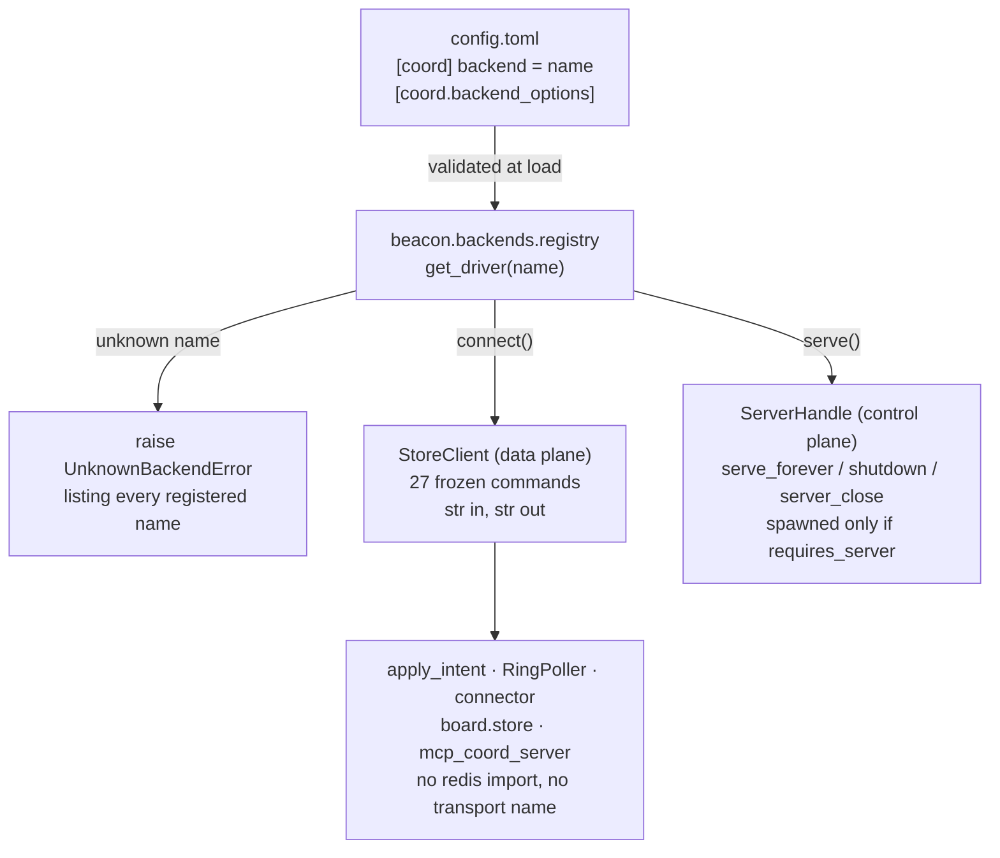

# The coordination store backend slot

`docs/decisions/2026-08-21-coord-backend-slot.md` records decision D-B1
and its rejected alternatives. This document is the contract a backend
author reads instead of that decision record — someone who has not read
the decision will write the next backend.

## 1. What the slot is

The Beacon subsystem needs a coordination
store: a key/value/hash/set/sorted-set/list store with TTL, reachable from
every agent working in a directory. Beacon used to hardcode `fakeredis`
over a unix socket as that store. This slot makes it replaceable: changing
`[coord].backend` in `config.toml`, and nothing else, selects a different
implementation. `fakeredis_unix` is the first implementation of the
interface, not the only possible one.

```text
                       ┌────────────────────────────────┐
                       │  config.toml                   │
                       │  [coord] backend = "<name>"    │
                       │  [coord.backend_options]       │
                       └───────────────┬────────────────┘
                                       │ validated at load
                                       ▼
                       ┌────────────────────────────────┐
                       │  beacon.backends.registry      │
                       │  get_driver(name) -> Driver    │
                       │  unknown name ──► raise        │
                       └───────────────┬────────────────┘
                                       │
                 ┌─────────────────────┴─────────────────────┐
                 │ connect()                       serve()   │
                 ▼                                           ▼
   ┌───────────────────────────────┐         ┌───────────────────────────────┐
   │  StoreClient  (data plane)    │         │  ServerHandle (control plane) │
   │  27 frozen commands           │         │  serve_forever / shutdown /   │
   │  str in, str out (D-B5)       │         │  server_close, spawned only   │
   └───────────────┬───────────────┘         │  if requires_server is true   │
                   │ consumed by             └───────────────────────────────┘
                   ▼
   ┌─────────────────────────────────────────────────────────────────────────┐
   │  apply_intent · RingPoller · connector · board.store · mcp_coord_server │
   │  none of these import redis, none of these name a transport             │
   └─────────────────────────────────────────────────────────────────────────┘
```



## 2. The two Protocols

`src/beagle/beacon/backend.py` defines the whole contract. It imports
nothing from `redis`, nothing from `fakeredis`, and nothing from any
transport library — a shared-memory backend that never opens a socket is
a legal implementation of both Protocols below.

### `StoreClient` — the data plane

27 commands, `str` in and `str` out (`decode_responses=True` semantics
are part of the contract, not an implementation detail — a backend
returning `bytes` makes a `get()` result compare unequal to a `str`
agent id and silently no-ops a lock release). One per Redis primitive:

| Group | Commands |
|---|---|
| keys/strings | `get`, `set`, `delete`, `exists`, `expire`, `ttl`, `incr`, `scan_iter`, `type` |
| hashes | `hset`, `hget`, `hgetall`, `hdel` |
| sets | `sadd`, `srem`, `scard`, `smembers`, `sinter` |
| sorted sets | `zadd`, `zrange`, `zrem` |
| lists | `lpush`, `lrange`, `ltrim`, `llen` |
| connection | `ping`, `close` |

The empty/missing-key case is part of the contract — it is what a new
backend gets wrong:

| Command | Missing/empty case |
|---|---|
| `get` / `hget` | `None`, never `b""`, never `KeyError` |
| `hgetall` | `{}`, never `KeyError` |
| `smembers` | empty `set()` |
| `scard` | `0` |
| `lrange` / `zrange` | `[]` |
| `ttl` | `-2` missing key, `-1` no expiry |
| `exists` | count of names (among those given) that exist |
| `incr` | `1` on the first call for a key that did not exist |
| `type` | `"none"` |
| `set(..., nx=True)` on an already-held key | `None`, **not** `False` |

### `BackendDriver` — the control plane

Liveness, stale-state clearing, server construction, client construction
— kept separate from the data plane (`StoreClient`) so a test double
implementing only the data plane never has to fake a subprocess.

```python
class BackendCapabilities:
    name: str
    shared: bool           # state visible to other OS processes?
    requires_server: bool  # must a server process be spawned first?
    description: str

class BackendDriver(Protocol):
    capabilities: BackendCapabilities
    def is_live(self, paths, *, connect_timeout_s: float) -> bool: ...
    def clear_stale(self, paths) -> None: ...
    def serve(self, paths, options: Mapping[str, str]) -> ServerHandle: ...
    def connect(self, paths, *, connect_timeout_s: float, options: Mapping[str, str]) -> StoreClient: ...
```

`requires_server=False` means a backend attached directly by each agent
(e.g. shared memory, no listener) — `spawn.py` never launches a
subprocess for it, and `is_live()` for such a backend is typically just
`True` unconditionally, since there is no external process to probe.

## 3. Registering a backend

One dict entry, in `src/beagle/beacon/backends/__init__.py`:

```python
REGISTRY: dict[str, type[BackendDriver]] = {
    "fakeredis_unix": FakeredisUnixDriver,
    "your_backend": YourBackendDriver,
}
```

`register(name, driver_cls)` exists so a test can add a backend without
editing `src/` — `get_driver(name)` raises `UnknownBackendError` naming
every registered name for an unknown value; there is no default and no
fallback (`[coord].backend = "nope"` is a defect at config load, not a
mode — a silent substitution runs a session against a store the operator
never chose).

## 4. The conformance suite is the definition of done

`tests/test_beacon_backend_conformance.py` parametrises over
`REGISTRY` at collection time — a backend added to `REGISTRY` without
passing this suite fails CI automatically; registration and conformance
are the same event. It asserts behaviour, not signatures
(`hasattr(client, "hset")` proves nothing about whether `nx=True` is
honoured under contention or a TTL actually expires) — every command
gets at least one behavioural assertion, with adversarial cases for
`set(nx=True)`, `ttl`, `hgetall`, and `ltrim`. It also contains the
substitution proof: `[coord].backend` set to a given name, with no other
code change, drives attach, heartbeat, lock acquire under contention,
lock release, roster read, and event append through the real production
code path (`SocketRpcClient` + `apply_intent`) to a passing result.

## 5. Config surface

```toml
[coord]
backend = "fakeredis_unix"   # key of beacon.backends.REGISTRY

[coord.backend_options]
# Free-form, backend-specific. Passed to the driver verbatim. Empty by default.
```

## 6. The latency harness is the acceptance measurement

```text
beagle_venv/bin/python3 scripts/bench_coord_backend.py --backend <name> --iterations 5000
```

Measures the four coordination operation shapes (heartbeat write,
file-lock acquire, roster read, event append) with `time.perf_counter_ns`
(monotonic — never `time.time`, which can jump backwards under an
NTP/DST step and corrupt a duration), reporting median and p99 —
p99 is what stalls an agent, not the mean. The shipped `fakeredis_unix`
backend costs 295-536 us/op over the socket and 95-212 us/op in-process
(parent plan facts M-2/M-3); a replacement backend exists to beat those
numbers and this harness is how that claim gets a number attached to it.

## 7. What a backend does NOT have to provide (D-B7)

Outside the seam entirely — a backend author never touches these:

- **The ring fast path.** Fire-and-forget writes (heartbeat, event
  append, lock release) go over a per-agent `orpheus` ring, drained by
  `RingPoller` and applied via `apply_intent`, which already takes its
  client as a parameter. This exists to move the store's cost off the
  agent's critical path — it is true whatever the store is, so it is
  orthogonal to this slot.
- **The intent envelope.** `beagle.beacon.intents`' JSON ring-message
  format is unrelated to the store contract.
- **The journal.** `beagle.beacon.journal`'s write-behind durability
  layer replays board-class keys on spawn; it calls `StoreClient`
  methods like any other caller.
- **Path derivation.** `BeaconPaths.base_dir`/`rings_dir`/`archive_dir`
  are backend-independent and stay exactly where they are — only
  `socket_path` is transport-specific, and a driver that needs a
  different endpoint derives it from `base_dir` itself rather than
  changing the shared dataclass.
- **Agent identity.** `SO_PEERCRED`-based kernel-attested identity is a
  property of the unix-socket transport `fakeredis_unix` happens to use,
  not a requirement the contract imposes on every backend.

## 8. Adding a coordination backend — the checklist

<verification-checklist name="adding a coordination backend">
  1. Implement BackendDriver and return a StoreClient from connect().
  2. Add one line to REGISTRY in beagle/beacon/backends/__init__.py.
  3. pytest tests/test_beacon_backend_conformance.py  -> all green, no xfail.
  4. `scripts/bench_coord_backend.py --backend <name>`  -> record the numbers.
  5. Set `[coord].backend = "<name>"`. Change NO other file. Run the full suite.
  If step 5 required a Python edit, the backend is not conformant; the slot is.
</verification-checklist>
