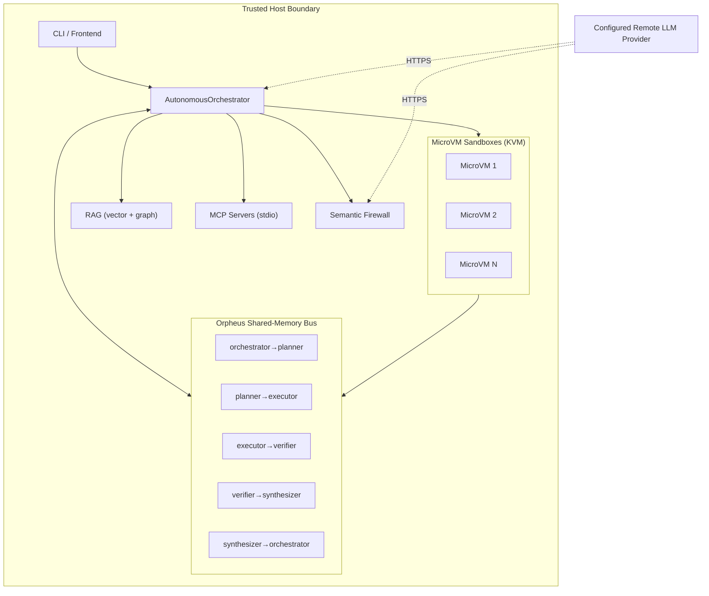

# Deployment Topology

The following diagram shows the host boundary, the MicroVM sandboxes, and the
Orpheus shared-memory bus. The host is the trusted boundary; model output and
untrusted code are confined to the MicroVM sandboxes, which communicate with
the orchestrator over the Orpheus ring buffer.

```text
┌──────────────────────────────────────┐
│         Trusted Host Boundary        │
└──────────────────┬───────────────────┘
                   │
                   ▼
┌──────────────────────────────────────┐
│        AutonomousOrchestrator        │
│  CLI / Frontend / RAG / MCP / FW    │
└──────────────────┬───────────────────┘
                   │
                   ▼
┌──────────────────────────────────────┐
│      Orpheus Shared-Memory Bus       │
│  orchestrator / planner / executor  │
│  verifier / synthesizer             │
└──────────────────┬───────────────────┘
                   │
                   ▼
┌──────────────────────────────────────┐
│      MicroVM Sandboxes (KVM)         │
│  MicroVM 1 / MicroVM 2 / MicroVM N   │
└──────────────────────────────────────┘
```



**Key properties:**

- **Host boundary**: the orchestrator, RAG, MCP servers, and firewall run on
  the trusted host. The host is assumed trusted (see `SECURITY.md`).
- **MicroVM sandboxes**: untrusted code runs inside Firecracker/KVM VMs with
  hardware isolation. If the MicroVM path is unavailable and `allow_fallback`
  is `False`, the orchestrator refuses to run the payload (deny-by-default).
- **Orpheus bus**: agents communicate over shared-memory ring buffers
  (1–4 MiB per channel). The verifier→synthesizer channel is 2 MiB to give
  headroom over the largest observed verified-facts payload.
- **LLM inference**: all heavy model inference is delegated to the configured
  remote LLM provider over HTTPS. The host itself performs only orchestration
  and local CPU-bound embedding work; no local model weights are loaded.
