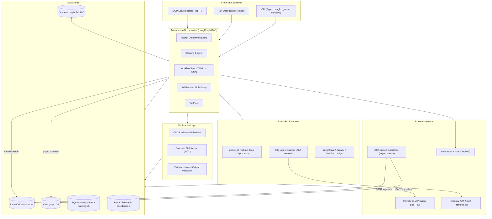

# Beagle — System Specification and Operations Manual

| Field | Value |
| :--- | :--- |
| **Document Title** | Beagle — System Specification and Operations Manual |
| **Document ID** | BEAGLE-SPEC-OPS-002 |
| **Document Version** | 2.0 |
| **Software Version** | 1.4.0 |
| **Release Date** | 2026-08-28 |
| **System Classification** | Autonomous Multi-Agent Workflow Orchestration Engine |
| **Audience** | Platform engineers, SREs, security reviewers, integration developers |
| **License** | MIT (Beagle + vendored `pi` fork); optional `beagle-orpheus` wheel proprietary |

> **Software version SSOT:** Beagle single-sources the installed package version
> in `pyproject.toml [project].version`. `beagle.constants._resolve_package_version()`
> derives it at import time (installed distribution metadata first, then a direct
> `pyproject.toml` read for uninstalled checkouts). No version literal exists
> anywhere else in the tree. Verify at runtime with `beagle --version`.

---

## Table of Contents

1. [Front Matter](#1-front-matter)
2. [System Architecture](#2-system-architecture)
3. [Data and State Management](#3-data-and-state-management)
4. [Interfaces and Integration](#4-interfaces-and-integration)
5. [Security and Access Control](#5-security-and-access-control)
6. [Observability and Telemetry](#6-observability-and-telemetry)
7. [Operational Runbook](#7-operational-runbook)
8. [Compliance and Verification Matrix](#8-compliance-and-verification-matrix)

---

## 1. Front Matter

### 1.1 Purpose and Scope

This document is the normative specification and operations reference for the
Beagle engine (version 1.4.0). It describes what the system is, how it is
structured, how data flows through it, how it is secured, and how it is
operated. It does not describe any particular deployment, model fleet, or host
configuration; those are operator configuration concerns external to the
codebase and are governed by `~/.config/beagle` (XDG).

The primary audience is platform engineers, SREs, security reviewers, and
integration developers who must deploy, operate, extend, or secure a Beagle
installation.

### 1.2 Executive Summary

**Beagle is an autonomous multi-agent workflow orchestration engine.** It
coordinates heterogeneous AI agents through declarative YAML/TOML workflows
executed as directed acyclic graphs (DAGs). The engine runs headless as a
backend and exposes itself to host orchestrators (such as interactive AI
harnesses) through a Typer CLI, an optional Textual TUI dashboard, and a set of
Model Context Protocol (MCP) servers.

Business value derives from five capabilities:

1. **Deterministic delegation** — workflows are declared, validated, and
   executed as graphs with checkpointing, resume, and deterministic replay.
2. **Cost governance** — every model call is metered per agent and per workflow
   against a hard USD budget; execution stops when the budget is exhausted.
3. **Secure autonomy** — untrusted code executes inside sandboxed executors
   (Firecracker microVM hardware isolation when available, deny-by-default
   otherwise); all inputs pass a layered semantic firewall.
4. **Federated agents** — the Agent-to-Agent (A2A v2) protocol signs every
   inter-agent message with Ed25519 and authorises actions through
   Casbin-backed role-based access control (RBAC).
5. **Semantic code intelligence** — a hybrid retrieval-augmented generation
   (RAG) subsystem combines vector search (LanceDB) with graph traversal
   (Kùzu) over AST-parsed codebases.

The system is engineered for **CPU-only hosts**: heavy LLM inference is
delegated to a configured remote provider over HTTPS, and only local embedding
models run on-device. GPU/CUDA builds are explicitly prohibited by the build
chain to keep the wheel lean and reproducible.

### 1.3 Technology Stack

| Layer / Subsystem | Technology | Version / Constraint | Architectural Role |
| :--- | :--- | :--- | :--- |
| Runtime language | Python | >= 3.12 (3.13 used in CI and Docker) | Typed async core (`src/` layout) |
| Graph execution | LangGraph / LangChain Core | `langgraph==1.2.4`, `langchain-core>=1.2.22,<2` | DAG workflow execution, state transitions |
| Checkpointing | LangGraph SQLite checkpointer | `langgraph-checkpoint-sqlite>=3.0.1`, `aiosqlite==0.22.1` | Durable workflow state, resume |
| CLI framework | Typer + Rich + Click | `typer>=0.24.0`, `rich==15.0.0`, `click==8.3.3` | Command surface and terminal rendering |
| Protocol layer | Model Context Protocol SDK | `mcp==1.28.1`, `fastmcp==3.4.7` | Tool servers for host orchestrators |
| Vector store | LanceDB | `lancedb==0.30.2` | Disk-backed embedding index for RAG |
| Graph store | Kùzu embedded graph DB | `kuzu==0.11.3` | Property graph for AST relations, multi-hop traversal |
| ANN prefilter | FAISS (CPU) | `faiss-cpu==1.13.2` | Candidate prefilter for vector search |
| Embeddings | sentence-transformers | `>=5.4` | Local embedding inference |
| Numerical runtime | PyTorch (CPU-only build) | `torch==2.11.0` via CPU index | Embedding backend; CUDA prohibited |
| Quantization | TurboQuant (in-tree) | NumPy-based | 3-bit numeric KV/embedding compression |
| Coordination store | Redis client + fakeredis | `redis>=5.0`, `fakeredis==2.37.1` | Beacon ephemeral coordination over Unix socket |
| IPC | Orpheus shared-memory ring buffer | local C++20 wheel (not on PyPI) | Lock-free inter-process event bus |
| AuthN / AuthZ | PyJWT, PyNaCl, Casbin | `PyJWT>=2.12.0`, `PyNaCl>=1.6.0`, `casbin>=1.30.0` | JWT sessions, Ed25519 signing, RBAC policy |
| Web / API | aiohttp, httpx | `aiohttp==3.14.0`, `httpx>=0.28.0` | A2A HTTP transport, webhooks, outbound calls |
| Config / validation | Pydantic, toml, PyYAML, Jinja2 | `pydantic>=2.13.3`, `jinja2>=3.1.6` | Schema-typed TOML configuration and templates |
| Security scanning | google-re2, defusedxml | `google-re2==1.1.20251105`, `defusedxml>=0.7.1` | Linear-time regex secret scrubbing, safe XML parsing |
| Observability | OpenTelemetry API/SDK, structlog | `opentelemetry-*>=1.41`, `structlog>=24.0.0` | Distributed tracing, structured logging |
| Metrics export | prometheus_client (optional extra) | `>=0.21.0` | Pull-based metrics endpoint |
| Search backend | ddgs | `>=9.0` | DuckDuckGo web search tooling |
| Build / packaging | setuptools + uv | uv mandatory for wheel installs | Reproducible CPU-only builds |

> **Dependency note:** no proprietary dependency ships by default. The optional
> `beagle-orpheus` transport wheel is downloaded and installed **explicitly** by
> the operator after an informed licensing decision. If it is absent, Beagle
> degrades to a socket/fallback IPC path (Orpheus is optional; Redis is core).

---

## 2. System Architecture

### 2.1 High-Level Design

Beagle uses a **DAG-based, event-driven, multi-agent orchestration paradigm**.
A single **AutonomousOrchestrator** (built on LangGraph `StateGraph`) executes
declarative workflows as a directed acyclic graph of typed agent nodes. The
orchestrator is the control plane; it does not itself run model inference but
spawns and coordinates **sub-agent execution runtimes** (default: a local
`goose` subprocess via the `goose_cli` runtime plugin, or an A2A remote
`http_agent` runtime). Every agent-to-agent message is cryptographically signed
under role-based access control.

The system is organised along two **replaceability axes**:

- **Front-end axis** — the CLI, TUI, and MCP servers are interchangeable
  front ends over the same orchestrator core.
- **Sub-agent runtime axis** — the sub-agent execution runtime is a pluggable
  interface (`beagle.runtime.base.AgentRuntime`) with `goose_cli` (local
  subprocess) and `http_agent` (remote A2A) implementations, plus framework
  bridges for LangChain, CrewAI, and AutoGen.

Core structural components:

| Component | Responsibility |
| :--- | :--- |
| **AutonomousOrchestrator** | Graph execution, node sequencing, retry/backoff, circuit breaking, budget enforcement |
| **Router (AdaptiveRouter)** | Routes a query to the best workflow / model via learned + keyword routing |
| **Steering Engine** | Injects high-priority directives into all agents |
| **WorkflowSpec loader** | Parses YAML/TOML workflow definitions into validated DAGs |
| **SkillRouter / SkillLibrary** | Routes to named skills / recipes |
| **ToolPool** | Pooled tool execution and MCP tool registration |
| **SandboxedExecutor / MicroVMSandbox** | Deny-by-default subprocess isolation, optional KVM hardware isolation |
| **CVCP** | Cross-Verification Collaboration Protocol — adversarial reviewer agents |
| **A2A Protocol** | Signed inter-agent messaging and federation |
| **Hybrid RAG** | LanceDB vector search + Kùzu graph traversal over AST-parsed code |
| **Guardian Gatekeeper** | Human-in-the-loop approval for consequential actions |
| **Beacon** | Ephemeral coordination backend (Redis / fakeredis over Unix socket) |
| **Cost Tracker** | Per-agent, per-workflow USD metering against a hard budget |

### 2.2 System Architecture Diagram

```text
┌────────────────────────────────────────────────────────┐
│                   Front-End Surfaces                   │
│    CLI (beagle/goose-workflow) / TUI / MCP Servers     │
└────────────────────────────┬───────────────────────────┘
                             │
                             ▼
┌────────────────────────────────────────────────────────┐
│         AutonomousOrchestrator (LangGraph DAG)         │
│            Router / Steering / WorkflowSpec            │
│                 SkillRouter / ToolPool                 │
└────────────────────────────┬───────────────────────────┘
                             │
                             ▼
┌────────────────────────────────────────────────────────┐
│          Execution Runtimes and Verification           │
│             goose_cli / http_agent runtime             │
│                 CVCP / Guardian / EVH                  │
└────────────────────────────┬───────────────────────────┘
                             │
                             ▼
┌────────────────────────────────────────────────────────┐
│                  Data Stores and IPC                   │
│     LanceDB / Kùzu / SQLite / Redis / Orpheus ring     │
└────────────────────────────┬───────────────────────────┘
                             │
                             ▼
┌────────────────────────────────────────────────────────┐
│                    External Systems                    │
│     Remote LLM / Web / A2A peers / CAST ingestion      │
└────────────────────────────────────────────────────────┘
```



### 2.3 Data and Control Flow Diagram

The primary flow is a **workflow run**: a query enters the CLI or MCP surface,
is routed, decomposed into a DAG, executed through sandboxed agent nodes, and
verified before the final report is emitted. Every step is metered, traced, and
optionally approved.

```text
┌────────────────────────────────────────────────────────┐
│                    Operator / Host                     │
└────────────────────────────┬───────────────────────────┘
                             │
                             ▼
┌────────────────────────────────────────────────────────┐
│                 Front End (CLI / MCP)                  │
│          validate + route (semantic firewall)          │
└────────────────────────────┬───────────────────────────┘
                             │
                             ▼
┌────────────────────────────────────────────────────────┐
│                 AutonomousOrchestrator                 │
│        build DAG · reserve budget · hydrate RAG        │
└────────────────────────────┬───────────────────────────┘
                             │
                             ▼
┌────────────────────────────────────────────────────────┐
│         Sub-Agent Runtime in Sandbox / MicroVM         │
│              EVH-validated, signed result              │
└────────────────────────────┬───────────────────────────┘
                             │
                             ▼
┌────────────────────────────────────────────────────────┐
│                CVCP Adversarial Review                 │
│          primary + 2 critics · bounded retry           │
└────────────────────────────┬───────────────────────────┘
                             │
                             ▼
┌────────────────────────────────────────────────────────┐
│                  Front End → Operator                  │
│             markdown / json / sarif output             │
└────────────────────────────────────────────────────────┘
```

```mermaid
sequenceDiagram
    autonumber
    participant U as Operator / Host
    participant FE as Front End (CLI/MCP)
    participant OR as AutonomousOrchestrator
    participant RT as Sub-Agent Runtime
    participant SB as Sandbox / MicroVM
    participant RAG as Hybrid RAG (LanceDB+Kùzu)
    participant VF as CVCP / EVH Verifiers
    participant CT as Cost Tracker

    U->>FE: beagle run <workflow> "<query>"
    FE->>OR: Route + validate query (semantic firewall)
    OR->>OR: Select workflow YAML → build DAG
    OR->>CT: Reserve budget (BEAGLE_BUDGET_USD)
    OR->>RAG: Hydrate context (vector + graph search)
    RAG-->>OR: hydrated context, constraints, code chunks
    loop Each DAG Node
        OR->>RT: Spawn agent (goose_cli / http_agent)
        RT->>SB: Execute under resource + network isolation
        SB-->>RT: node result (EVH-validated)
        RT-->>OR: signed result + token/cost telemetry
        OR->>CT: Meter cost; check budget threshold
        CT-->>OR: budget / circuit-breaker verdict
    end
    OR->>VF: Run CVCP adversarial review (primary + 2 critics)
    VF-->>OR: verified report or bounded retry
    OR->>FE: final_report + cost summary
    FE-->>U: formatted output (markdown/json/sarif)
    Note over OR,FE: Post-final-answer fold compacts context
```

### 2.4 Core Modules and Components

| Module | Path | Responsibility |
| :--- | :--- | :--- |
| CLI | `src/beagle/cli/` | Typer command surface (`run`, `workflows`, `runs`, `system`, `render`, `config`, `checkpoint`, `slo`, `coord`) |
| Orchestrator | `src/beagle/core/` | DAG orchestration, graph building, workflow loading, state management, routing, sandbox |
| Bridges | `src/beagle/bridges/` | A2A protocol, LLM client registry, ChatModel, retriever, tool registry, Orpheus HTTP transport |
| Context | `src/beagle/context/` | Context window, compression, hydration, TurboQuant folding, rehydration, watchdog |
| Infrastructure | `src/beagle/infrastructure/` | MCP servers (beagle, rag, utility, coord), CAST ingestion, hot-swap ingest, audit logger, task store |
| Security | `src/beagle/security/` | AST validator, semantic firewall, sanitization, validation, binary validator, vigil |
| Auth | `src/beagle/auth/` | JWT validation, RBAC, tenant roles |
| Config | `src/beagle/config/` | Schema, loader, defaults, model routing, allowlists, env overrides |
| Observability | `src/beagle/observability/` | Logging, metrics, tracing, Prometheus exporter |
| Memory | `src/beagle/memory/` | Hierarchical memory, AutoDream, checkpointer, memory index |
| RAG | `src/beagle/infrastructure/cast_ingestion.py` | CAST AST ingestion, Kùzu graph, LanceDB embedding |
| Reproducibility | `src/beagle/reproducibility/` | Deterministic replay, recorder, manifest |
| SLO | `src/beagle/slo/` | Indicators, objectives, policy, tracker |
| Resilience | `src/beagle/resilience/` | Degradation policies, fallback chains |
| Skills | `src/beagle/skills/` | XML skill definitions (web-search, traefik, etc.) |
| Blocks | `src/beagle/blocks/` | XML/Python block engine for modular execution |
| Health | `src/beagle/health/` | Collector, monitor, thresholds |
| Tracking | `src/beagle/tracking/` | SQLite run/finding tracking (`tracking.db`) |
| Events | `src/beagle/events/` | Typed event bus (`NodeFailed`, `NodeCompleted`, `BudgetWarning`, …) |

---

## 3. Data and State Management

### 3.1 Data Models and Schemas

Beagle models its core entities with **Pydantic** (`pydantic>=2.13.3`) and
**dataclasses**. Two state representations coexist:

- **`BeagleState`** (Pydantic `BaseModel`, `src/beagle/core/state.py`) — the
  LangGraph workflow state, `extra="forbid"` strict mode. Scalar fields use
  last-write-wins; list/dict fields use append reducers. It exposes a
  dict-native mapping protocol (`.get()`, `[]`, `.update()`, `.items()`) for
  compatibility with LangGraph's dict-native graph layer.
- **`AgentState`** (dataclass, `src/beagle/core/orchestrator_types.py`) — the
  strongly-typed state object threaded through the DAG, with `synthesis_failed`
  signalling a structurally-invalid final report.

**Key `BeagleState` fields:**

| Field | Type | Purpose |
| :--- | :--- | :--- |
| `query` | `str` | User query being processed |
| `research_plan` / `raw_execution_context` / `verified_facts` / `final_report` | `str` | Phase outputs |
| `workflow_id` | `str` | Full `uuid4()` (122-bit entropy) workflow identifier |
| `workflow_mode` | `str` | `audit` (read-only) \| `develop` (read-write) \| `research` |
| `permission_level` | `str` | `read` \| `write` \| `admin` |
| `total_cost` / `total_tokens` | `float` / `int` | Cumulative metered spend and token count |
| `steering_prompt` | `str` | High-priority directive injected into all agents |
| `hydrated_context` / `hydration_code_chunks` / `hydration_constraints` | `str` / `list` | Pre-loaded RAG context |
| `operational` | `OperationalMetadata` | Circuit-breaker iteration/error counters |
| `tool_failure_history` | `list[dict]` | Tool failures for executor escalation |

**State list size caps** (bounded to prevent memory exhaustion): `errors` = 500,
`fact_ledger` = 1000, `completed_nodes` = 500, `tool_failure_history` = 200,
`hydration_code_chunks` = 500.

**Other models:** `OperationalMetadata` (circuit breaker), `AgentPingMessage`
(agent→orchestrator messaging), typed events in `events/events.py`, tracking
models (`WorkflowRun`, `NodeRun`, `Finding`) in `tracking/models.py`.

### 3.2 Persistence Layer

| Store | Technology | Location | Purpose |
| :--- | :--- | :--- | :--- |
| Vector store | LanceDB | `data_root/rag` | Disk-backed embedding index (`ast_code_chunks` table) |
| Graph store | Kùzu (embedded) | `data_root/rag` | Property graph of AST relations; multi-hop Cypher traversal (read-only at runtime) |
| Checkpoints | LangGraph SQLite checkpointer | `data_root` | Durable workflow state, resume |
| Run tracking | SQLite WAL | `data_root/tracking.db` | Per-workflow stats, history, findings |
| Coordination | Redis / fakeredis (Unix socket) | runtime | Beacon ephemeral coordination, task queue |
| IPC | Orpheus ring buffer (shared memory) | `/run/orpheus/nexus` | Lock-free inter-process event bus |
| Event log | NDJSON file | `config_root/events.ndjson` | Event bus persistence |
| Secret store | `~/.config/goose/secrets.yaml` | operator home | Secrets (permission 0600/0400) |
| RAG stale state | file | `config_root` | `rag_staleness` marker |

> **Data-root invariant:** writable runtime state anchors to
> `get_data_root()` (honours `$BEAGLE_DATA_ROOT` / config `paths.data_root` /
> XDG), *not* `workspace_root`. This prevents the tracking DB and checkpoints
> from being written into an installed `site-packages` tree.

**RAG ingestion (CAST):** the Context-Aware Splitting via AST pipeline
(`infrastructure/cast_ingestion.py`) parses source with tree-sitter, chunks
respecting AST boundaries, constructs the Kùzu knowledge graph, and embeds
chunks into LanceDB. It supports **ramdisk staging** (intermediate files on
tmpfs, only the final `os.replace()` hits SSD) and **incremental ingestion**
(cache tracks `{file_path: {mtime, hash}}` to skip unchanged files). Against a
running RAG server, use **hot-swap ingest** (`rag_hotswap_ingest`) to avoid the
Kùzu write lock; a `rag_hotswap_rollback` restores the previous DB state.

### 3.3 State Management Patterns

- **Independent state per fork** — every branch of the workflow graph receives
  an isolated `copy.deepcopy` snapshot (`core/graph.py`); a failed branch is
  discarded, never repaired in place.
- **Thread-safe singletons** — `Singleton`, `AsyncSingleton`, and
  `PersistentSingleton` base classes with double-checked locking and atomic
  (write-temp + fsync + `os.replace`) persistence.
- **Context folding (TurboQuant)** — evicted numeric context is compressed to
  3 bits/value instead of discarded (~5.3× more history held per GiB). Hard
  ceilings: never fold above 0.95, never fold below 0.50.
- **Circuit breakers** — per-model breakers (`goose-{model}`) with retry/
  backoff (`timeout_seconds=300`, `max_retries=3`, `max_backoff=60.0`).

---

## 4. Interfaces and Integration

### 4.1 Command-Line Interface

Beagle exposes two console entry points: `beagle` and `goose-workflow`
(`beagle.cli.cli:main`). The CLI is grouped by module; command groups are
flattened into the root namespace.

| Command | Description |
| :--- | :--- |
| `beagle run <workflow> <query>` | Run a workflow. Options: `--budget`, `--resume`, `--estimate`, `--auto-approve`/`--approve-all`, `--steering`, `--mode`, `--tui`, `--headless`, `--skip-preflight`, `--output-format {markdown,json,sarif,github-issues}`, `--output`, `--dry-run` |
| `beagle run-interactive` | Interactive agent shell |
| `beagle run-crewai` / `run-autogen` | Run via CrewAI / AutoGen bridges |
| `beagle workflows new-workflow \| list \| info \| validate \| visualize` | Workflow management and DAG visualisation |
| `beagle runs stats \| history \| findings \| diff \| replay` | Run tracking and deterministic replay |
| `beagle system agents \| checkpoint \| dream \| daemon \| health \| doctor` | System introspection, daemon, health |
| `beagle render-prompts \| render-hints` | Render style-guide prompt substrates |
| `beagle config show \| validate \| cards \| schema \| init` | Configuration management |
| `beagle checkpoint list \| resume \| cleanup` | Checkpoint management |
| `beagle slo ...` | SLO indicators and objectives |
| `beagle coord ...` | Coordination backend management |
| `beagle --version` | Print the package version (SSOT) |

**Exit codes:** `0` success; `1` generic error / failed required health check;
`2` misuse; `130` SIGINT.

### 4.2 MCP Tool Servers

Beagle ships multiple MCP servers (stdlib by default; streamable-HTTP in Docker
with mandatory Bearer auth):

| Server | Module | Purpose |
| :--- | :--- | :--- |
| Beagle utility server | `infrastructure/mcp_utility_server.py` | Workflow orchestration, session bootstrap, context folding, progress |
| Hybrid RAG server | `infrastructure/mcp_rag_server.py` | `rag_search`, `rag_ingest`, `rag_hotswap_ingest`, `rag_status`, metrics, health |
| Coord server | `infrastructure/mcp_coord_server.py` | Coordination + `[tool]` registry plugins (beacon, openclaw) |
| Beacon | `beacon/server.py` | Ephemeral coordination contacts, intents, journal, records |

### 4.3 Network Endpoints

| Endpoint | Protocol | Port | Purpose | Notes |
| :--- | :--- | :--- | :--- | :--- |
| `/a2a/discover` | A2A JSON-RPC (HTTP) | 8420 | Return `list[AgentCard]` for federation | Loopback-only in standalone compose |
| `/a2a/execute` | A2A JSON-RPC (HTTP) | 8420 | Execute an A2A task (signed result) | 1 MiB body cap |
| MCP RAG | streamable-HTTP | 8421 | RAG MCP surface | Internal network; `BEAGLE_MCP_TOKEN` fail-closed |
| OpenClaw MCP | streamable-HTTP | 8791 | Task queue / metaevents | Internal network; no host publish yet |

> **A2A protocol limits:** `MCP_A2A_MAX_BODY_BYTES = 1 MiB`,
> `MCP_A2A_MAX_INPUT_KEYS = 50`, query length cap 50 000 chars.

### 4.4 Workflow Catalog

The canonical built-in workflows (`beagle.constants.SUPPORTED_WORKFLOWS`):

| Workflow | Default mode | Use case |
| :--- | :--- | :--- |
| `research` | read-only | General research and codebase analysis |
| `deep-planning` | — | Multi-phase deep planning with adversarial critique |
| `develop` | read-write | Feature implementation |
| `self-improvement` | — | Engine / config self-improvement |
| `devops` | — | Operational automation |
| `db-migration` | — | Schema migration planning |
| `audit` | read-only | Read-only codebase audit |
| `security` | — | Security assessment |
| `incident` | — | Production incident response |
| `verify` | — | Verify changes against gates |

Workflow definitions are declared as YAML (or TOML) under the config root and
validated (`workflows validate`) before execution; custom runtime-registered
workflows are also supported.

### 4.5 External Dependencies

| Dependency | Protocol | Purpose |
| :--- | :--- | :--- |
| Remote LLM provider | HTTPS (OpenAI-compatible) | All heavy model inference (e.g. Ollama Cloud, vLLM, litellm) |
| Local Ollama (optional, dev-stack) | HTTP `:11434` | Embeddings + optional local chat LLM |
| DuckDuckGo search | HTTPS | `web_search` tooling via `ddgs` |
| External A2A peers | A2A v2 | Federation with CrewAI, AutoGen, LangChain agents |
| `beagle-orpheus` (optional) | native ring buffer | Proprietary high-throughput IPC transport (informed-decision install) |

---

## 5. Security and Access Control

Beagle's security model is **zero-trust at every trust boundary** (see
`docs/SECURITY_WHITEPAPER.md`). The four trust boundaries are: the operator
(trusted for workspace files, not for arbitrary paths or injected Python), the
subprocess (untrusted), the MCP/HTTP surface (untrusted), and the external
network (untrusted).

### 5.1 Authentication and Authorisation

- **JWT sessions** (`auth/jwt.py`) — HS256; `exp` and `iat` claims are
  **required** (`require=["exp","iat"]`, `verify_exp=True`), preventing replay
  and cross-environment token abuse. Default TTL 3600 s.
- **RBAC** (`auth/rbac.py`) — Casbin-backed enforcer with a built-in fallback
  permission matrix. Roles: `admin`, `operator`, `viewer` (default bound
  identity = read-only `observer`). Multi-tenant via `tenant.py`
  (`BEAGLE_MULTI_TENANT`).
- **A2A signing** — every inter-agent message carries an **Ed25519 signature**
  (PyNaCl); an unbound identity defaults to the read-only `observer` role. The
  signed message log is a tamper-evident audit trail.
- **MCP auth** — stdio-only by default. HTTP/SSE transport requires mandatory
  **Bearer token** auth (`TokenVerifier` middleware), strict CORS (no
  wildcards), and **fail-closed boot** (server refuses to start without a
  token). Tokens are SHA-256-hashed with constant-time comparison.

### 5.2 Secret Management

- **Loader chain** (`secrets_loader.py`) — environment variables first, then
  `~/.config/goose/secrets.yaml` via `yaml.safe_load`.
- **Permissions** — the secrets file must be `0600` or `0400`; more permissive
  modes raise by default.
- **Cache** — TTL 300 s (`BEAGLE_SECRET_CACHE_TTL`); rotation picked up without
  restart. Secrets are never logged or exposed.
- **Scrubbing** — `security/sanitization.py::scrub_secrets()` detects and
  redacts API keys, passwords, cloud keys, private keys, DB connection strings,
  source-control tokens, and age encryption keys. Uses **google-re2**
  (linear-time, no ReDoS) with stdlib `re` + timeout fallback. **Fail-closed**:
  if re2 cannot load, output is rejected rather than passed un-sanitised.
- **Ephemeral generation** — session secrets are generated with
  `secrets.token_hex()` when not provided.

### 5.3 Validation and Execution Isolation

| Control | Mechanism |
| :--- | :--- |
| Query validation | `security.validate_query()` — length caps, prompt-injection patterns, shell metacharacters, system-tag injection, optional LLM semantic firewall |
| Path containment | `Path.relative_to()` (never `str.startswith()`); blocks `..`, null bytes, sensitive paths; resolves symlinks |
| Python injection | AST validator (`DANGEROUS_AST_NODES`) on all code extracted from agent output |
| Cypher/SQL injection | Parameterized queries only; `validate_cypher_identifier()` allowlist for identifiers |
| MCP schema hardening | Post-registration hardener injects `additionalProperties: false` recursively |
| Subprocess isolation | `SandboxedExecutor` enforces CPU, memory (4 GiB cap), FD, and process-count limits by default |
| MicroVM sandbox | Firecracker/KVM hardware isolation when hypervisor + `/dev/kvm` present; **deny-by-default** — refuses to run (no subprocess degrade) if unavailable and `allow_fallback=false` |
| Output validation | EVH (Evidence-based Output Validation) on every subprocess result before it mutates orchestrator state |
| Rate limiting | Token-bucket per workflow/model; default 10 RPS / burst 20; per-tenant 50 RPS; auth-failure throttling |
| Webhooks | HMAC-SHA256 signatures, constant-time verification, retry with exponential backoff |

> **Fail-closed floor:** microVM `allow_fallback=false`, strict model
> allowlist, semantic firewall with no off switch, and mandatory secret
> scrubbing are non-negotiable invariants (`scripts/check_fail_closed.py`).

---

## 6. Observability and Telemetry

### 6.1 Logging and Correlation

- **Structured logging** — `structlog` + `logging`; every request carries a
  **correlation ID** that flows through all operations.
- **Log format:**
  `%(asctime)s [%(name)s] [%(correlation_id)s] %(levelname)s: %(message)s`.
- **Logger naming** — one logger per module,
  `logging.getLogger("Beagle.{module_path}")`; default INFO loggers:
  `Beagle.orchestrator`, `Beagle.cli`, `Beagle.security`, `Beagle.rag`.
- **Log rotation** — `[logging]` section: max 10 MB/file, 5 backups.
- **Event bus** — typed NDJSON events at `config_root/events.ndjson`:
  `NodeFailed`, `NodeCompleted`, `BudgetWarning`, `DaemonStarted`, plus
  workflow lifecycle events.

### 6.2 Metrics

Both MCP servers instrument tool calls with:

| Metric | Description |
| :--- | :--- |
| `requests.total` / `requests.success` / `requests.error` | Request counters |
| `latency.sum` / `latency.count` / `latency.min` / `latency.max` | Latency statistics |

Exposed via `get_metrics()` and `health_check()` MCP tools. Optional
**Prometheus** exporter activates when `BEAGLE_PROMETHEUS_PORT` (or
`[observability].prometheus_port`) is non-zero and `prometheus_client` is
installed (opt-in). **OpenTelemetry** tracing via `utils/tracing.py` with
configurable exporters (OTLP, console) and `[observability]`/`BEAGLE_OTEL_*`
config; optional LangSmith bridge.

### 6.3 Health Checks

- **Workflow server** (`health_check()`): config, workflow loader, router,
  memory (RSS/shared/unshared), metrics/success rate.
- **RAG server** (`health_check()`): LanceDB connectivity + row count, Kùzu
  mode, embedding model, cache utilization, memory, metrics.
- **Dedicated module** — `python -m beagle.infrastructure.health_check` (206
  LOC) exercises every subsystem; it is what the Docker HEALTHCHECK runs (not
  `import beagle`, which passed even when everything was down).

### 6.4 SLOs and Cost Governance

- **SLO subsystem** (`slo/`) — indicators, objectives, policy, and tracker.
- **Cost tracker** (`cost_tracker.py`) — per-agent/per-workflow USD metering
  against `[budget]` (`default_usd=10.0`, `warn_threshold=0.8`,
  `hard_limit_usd=50.0`); execution stops at the hard budget. `BudgetWarning`
  events fire as spending approaches limits.
- **Watchdog** — warns at 70% context, critical at 85%; escalates on
  compliance drift.

---

## 7. Operational Runbook

### 7.1 Prerequisites

| Prerequisite | Version / Requirement |
| :--- | :--- |
| Python | >= 3.12 (3.13 recommended, used in CI and Docker) |
| `uv` package manager | required for wheel builds/installs — see <https://astral.sh/uv/install.sh> |
| Docker + Compose | required for container deployment |
| Target venv | non-editable (`uv sync --frozen` or wheel install) |
| Remote LLM provider | API key set as configured env var; model allowlist configured |
| Secrets file | `~/.config/goose/secrets.yaml` at 0600/0400 |

### 7.2 Local Development Setup

```bash
# 1. Clone
git clone https://github.com/MattCreigh/beagle.git
cd beagle

# 2. Reproducible dependency install straight from uv.lock (the SSOT)
uv sync --frozen --no-dev

# 3. Install the [dev] extra (non-editable, CPU-only index — never the GPU torch stack)
uv pip install ".[dev]" --extra-index-url https://download.pytorch.org/whl/cpu --no-deps

# 4. Run the quality gate
make check            # lint + vulture + mypy (zero-error gate)
make test             # full suite via pytest (golden master: 0 failures)

# 5. Configure
beagle config init    # seeds ~/.config/beagle
beagle config show    # inspect effective config

# 6. Run a workflow
beagle run research "What does the auth module do?" --dry-run
beagle run research "What does the auth module do?" --budget 5.0
```

### 7.3 Environment Configuration

Core environment variables (full set documented in `docs/CLI.md`,
`docs/SECURITY.md`, and `src/beagle/config/env_overrides.py`):

| Variable | Purpose | Default |
| :--- | :--- | :--- |
| `BEAGLE_CONFIG_PATH` | Override path to `config.toml` | repo root |
| `BEAGLE_LOG_LEVEL` | Log level (DEBUG/INFO/WARNING/ERROR/CRITICAL) | INFO |
| `BEAGLE_LOG_JSON` | Enable JSON structured logging | false |
| `BEAGLE_BUDGET_USD` | Hard USD budget per workflow | 10.0 |
| `BEAGLE_DATA_ROOT` | Writable state root (tracking DB, checkpoints) | XDG |
| `BEAGLE_KNOWLEDGE_DIR` / `BEAGLE_RAG_KUZU_PATH` | RAG corpus / Kùzu path | data_root/rag |
| `BEAGLE_MCP_TOKEN` | Bearer token for HTTP MCP transport (fail-closed) | — |
| `BEAGLE_MCP_TRANSPORT` | `stdio` (default) or `streamable-http` | stdio |
| `BEAGLE_MULTI_TENANT` | Enable per-tenant rate limiting | not set |
| `BEAGLE_PROMETHEUS_PORT` | Enable Prometheus exporter on this port | not set |
| `BEAGLE_SECRET_CACHE_TTL` | Secret cache TTL seconds (0 = off) | 300 |
| `BEAGLE_EXECUTION_ENV` | `docker` in container images | — |
| `BEAGLE_CONTEXT_WARNING/CRITICAL/HARD_COMPACT/PRE_COMPACT` | Context folding thresholds | 0.70/0.85/0.95/0.58 |
| `BEAGLE_CONTEXT_WATCHDOG_SECONDS` | Context watchdog interval | — |
| `BEAGLE_POOL_WORKERS` | Adaptive worker pool size | 2–6 |
| `BEAGLE_MICROVM_KERNEL` / `BEAGLE_MICROVM_ROOTFS` | Firecracker kernel/rootfs | — |
| `GOOSE_BIN` / `GOOSE_MODEL` / `GOOSE_PROVIDER` / `GOOSE_HOST` | Sub-agent runtime override | — |
| `OLLAMA_BASE_URL` / `OLLAMA_EMBED_MODEL` | Local embedding backend | `http://ollama:11434` / `nomic-embed-code` |

> **Precedence for model routing:** `GOOSE_MODEL` env → orchestrator model
> param → `[models]` recipe overrides → `default_model`. The model allowlist
> is strict (fail-closed); unknown models are rejected.

### 7.4 Production Deployment

**Build the wheel and container image:**

```bash
# Build the wheel (requires uv)
make build                      # uv build → dist/beagle-*.whl

# Build the shippable single-container image
make image-build                # docker build -t beagle:1.4.0 -f docker/Dockerfile .

# Push to a registry
make image-push REGISTRY=ghcr.io/<owner>
```

**Standalone single-container run** (`docker/docker-compose.yml`):

```bash
make container-up               # beagle:1.4.0, A2A :8420 loopback-only
make container-down
```

The standalone image hardens by default: `cap_drop: ALL`,
`no-new-privileges:true`, read-only rootfs, tmpfs `/tmp`, `mem_limit=2g`,
`cpus=2.0`. Operator config/secrets are **never baked into the image** — mount
`~/.config/beagle` read-only to seed the container.

**Full dev-stack MCP mesh** (`docker/compose.dev-stack.yml`):

```bash
# Wire into a compose stack
make dev-stack-integrate DEV_STACK_DIR=/path/to/stack

# Stack topology: ollama (embeddings) + beagle (orchestrator)
# + beagle-rag (RAG MCP :8421) + openclaw (task queue :8791)
```

Set `BEAGLE_MCP_TOKEN` in `.env` before bringing up the RAG service (required,
fail-closed).

**Alternative microservice deployment** (`src/beagle/infrastructure/docker-compose.yml`):
an `orpheus-daemon` plus per-node agent containers (`orchestrator`, `planner`,
`executor`, `verifier`, `synthesizer`) that share the Orpheus ring buffer, with
pinned images, health checks, resource limits, and dependency ordering.

**CI/CD pipeline** — five GitHub Actions workflows gate `main`:

| Workflow | Gate |
| :--- | :--- |
| `beagle-test.yml` | Ruff, Vulture, banned-patterns, mypy (zero-error), full test matrix (3.12 + 3.13) with coverage floor |
| `beagle-doctrine-gates.yml` | Exception-debt, broad-except justification, truncated UUID, TOML coherence, version consistency |
| `beagle-security-audit.yml` | Bandit (native SARIF), pip-audit (uv.lock), Semgrep, TruffleHog; daily + PR |
| `beagle-sbom.yml` | CycloneDX SBOM, release-attached artifact |
| `beagle-version-check.yml` | `__version__` matches git tag |

### 7.5 Daemon Mode

```bash
beagle daemon start      # long-lived production daemon
beagle daemon status
beagle daemon stop
```

The daemon manages the Orpheus IPC, RAG connections, and the cost tracker
across multiple CLI invocations, and is the recommended production runtime.

### 7.6 Upgrade Procedure

```bash
# Reinstall the previous/next version into the venv (--no-deps avoids GPU torch)
uv pip install --force-reinstall --no-deps dist/beagle-<version>-py3-none-any.whl

# Restart the daemon / MCP servers so stale in-memory modules are reloaded
beagle daemon restart
```

> **Wheel reinstall rule:** a wheel reinstall leaves stale modules in running
> MCP servers — restart the extension before testing a change. Never
> hand-edit `site-packages` (a `.bak` file there is the diagnostic signature of
> that anti-pattern); edit the repo, rebuild, reinstall.

### 7.7 Known Operational Hazards

| Hazard | Mitigation |
| :--- | :--- |
| GPU torch pulled on install | Always `--no-deps` + CPU index; CUDA builds prohibited |
| Kùzu lock on live RAG server | Use `rag_hotswap_ingest`, never plain `rag_ingest` |
| HTTP hangs (missing timeout) | Every `httpx` call carries `timeout=` (default 30 s; >60 s needs justification + circuit breaker) |
| Redirects silently unhandled | `httpx.AsyncClient` does not follow redirects; update base URL on 301/302 |
| Context overflow | TurboQuant folding (0.58 pre-compact threshold), sovereign ceiling 0.95 |
| MCP server wedged | Restart goose, never blind `pkill`/`kill -9` (validate PID via `ps` first) |
| Budget exhaustion | Hard USD budget; `BudgetWarning` events; cost tracker stops execution |
| ReDoS on secret scrub | google-re2 linear-time; fail-closed on backend absence |

---

## 8. Compliance and Verification Matrix

| Area | Control / Standard | Evidence |
| :--- | :--- | :--- |
| Test gate | Golden master suite, 0 failures/errors | `make test`; `tests/test_*.py` (~3300+ tests) |
| Static typing | mypy zero-error gate on `src` | `make typecheck`; CI `beagle-test.yml` |
| Dead code | Vulture with signed whitelist | `make vulture`; CI |
| Banned patterns | `make banned` (utcnow, truncated UUID, `yaml.load`, `shell=True`, …) | CI |
| Dependency audit | pip-audit against tracked `uv.lock` | `make pip-audit`; CI `beagle-security-audit.yml` |
| SAST | Bandit (SARIF), Semgrep, TruffleHog | CI `beagle-security-audit.yml` |
| SBOM | CycloneDX 1.5 | CI `beagle-sbom.yml` |
| Security unit tests | `tests/test_security_*.py` (path containment, SSRF/SSTI, secret scrub, AST validator, tenant isolation) | test suite |
| Doctrine conformance | Exception-debt, broad-except, UUID entropy, fail-closed floor | CI `beagle-doctrine-gates.yml` |
| Reproducibility | `reproducibility/` recorder + deterministic replay | `beagle runs replay --manifest …` |
| Version consistency | `__version__` matches git tag | CI `beagle-version-check.yml` |

---

*End of document. This specification was generated from the Beagle 1.4.0
source tree on 2026-08-28 and verified against the actual configuration,
workflow, CI, and Docker files in the repository.*
