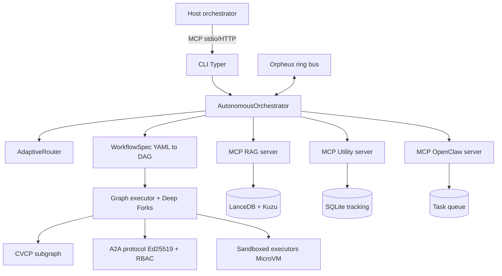
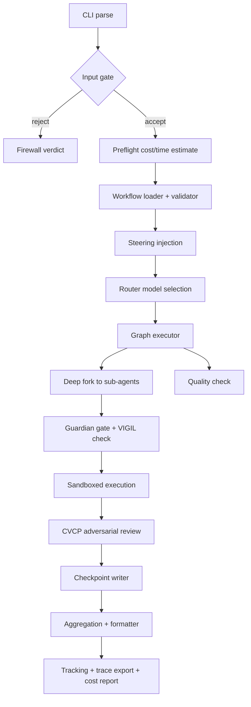
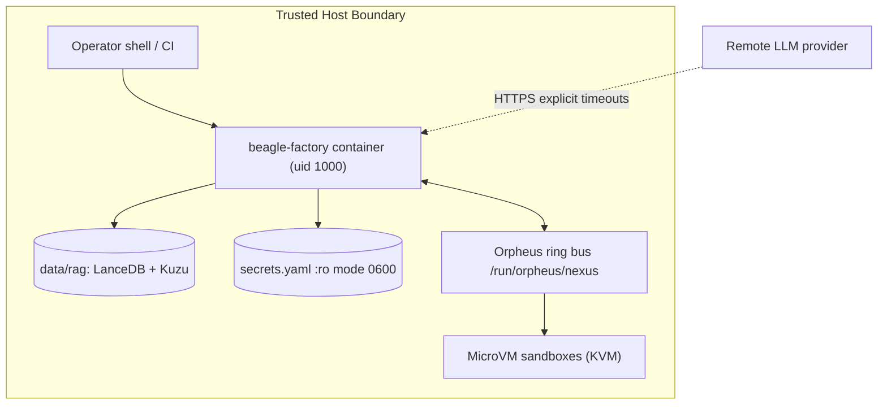

# Beagle — System Specification and Operations Manual

| Field | Value |
|---|---|
| **Document Title** | Beagle — System Specification and Operations Manual |
| **Document ID** | BEAGLE-SPEC-OPS-001 |
| **Document Version** | 1.0 |
| **Software Version** | 1.3.0 (single-sourced from `pyproject.toml [project].version`, resolved at import time by `beagle.constants._resolve_package_version()`; verify at runtime with `beagle --version`) |
| **Release Date** | 2026-08-22 |
| **System Classification** | Autonomous Multi-Agent Workflow Orchestration Engine |
| **Audience** | Platform engineers, SREs, security reviewers, integration developers |

---

## 1. Front Matter

### 1.1 Purpose and Scope

This document is the normative specification and operations reference for the
Beagle engine. It describes what the system is, how it is structured, how data
flows through it, how it is secured, and how it is operated. It does not
describe any particular deployment, model fleet, or host configuration; those
are configuration concerns external to the codebase.

### 1.2 Executive Summary

Beagle is an autonomous multi-agent workflow orchestration engine built on
LangGraph. It coordinates heterogeneous AI agents through declarative YAML/TOML
workflows executed as directed acyclic graphs (DAGs). The engine runs headless
as a backend and exposes itself to host orchestrators (such as interactive AI
harnesses) through a Typer CLI, an optional Textual TUI dashboard, and a set of
Model Context Protocol (MCP) servers.

Business value derives from five capabilities:

1. **Deterministic delegation** — workflows are declared, validated, and
   executed as graphs with checkpointing, resume, and deterministic replay.
2. **Cost governance** — every model call is metered per agent and per
   workflow against a hard USD budget; execution stops when the budget is
   exhausted.
3. **Secure autonomy** — untrusted code executes inside sandboxed executors
   (MicroVM hardware isolation when available, deny-by-default otherwise);
   all inputs pass a layered semantic firewall.
4. **Federated agents** — the Agent-to-Agent (A2A v2) protocol signs every
   inter-agent message with Ed25519 and authorises actions through
   Casbin-backed role-based access control (RBAC).
5. **Semantic code intelligence** — a hybrid retrieval-augmented generation
   (RAG) subsystem combines vector search (LanceDB) with graph traversal
   (Kùzu) over AST-parsed codebases.

The system is engineered for CPU-only hosts: heavy LLM inference is delegated
to a configured remote provider over HTTPS, and only local embedding models
run on-device.

### 1.3 Technology Stack

| Layer / Subsystem | Technology | Version / Constraint | Architectural Role |
| :--- | :--- | :--- | :--- |
| Runtime language | Python | >= 3.12 | Typed async core (`src-layout` package `src/beagle/`) |
| Graph execution | LangGraph / LangChain Core | langgraph==1.2.4; langchain-core>=1.2.22,<2 | DAG workflow execution, state transitions |
| Checkpointing | LangGraph SQLite checkpointer | langgraph-checkpoint-sqlite>=3.0.1, aiosqlite==0.22.1 | Durable workflow state, resume |
| Agent frameworks bridges | LangChain OpenAI/Anthropic/Community | 1.1.15 / 1.4.6 / 0.4.1 | LLM provider adapters |
| CLI framework | Typer + Rich + Click | typer>=0.24.0, rich==15.0.0, click==8.3.3 | Command surface and terminal rendering |
| Protocol layer | Model Context Protocol SDK | mcp==1.28.1 | Tool servers for host orchestrators |
| Vector store | LanceDB | lancedb==0.30.2 | Disk-backed embedding index for RAG |
| Graph store | Kùzu embedded graph DB | kuzu==0.11.3 | Property graph for AST relations, multi-hop traversal |
| ANN prefilter | FAISS (CPU) | faiss-cpu==1.13.2 | Candidate prefilter for vector search |
| Embeddings | sentence-transformers | >= 5.4 | Local embedding inference |
| Numerical runtime | PyTorch (CPU build only) | torch==2.11.0 via CPU index | Embedding backend; CUDA builds are prohibited |
| Quantization | TurboQuant (in-tree) | NumPy-based | 3-bit numeric KV/embedding compression |
| Coordination store | Redis client + fakeredis | redis==8.1.0, fakeredis==2.37.1 | Beacon ephemeral coordination over Unix socket |
| IPC | Orpheus shared-memory ring buffer | local C++20 wheel (not on PyPI) | Lock-free inter-process event bus |
| AuthN/AuthZ | PyJWT, PyNaCl, Casbin | PyJWT>=2.12.0, PyNaCl>=1.6.0, casbin>=1.30.0 | JWT sessions, Ed25519 signing, RBAC policy |
| Web/API | aiohttp, httpx | aiohttp==3.14.0, httpx>=0.28.0 | A2A HTTP transport, webhooks, outbound calls |
| Config/validation | Pydantic, toml, PyYAML, Jinja2 | pydantic>=2.13.3, jinja2>=3.1.6 | Schema-typed TOML configuration and templates |
| Security scanning | google-re2, defusedxml | re2 1.1.*, defusedxml>=0.7.1 | Linear-time regex secret scrubbing, safe XML parsing |
| Observability | OpenTelemetry API/SDK, structlog | otel>=1.41, structlog>=24.0.0 | Distributed tracing, structured logging |
| Metrics export | prometheus_client (optional extra) | >= 0.21.0 | Pull-based metrics endpoint |
| Search backend | ddgs | >= 9.0 | DuckDuckGo web search tooling |
| Build/packaging | setuptools + uv | uv mandatory for wheel installs | Reproducible CPU-only builds |
| Test toolchain | pytest (+ asyncio, timeout, xdist, randomly), Hypothesis | pytest>=8.0, timeout 300 s | ~3300 collected tests; property-based suites |

Optional extras (installed only when requested): `tui` (Textual dashboard),
`observability` (Prometheus exporter), `scraping` (BeautifulSoup4),
`code_parsing` (tree-sitter-languages).

---

## 2. System Architecture

### 2.1 High-Level Design

Beagle is a modular monolith with process-level decomposition at the edges.
The core orchestrator executes in one process; MCP servers, the daemon, and
sandboxed executors run as separate processes communicating over stdio (MCP),
a shared-memory ring buffer (Orpheus IPC), and Unix domain sockets (Beacon).
The structural paradigm is graph-oriented orchestration: every unit of work is
a node in a typed state graph, with conditional edges, parallel fan-out, and
persistent checkpointing.

```text
DIAGRAM 1 — SYSTEM ARCHITECTURE (logical view)

+----------------------------------------------------------------------+
|                        HOST ORCHESTRATOR                             |
|        (interactive AI harness / CI driver / human operator)         |
+----------------------------------^-----------------------------------+
                                   |  MCP protocol (stdio / authenticated HTTP+SSE)
+----------------------------------+-----------------------------------+
|                          BEAGLE ENGINE                               |
|                                                                      |
|  +---------------------+     +------------------------------------+  |
|  |   CLI (Typer)       |     |  AutonomousOrchestrator            |  |
|  |   TUI (Textual opt.)|---->|  - preflight estimator             |  |
|  +---------------------+     |  - steering manager                |  |
|                              |  - FSM state machine               |  |
|  +---------------------+     +------------------+-----------------+  |
|  |  Workflow Loader    |<---|  Router (AdaptiveRouter)           |  |
|  |  (YAML -> DAG spec) |    +------------------+-----------------+  |
|  +---------------------+                       |                    |
|                                                v                    |
|  +---------------------+     +------------------------------------+  |
|  | Skill Library /     |     |  Graph Executor (LangGraph)        |  |
|  | Block Engine        |     |  - Deep Forks (O(1) branching)     |  |
|  | (XML/Python blocks) |     |  - node fan-out / fan-in           |  |
|  +---------------------+     |  - checkpoint / resume             |  |
|                              +---+---------+---------+-----------+  |
|  +---------------------+         |         |         |              |
|  | CVCP subgraph       |<--------+         |         +------------> |  |
|  | (adversarial review)|                   |                        |  |
|  +---------------------+     +-------------v--------------------+   |  |
|                              |  A2A Protocol v2 (Ed25519+RBAC)    |   |  |
|                              +------------------------------------+   |  |
|                                                                       |  |
|  +-----------------------------------------------------------------+  |
|  |                MCP SERVER FLEET (child processes)                |  |
|  |  beagle-rag    beagle-utility    beagle-openclaw   mcp-coord     |  |
|  +-------+---------------+-----------------+---------------+--------+  |
|          |               |                 |               |           |
+----------|---------------|-----------------|---------------|-----------+
           v               v                 v               v
   +---------------+  +------------+  +-------------+  +--------------+
   | RAG STORES    |  | TRACKING   |  | TASK QUEUE  |  | BEACON       |
   | LanceDB+Kuzu  |  | SQLite DB  |  | task_store  |  | UDS journal  |
   | (~/.beagle)   |  | ~/.beagle  |  | + schedules |  | (Redis/fake) |
   +---------------+  +------------+  +-------------+  +--------------+

                   +-------------------------------------+
                   | ORPHEUS SHARED-MEMORY EVENT BUS      |
                   | lock-free rings, CRC32-checked slots |
                   +------------------^------------------+
                                      |
                   +------------------+------------------+
                   | SANDBOXED EXECUTORS                 |
                   | SandboxedExecutor (rlimits+timeout) |
                   | MicroVM (KVM) when hypervisor found |
                   +-------------------------------------+

                   +-------------------------------------+
                   | REMOTE LLM PROVIDER (HTTPS)         |
                   | all heavy inference; no local weights|
                   +-------------------------------------+
```



Key architectural decisions:

- **Headless core.** The engine exposes no GUI of its own; the TUI is an
  optional extra. Every capability is reachable from the CLI or MCP tools,
  which makes the system scriptable and container-native.
- **Fail-closed boundaries.** Input validation, the semantic firewall, and
  the sandbox refuse operation on error, timeout, or missing dependency.
  Degradation requires an explicit operator-permitted fallback and emits a
  loud WARNING.
- **Configuration as schema.** All tunables are typed fields in
  `config/schema.py`, valued in shipped TOML, resolved through a documented
  precedence chain (environment variable > user config > repo config >
  bundled wheel defaults). Hardcoded literals are forbidden and enforced by
  a CI AST gate.
- **CPU-only mandate.** The build resolves torch exclusively from the PyTorch
  CPU index; installing NVIDIA/CUDA packages is prohibited by policy and by
  `[tool.uv.sources]` routing.

### 2.2 Core Modules and Components

#### 2.2.1 Orchestration Layer (`src/beagle/core/`)

| Component | Module | Responsibility |
|---|---|---|
| AutonomousOrchestrator | `core/autonomous_orchestrator.py` | Top-level executor: budget enforcement, signal handling, post-final-answer folding |
| Graph builder / loader | `core/graph_builder.py`, `core/workflow_loader.py` | YAML/TOML workflow discovery, DAG construction, schema validation |
| Deep Forks | `core/graph.py` | O(1) structural state branching via persistent PMap/PVector; deepcopy fallback |
| AdaptiveRouter | `core/router.py` | Runtime latency/quality measurement; escalate/downgrade model per node |
| Turboboost cache (TurboQuant) | `core/turboquant.py` | 3-bit quantization of numeric vectors only; strings/bytes bypass |
| A2A protocol | `core/a2a_protocol.py`, `core/a2a_types.py` | Signed inter-agent messaging, role checks, payload limits |
| Agent spawner | `core/agent_spawner.py` | Sub-agent lifecycle over the subprocess pool with circuit breakers |
| MicroVM sandbox | `core/sandbox.py` | rlimit-bounded execution; KVM/Firecracker isolation when present |
| Steering | `steering/` | Mid-workflow directive injection: registry -> state -> prompt |
| Skill library | `core/skill_library.py`, `skills/*.xml` | Reusable XML skill modules loaded at runtime |
| Block engine | `blocks/` | Composable XML plan blocks and Python IO blocks with registry + cache |

#### 2.2.2 Context and Memory Layer

| Component | Module | Responsibility |
|---|---|---|
| Context compaction | `context/compaction_controller.py`, `context/trigger.py` | Threshold-triggered context folding (TurboQuant folds + sidecars) |
| Post-compaction rehydration | `context/post_compaction_rehydration.py` | Restores task context after a compaction event |
| Context preprocessor | `context/context_preprocessor.py` | Token-aware chunking and window management |
| Memory index | `memory/memory_index.py` | Three-layer memory (semantic / RAG detail / session) under a token budget |
| Hierarchical memory + AutoDream | `memory/hierarchical_memory.py`, `memory/autodream.py` | Tiered storage with background prune/merge/refresh consolidation |
| Session bootstrap | `infrastructure/session_memory.py` | Cross-session progress recovery (`.beagle/progress.xml`) |

#### 2.2.3 Infrastructure Layer (`src/beagle/infrastructure/`)

| Component | Module | Responsibility |
|---|---|---|
| MCP RAG server | `mcp_rag_server.py` | Hybrid vector+graph semantic search; CAST ingestion; hot-swap reindex |
| MCP Utility server | `mcp_utility_server.py` | Workflow orchestration, code tools, web search, session bootstrap |
| MCP OpenClaw server | `mcp_openclaw_server.py` | Background task queue: create/wait/cancel/schedule tasks |
| MCP Coordination server | `mcp_coord_server.py` | Beacon coordination surface for multi-agent rosters |
| MCP security middleware | `mcp_security.py` | Bearer-token verification, transport hardening, fail-closed auth |
| Orpheus ring manager | `orpheus_ring_manager.py` | Shared-memory channel allocation and watchdog supervision |
| CAST ingestion pipeline | `cast_ingestion.py` | AST parse -> chunk -> graph build -> embed -> store |
| Hot-swap ingest | `hotswap_ingest.py` | Staged reindex without database-lock contention |
| Audit logger | `audit_logger.py` | Structured audit trail for security-relevant events |
| Task store / notifier | `task_store.py`, `task_notifier.py` | Queue persistence and completion notifications/webhooks |
| Docker wrappers | `docker_agent_wrapper.py`, `Dockerfile.base`, `Dockerfile.agent` | Per-agent container packaging for cluster topologies |

#### 2.2.4 Security, Quality, and Lifecycle Layers

| Component | Module | Responsibility |
|---|---|---|
| Semantic firewall | `security/firewall.py` | Regex prompt-injection detection plus LLM semantic guard |
| Input validation | `security/validation.py` | Query validation; path containment via `Path.relative_to()` |
| AST validator | `security/ast_validator.py` | Static analysis of Python payloads before execution |
| Sanitization | `security/sanitization.py` | Secret scrubbing from logs and outputs (re2 patterns) |
| VIGIL validator | `security/vigil.py` | Verify-before-commit gate on tool outputs |
| Guardian | `guardian/` | Human-in-the-loop approval gates for consequential actions |
| CVCP | `protocols/cvcp.py` | Cross-Verification Collaboration Protocol (adversarial second pass) |
| Lifecycle | `lifecycle/` | Ordered startup, graceful shutdown, restart, restore |
| Health | `health/`, `startup/health_check.py` | Collector/monitor with thresholds; startup gate |
| SLO tracker | `slo/` | Service-level objectives, indicators, and policy evaluation |
| Cost tracker | `cost_tracker.py` | Per-model/per-workflow spend accounting against budget |
| Reproducibility | `reproducibility/` | Deterministic run recording and replay |
| Tracking DB | `tracking/database.py` | SQLite persistence of runs, nodes, findings |
| Beacon | `beacon/` | Ephemeral coordination: roster, contact, intents, append-only journal |

---

## 3. Data and State Management

### 3.1 Data Models

Core entities are Pydantic models and typed dataclasses:

| Entity | Definition site | Purpose |
|---|---|---|
| `WorkflowConfig` | `config/schema.py` | Root typed configuration tree (all sections below) |
| `WorkflowSpec` / phase DAG | `core/workflow_schema.py`, `workflow_validator.py` | Validated workflow definition (phases, dependencies, modes) |
| `GraphState` | `core/state.py` | Orchestrator state container; supports persistent-map deep forks |
| `WorkflowRun` / `NodeRun` / `Finding` | `tracking/models.py` | Persisted run telemetry and audit findings |
| `TaskRecord` | `infrastructure/task_store.py` | Queued background task with constraints and status |
| A2A message types | `core/a2a_types.py` | Signed envelopes, capabilities, role bindings |
| `AgentRecord` roster | `beacon/records.py` | Live agent roster entries for coordination |
| Journal records | `beacon/journal.py` | Append-only op/key/args entries with replay validation |

### 3.2 Persistence Layer

| Store | Technology | Location (default) | Contents |
|---|---|---|---|
| Workflow checkpoints | SQLite via `langgraph-checkpoint-sqlite` | `BEAGLE_CHECKPOINT_DIR` | Resumable graph state snapshots |
| Tracking database | SQLite (aiosqlite, WAL) | `~/.beagle/tracking.db` | Runs, node executions, findings, cost rows |
| Vector index | LanceDB | `BEAGLE_KNOWLEDGE_DIR` | Embedded AST chunks (nomic-class embeddings) |
| Graph index | Kùzu embedded DB | alongside vector store | AST node/relation property graph |
| FAISS prefilter | flat index file | alongside vector store | Candidate shortlists for hybrid search |
| Task queue | JSON/file-backed store | `BEAGLE_DATA_ROOT` | Pending/running/completed task records |
| Beacon journal | append-only text + rotation | workdir `.beacon/` (per instance) | Coordination ops; size/count rotation; fsync timer |
| Coordination store | Redis/fakeredis over Unix socket | instance-scoped socket | Ephemeral roster/contact/intent state |
| Secrets file | YAML, mode 0600/0400 enforced | `~/.config/goose/secrets.yaml` | Credential chain fallback (env vars first) |
| Progress markers | XML sidecar | `.beagle/progress.xml` | Cross-session resumability |
| Replay archive | recorded run bundles | `BEAGLE_REPLAY_DIR` | Deterministic replay inputs |

State-management properties:

- **Deep Fork semantics.** Branching copies nothing on fork; writes copy only
  the modified path (structural sharing). With `pyrsistent` absent the engine
  degrades to full deepcopy and logs the degradation.
- **Durability.** Checkpoints and tracking writes are crash-safe (fsync +
  atomic rename); the Beacon journal rotates at configured byte/file limits
  and replays line-by-line with schema-drift skip.
- **Retention.** Compacted context is folded into queryable TurboQuant
  sidecars rather than discarded; memory consolidation prunes and merges
  tiers in the background.

### 3.3 Data and Control Flow

```text
DIAGRAM 2 — DATA/CONTROL FLOW (one workflow execution)

 Operator          Engine processes                         Stores
 --------          -------------------------------          ------
    |
    |  beagle run <wf> "<query>"
    v
 [CLI parse]
    |
    v               validate_query()  --reject--> firewall verdict
 [Input Gate] <--------------------------------------------------
    |
    v
 [Preflight] --- cost/time estimate ---> confirm or abort
    |
    v
 [Loader]  YAML/TOML --> WorkflowSpec --> validator
    |
    v
 [Steering] constraints --> graph state --> prompts
    |
    v
 [Router] pick model per node (adaptive latency/quality)
    |
    v
 +----------------- GRAPH EXECUTOR (LangGraph) -----------------+
 |                                                              |
 |  hydrate --> generate --> interact --> quality_check         |
 |      ^                                  |                    |
 |      +----- retry / branch <------------+                    |
 |                                                              |
 |  parallel branch path:                                       |
 |    deep fork (O(1)) -> sub-agents (messages signed via A2A)  |
 |    agent tool calls -> Guardian gate -> VIGIL verification   |
 |    untrusted code    -> SandboxedExecutor (rlimit/MicroVM)   |
 |    consequential changes -> CVCP adversarial review          |
 +--------------------------------------------------------------+
                         |
                         v
        [Checkpoint writer] ------> SQLite checkpoints
                         |
                         v
        [Aggregation] --> output formatter (markdown/json/sarif)
                         |
                         v
        [Tracking recorder] ------> SQLite tracking DB
        [Trace exporter]   ------> OTLP endpoint
        [Cost report]      ------> budget ledger
```



Failure paths: any node failure is recorded with correlation ID, retried
within policy, then escalated; SIGINT yields exit code 130 and leaves a valid
checkpoint for `beagle run --resume`.

---

## 4. Interfaces and Integration

### 4.1 Command-Line Interface

Entry points (from `pyproject.toml [project.scripts]`): `beagle` and legacy
alias `goose-workflow`, both bound to `beagle.cli.cli:main`.

```bash
# Execute a workflow (10 shipped workflows)
beagle run research "Investigate authentication patterns" --budget 5.0
beagle run audit "Find hardcoded secrets" --mode audit --dry-run
beagle run security "Scan the codebase" --headless --output-format json -o scan.json

# Diagnostics and health
beagle doctor [--json]
beagle health [--json] [--required-only]

# Configuration
beagle config show [--json]
beagle config validate
beagle config init [--force]

# Run history, checkpoints, replay, statistics
beagle stats [--json]
beagle checkpoint list | show <id> | delete <id>
beagle replay <run_id> [--dry-run]
beagle visualize <workflow_name>

# Long-lived service mode
beagle daemon start | stop | status

# Coordination (Beacon)
beagle coord status
beagle coord watch

# Doctrine rendering (regenerates prompt-substrate artefacts)
beagle render-prompts
beagle render-hints
```

Selected `beagle run` options:

| Option | Default | Description |
|---|---|---|
| `--budget, -b` | 10.0 USD | Hard spend ceiling; execution stops when reached |
| `--resume` | — | Resume from a printed checkpoint ID |
| `--estimate, -e` | off | Show cost estimate without executing |
| `--auto-approve` / `--approve-all` | off | Bypass approval gates (use with care) |
| `--steering, -s` | — | Global steering prompt injected into all agents |
| `--mode, -m` | per workflow | `audit` (read-only) / `develop` (read-write) / `research` |
| `--tui` | off | Attach the reactive dashboard |
| `--headless` | off | Non-interactive CI mode |
| `--output-format, -f` | markdown | `markdown` \| `json` \| `sarif` \| `github-issues` |
| `--output, -o` | stdout | Write the report to a file |
| `--dry-run` | off | Print plan (graph, cost, agents) without executing |

Exit codes: `0` success; `1` generic failure or failed required health check;
`2` misuse; `130` SIGINT.

### 4.2 MCP Tool Servers

All four servers are launched as child processes over stdio by default;
authenticated HTTP/SSE transport is available behind mandatory bearer auth
(`BEAGLE_MCP_AUTH_ENABLED`, `BEAGLE_MCP_TOKEN`, `BEAGLE_MCP_REQUIRE_HTTPS`).

| Server | Launch module | Representative tools |
|---|---|---|
| `beagle-rag` | `python -m beagle.infrastructure.mcp_rag_server` | `rag_search`, `rag_ingest`, hot-swap ingest + job status, rollback, `graph_callees/callers/imports/dependents/class_hierarchy`, `rag_status`, `get_metrics`, `health_check` |
| `beagle-utility` | `python -m beagle.infrastructure.mcp_utility_server` | `run_beagle_workflow`, `route_query_to_workflow`, `web_search`, `web_research`, `arxiv_search`, `code_search`, `code_context`, `file_discovery`, `beagle_session_bootstrap`, `beagle_progress_update`, `check_and_fold_context`, `query_fold` |
| `beagle-openclaw` | `python -m beagle.infrastructure.mcp_openclaw_server` | `openclaw_create_task`, `openclaw_wait_for_task`, `openclaw_cancel_task`, `openclaw_list_tasks`, `openclaw_schedule_task`, `openclaw_subscribe_task` |
| `mcp-coord` | `python -m beagle.infrastructure.mcp_coord_server` | Beacon roster/coordination tools backing `beagle coord` |

MCP input schemas are hardened (`additionalProperties: false`) by
`hardening/mcp_schema_hardener.py`; per-endpoint rate limiting activates with
`BEAGLE_MULTI_TENANT`.

### 4.3 Network Endpoints

| Endpoint | Transport | Port / Path | Access Control |
|---|---|---|---|
| A2A federation server | HTTP (aiohttp) | 8420 (container `EXPOSE`) | Ed25519-signed messages; JWT; Casbin RBAC; unbound identities default to read-only `observer` |
| MCP HTTP/SSE transport | HTTPS (mandatory TLS when remote) | configurable bind address (`BEAGLE_MCP_BIND_ADDRESS`) | Bearer token required; plain HTTP refused when `BEAGLE_MCP_REQUIRE_HTTPS` is set |
| Prometheus exporter (optional) | HTTP pull | `BEAGLE_PROMETHEUS_PORT` | Bind locally; no auth on this scrape port — expose only on a trusted interface |
| Orpheus bus | POSIX shared memory | `/run/orpheus/nexus` | Host-local only; CRC32 integrity per slot |
| Beacon coordination | Redis protocol over Unix domain socket | instance-scoped socket path | Socket permissions scope access to the instance owner |
| Webhooks (task completion) | Outbound HTTPS | destination-configured | Signature headers; delivery via `webhooks.py` |

### 4.4 Workflow Catalog

| Workflow | Mode | Purpose |
|---|---|---|
| `research` | read-only | Multi-agent investigation and synthesis |
| `deep-planning` | read-only | Parallel discovery, adversarial critique, risk-mitigated master plan |
| `develop` | read-write | Feature implementation end-to-end |
| `self-improvement` | read-write | Doctrine/config improvement cycles |
| `devops` | read-write | Infrastructure and deployment automation |
| `db-migration` | read-write | Expand/contract schema migration planning and application |
| `audit` | read-only | Evidence-based codebase audit with severity ranking |
| `security` | read-only | Vulnerability review and hardening recommendations |
| `incident` | read-only | Incident triage, root cause, remediation |
| `verify` | read-only | Verification-gate execution on a working diff |

### 4.5 External Dependencies

| Dependency | Interface | Failure Behaviour |
|---|---|---|
| Remote LLM provider (e.g. Ollama Cloud, OpenAI-compatible) | HTTPS | Calls carry explicit timeouts; circuit breaker per model; no local weight fallback |
| PyTorch CPU index (`download.pytorch.org/whl/cpu`) | Package index at install time | Build fails closed rather than resolving GPU torch |
| DuckDuckGo (`ddgs`) | HTTPS search API | Tool returns explicit "not installed/degraded" error; declared hard dep |
| arXiv API | HTTPS | Search tool reports transport errors; bounded results |
| Firecracker/KVM (optional) | `/dev/kvm` presence probe | Sandbox refuses execution unless operator permits fallback (loud WARNING) |

---

## 5. Security and Access Control

### 5.1 Threat-Posture Overview

Beagle assumes the host is trusted and treats model output, fetched web
content, and submitted code as untrusted. Defence is layered and fail-closed:
any error, timeout, or missing component at a boundary blocks the operation
rather than proceeding degraded.

```text
is_payload_executable(p) = passes_ast_validation(p)
                           AND passes_firewall(p)
                           AND sandbox_available()
                           AND (microvm_present() OR allow_fallback = TRUE)

where:
  passes_ast_validation  static syntax/construct screen before any execution
  passes_firewall        regex + optional LLM semantic injection screen
  sandbox_available()    resource-limited executor can be constructed
  microvm_present()      hypervisor AND /dev/kvm detected on host
  allow_fallback         operator-explicit permission to run without MicroVM
```

### 5.2 Authentication and Authorisation

| Mechanism | Implementation | Notes |
|---|---|---|
| MCP transport auth | Bearer token middleware (`mcp_security.py`) | Fail-closed: missing/misconfigured token disables remote transport; stdio unaffected |
| A2A message signing | Ed25519 via PyNaCl | Missing key raises `RuntimeError`; signatures verified before dispatch |
| Session tokens | JWT (`auth/jwt.py`) | Used for HTTP surfaces and tenant scoping |
| RBAC | Casbin policies (`auth/rbac.py`) | Wildcards (`*`, `a2a:*`) are matching syntax; default role for unbound identities is read-only `observer` |
| Tenant isolation | `auth/tenant.py` + `BEAGLE_MULTI_TENANT` | Per-tenant rate limiting and namespace separation on MCP endpoints |
| Human-in-the-loop | Guardian approval gates | `require_approval` phases halt pending explicit approval unless overridden |
| Tool-output trust | VIGIL verify-before-commit | Outputs from tools are validated before entering durable state |

### 5.3 Secret Management

- Resolution chain (`secrets_loader.py`): process environment first, then
  `~/.config/goose/secrets.yaml`; the file must be mode `0600` or `0400` and
  the loader verifies permissions.
- Scrubbing: `security/sanitization.py` removes secret-shaped strings
  (minimum 20 characters) from logs and reports using linear-time re2
  patterns; log messages reference binaries by `Path.name`, never full path.
- Container deployments mount the secrets file read-only
  (`:ro`) and never bake secrets into images; generated compose files unset
  inherited `DOCKER_HOST` to prevent socket inheritance.
- No hardcoded credentials: repository-wide scans (`test_secret_leakage_audit`,
  bandit, pip-audit) run in CI quality gates.

### 5.4 Input Validation and Execution Isolation

- `validate_query()`: length limits, prompt-injection patterns, shell
  metacharacter screening, internal-tag injection screening, optional LLM
  semantic evaluation.
- `validate_file_path()`: null-byte rejection, `..` traversal rejection,
  containment enforced with `Path.relative_to()` (never prefix string
  comparison), symlink resolution, sensitive-path denylist.
- SQL/Cypher: parameterised queries only; dynamic identifiers use frozenset
  allowlists.
- Deserialisation guard blocks unsafe pickle/YAML load paths on untrusted
  input; XML parses exclusively through defusedxml.
- Execution isolation: `SandboxedExecutor` applies timeouts and rlimits;
  `MicroVMSandbox` adds KVM hardware isolation when available and refuses to
  execute otherwise (deny-by-default).

---

## 6. Observability and Telemetry

### 6.1 Logging and Correlation

Every request carries a correlation ID propagated through all log lines and
span attributes:

```text
%(asctime)s [%(name)s] [%(correlation_id)s] %(levelname)s: %(message)s
```

Logging discipline: one logger per module named `Beagle.<module_path>`;
structured JSON logging available via `BEAGLE_LOG_JSON`; level controlled by
`BEAGLE_LOG_LEVEL` (default INFO). Library code never prints to stdout.
Security-relevant events additionally flow to the dedicated audit logger.

### 6.2 Metrics

Automatic counters/timers wrap every MCP tool call:

| Metric | Description |
|---|---|
| `requests.total` / `requests.success` / `requests.error` | Call volumes by outcome |
| `latency.sum` / `latency.count` / `latency.min` / `latency.max` | Latency aggregates per tool |

Retrieval: `get_metrics` MCP tool (both RAG and utility servers), programmatic
metrics module, and the optional Prometheus exporter enabled by setting
`BEAGLE_PROMETHEUS_PORT`.

### 6.3 Distributed Tracing

OpenTelemetry spans cover workflow phases, agent calls, and GenAI semantics
(`observability/tracing.py`, `observability/genai.py`); OTLP export is
configured in the `[tracing]` section. An optional LangSmith bridge mirrors
spans for LLM-focused dashboards. Deterministic replay (`reproducibility/`)
provides after-the-fact reconstruction of any recorded run.

### 6.4 Health Checks and SLOs

| Check | Invocation | Scope |
|---|---|---|
| Startup gate | automatic at CLI boot; `beagle health [--required-only]` | Critical dependencies, config validity, feature flags |
| Full diagnostic | `beagle doctor [--json]` | Version SSOT, platform, key packages, re2 availability, workflow inventory |
| MCP server health | `health_check` tools per server | Store connectivity (LanceDB, Kùzu), embedding model, cache, memory |
| Daemon supervision | `beagle daemon status` | Long-lived service liveness |
| SLO tracking | `slo/` subsystem + `beagle slo` commands | Objective compliance, indicator burn rates |

### 6.5 Cost Governance

The cost tracker meters tokens and USD per model call, per agent, per
workflow; budgets come from `[budget]` config, `BEAGLE_BUDGET_USD`, or
`--budget`. Preflight estimation predicts cost/time before execution;
enforcement stops the run at the ceiling and records the overrun in the
tracking database.

---

## 7. Operational Runbook

### 7.1 Prerequisites

| Requirement | Minimum | Notes |
|---|---|---|
| Operating system | Linux x86_64 (tested Ubuntu 24.04+) | macOS works for development; MicroVM path is Linux-only |
| Python | 3.12 – 3.14 (`requires-python = ">=3.12"`) | 3.13 recommended |
| uv | latest | Mandatory for build/install; bare `pip` is rejected by PEP 668 marking |
| Git | any recent | Source checkout |
| Optional: KVM + Firecracker | kernel with `/dev/kvm` | Enables MicroVM isolation; absence triggers deny-by-default refusal for untrusted code |
| Optional: Docker + Compose | stable | Only for the containerised deployment path |
| Network egress | HTTPS | Remote LLM provider, package indexes, search/arXiv APIs |

### 7.2 Local Development Setup

```bash
# 1. Clone
git clone https://github.com/MattCreigh/beagle.git
cd beagle

# 2. Create/activate a virtual environment (Python >= 3.12)
python3 -m venv .venv && source .venv/bin/activate

# 3. Build the wheel from source (SSOT version stamping)
make build            # equivalent to: uv build

# 4. Install the wheel WITHOUT dependency resolution (--no-deps is mandatory:
#    unrestricted resolution pulls the ~3.5 GB GPU torch stack onto CPU hosts)
uv pip install --reinstall --no-deps dist/beagle-*.whl
uv pip install -r requirements.lock --no-deps

# 5. Development dependencies (non-editable by design: the deployed tree stays
#    on the frozen wheel; see Makefile target comments)
make dev-deps

# 6. Verify the installation
beagle --version
beagle doctor
```

Reproducible locked install alternative: `make locked-install`
(uses `requirements.lock`; regenerate with `make freeze-requirements`).

Quality gates during development:

```bash
make lint          # ruff + repo-specific consistency scripts
make typecheck     # mypy (zero-error gate)
make vulture       # dead-code scan
make banned        # banned-pattern grep gate (utcnow, shell=True, truncated uuid...)
make test          # full suite via project testpaths (timeout 300 s per test)
make qa            # lint + banned + test
make pip-audit     # known-CVE audit of requirements.txt (strict)
```

Test execution guidance: the suite collects roughly 3,300 tests. Prefer a
targeted selection (for example `pytest tests/test_security.py -q`) during
iteration; use `tup` as the canonical runner where available so failures are
formatted for diagnosis. Coverage floor: 60 % (`fail_under = 60`).

### 7.3 Environment Configuration

Precedence everywhere: OS environment variable > user config root > repo
config > bundled wheel defaults. The configuration root resolver order is:
`$BEAGLE_CONFIG_ROOT`, platform user-config directory, repo-local config,
bundled `default_config/`.

Core runtime variables:

| Variable | Purpose | Default / Constraint |
|---|---|---|
| `BEAGLE_CONFIG_ROOT` | Configuration root override | unset -> resolver chain |
| `BEAGLE_CONFIG_PATH` | Direct `config.toml` path override | repo root |
| `BEAGLE_DATA_ROOT` | Runtime state directory | `~/.beagle/` |
| `BEAGLE_KNOWLEDGE_DIR` | RAG store location (LanceDB + Kuzu) | under data root |
| `BEAGLE_CHECKPOINT_DIR` | Workflow checkpoint storage | under data root/cache |
| `BEAGLE_REPLAY_DIR` | Recorded-run replay archives | under data root |
| `BEAGLE_PROJECT_ROOT` | Explicit workspace/project root | cwd |
| `BEAGLE_EXECUTION_ENV` | Execution context marker (`host`, `docker`) | `host` |
| `GOOSE_AUTO_COMPACT_THRESHOLD` | Compaction trigger fraction (0-1) | REQUIRED in deployments; asserted at CLI startup |
| `BEAGLE_MEMORY_INDEX_TOKEN_BUDGET` | Semantic-layer context budget | 2000 (values below 500 clamped) |
| `BEAGLE_READONLY_MODE` | Forbid mutating operations | off |
| `BEAGLE_SKIP_HYDRATION` | Skip auto-hydration lookups | off |
| `BEAGLE_SECRET_CACHE_TTL` | Secrets-cache lifetime | tuned default |
| `BEAGLE_CACHE_ENABLED` | Enable response caching | on |

Inference and budget variables:

| Variable | Purpose | Default |
|---|---|---|
| `GOOSE_PROVIDER` | LLM provider override | `ollama_cloud` |
| `GOOSE_MODEL` | Primary model override | config-resolved chain |
| `GOOSE_BIN` | Host orchestrator binary path | PATH lookup |
| `GOOSE_HOST` | Remote orchestrator host | local |
| `BEAGLE_BUDGET_USD` | Default spend ceiling | 10.0 (negative values rejected) |
| `BEAGLE_RAG_TIER` | Retrieval tier selection | config default |
| `BEAGLE_NAMESPACE` | Instance namespace for shared resources | derived |

Security and observability variables:

| Variable | Purpose | Default |
|---|---|---|
| `BEAGLE_MCP_AUTH_ENABLED` | Require bearer auth on MCP transports | off (stdio needs none) |
| `BEAGLE_MCP_TOKEN` | Shared bearer token for MCP HTTP/SSE | unset -> remote transport refused |
| `BEAGLE_MCP_TRANSPORT` | `stdio` \| `http` \| `sse` | `stdio` |
| `BEAGLE_MCP_REQUIRE_HTTPS` | Refuse plaintext remote transports | on for remote |
| `BEAGLE_MCP_BIND_ADDRESS` | Bind address for HTTP/SSE servers | loopback |
| `BEAGLE_MULTI_TENANT` | Per-tenant rate limiting | off |
| `BEAGLE_PROMETHEUS_PORT` | Start Prometheus exporter on port | not set |
| `BEAGLE_LOG_LEVEL` | Log verbosity (`DEBUG`..`CRITICAL`) | `INFO` |
| `BEAGLE_LOG_JSON` | Structured JSON log lines | off |
| `BEAGLE_LICENSE_KEY` | Reserved licensing hook | not set |

### 7.4 Configuration Parameters (selected `[coord]` section)

All tunables live in schema-typed config, never at call sites (CI-enforced).
Coordination defaults as shipped:

| Key | Default | Read by |
|---|---|---|
| `probe_timeout_s` | 1.0 | `beagle coord status/watch` roster probes |
| `watch_poll_interval_s` | 2.0 | `beagle coord watch` refresh loop |
| `connect_timeout_s` | 2.0 | Store attach path |
| `archive_max_bytes` | 1073741824 | Journal rotation threshold |
| `archive_max_files` | 30 | Journal rotation count |
| `journal_fsync_interval_s` | 2.0 | Write-behind fsync timer |

Other principal sections: `[orchestrator]`, `[router]`, `[rag]`,
`[security]`, `[tracing]`, `[memory]`, `[embed]`, `[budget]`, `[cache]`,
`[logging]`. Inspect the authoritative schema with:

```bash
beagle config schema      # full typed schema with constraints
beagle config show        # resolved effective config, secrets redacted
```

### 7.5 Production Deployment

Two supported production shapes exist: a long-lived daemon on a trusted host,
or a container image produced by the in-repo factory pipeline.

Path A — daemon (recommended for single-host):

```bash
beagle daemon start
beagle daemon status
beagle daemon stop
```

The daemon owns Orpheus IPC setup, RAG connections, and the cost tracker
across CLI invocations.

Path B — containerised image:

```bash
cd beagle_containerisation
python3 -m beagle_dockeriser deploy          # validate -> build wheel -> generate artefacts -> image
docker compose -f docker-compose.yaml up -d  # launch (binds 127.0.0.1:8420)
curl http://127.0.0.1:8420/health || docker logs beagle-factory
```

Factory guarantees: multi-stage `python:3.12-slim` image (<200 MB),
non-root `beagle_user` (UID/GID 1000), CPU-only torch installed explicitly
before the wheel so resolution cannot substitute the CUDA build, secrets
mounted read-only only, auto-generated `.dockerignore` excluding venvs and
`.git`, healthcheck `import beagle` every 30 s, `SIGTERM` graceful stop.

For clustered agent topologies, `src/beagle/infrastructure/docker-compose.yml`
deploys the Orpheus daemon plus per-role agent containers (orchestrator,
planner, executor, verifier, synthesizer) on a private network with pinned
image tags, health-conditioned startup ordering, and resource limits.

```text
DIAGRAM 3 - DEPLOYMENT / INFRASTRUCTURE TOPOLOGY

Trusted host boundary: everything below runs host-local.
=========================================================

  Operator shell / CI            beagle-factory container
  beagle CLI                     python:3.12-slim, non-root 1000
        |  exec                   ENTRYPOINT ["beagle"]
        +-----------------------> EXPOSE 8420 (A2A federation)
                                 HEALTHCHECK import-beagle 30s
                                   |                   |
                         mounts    |                   |  reads
                                   v                   v
                    +------------------+  +--------------------+
                    | data/rag volume  |  | secrets.yaml (:ro) |
                    | LanceDB + Kuzu   |  | mode 0600 enforced |
                    +------------------+  +--------------------+

  MCP clients / host harness --stdio--> engine (bearer auth on HTTP/SSE)

  +----------------------------------------------------------+
  | ORPHEUS SHARED-MEMORY BUS     /run/orpheus/nexus          |
  | rings: orch -> planner -> executor -> verifier -> synth   |
  +----------------------------------------------------------+
                             |
                             v
                  +---------------------------+
                  | MICROVM SANDBOXES (KVM)   |
                  | untrusted code only       |
                  +---------------------------+
                             |  egress: HTTPS, explicit timeouts
                             v
                  +---------------------------+
                  | REMOTE LLM PROVIDER       |
                  | all heavy inference       |
                  +---------------------------+

```



Deployment invariants:

- The host boundary is trusted; everything beyond it (model output, fetched
  content) is untrusted input subject to the Section 5 gates.
- No Docker socket is ever mounted into any Beagle container; IPC is
  exclusively the Orpheus ring buffer.
- Heavy inference never runs on-host; only embedding models execute locally
  on CPU.
- Ring channels are sized 1-4 MiB; the verifier-to-synthesizer channel is
  fixed at 2 MiB for verified-facts headroom.
- The watchdog (`scripts/beagle_watchdog.py`, cron via
  `scripts/beagle_watchdog.cron`) supervises session hygiene and progress-file
  staleness.

### 7.6 Upgrade Procedure

```bash
git pull                                   # fetch the new revision
make build                                 # rebuild the wheel (new SSOT version)
uv pip install --reinstall --no-deps dist/beagle-*.whl
uv pip install -r requirements.lock --no-deps
beagle doctor && beagle health --required-only
beagle daemon restart                      # if running the daemon shape
```

Rollback: reinstall the previous wheel artifact from a retained `dist/`;
checkpointed runs remain resumable across versions within the same major
line. For containerised estates, retag and redeploy the prior image digest.

### 7.7 Known Operational Hazards

| Hazard | Symptom | Response |
|---|---|---|
| Blind process termination | MCP tool surface vanishes mid-session | Never `pkill -f python`; identify PIDs via `ps -p <pid> -o args=` and exclude `mcp_*_server` processes; restart the front-end instead |
| RAG reindex lock contention | Ingest fails with Kuzu/LanceDB lock errors while the RAG server is live | Use hot-swap ingest (staged swap with backup + rollback) instead of direct ingest |
| Bare-pip install attempt | `externally-managed-environment` error | Always route installs through uv against the target virtualenv |
| GPU torch contamination | Multi-GB nvidia packages appear in the environment | Reinstall with `--no-deps` from the CPU index; verify `torch` provenance |
| Missing compaction threshold env var | CLI startup assertion failure | Export `GOOSE_AUTO_COMPACT_THRESHOLD` (for example 0.7) in the service environment |
| Unhandled 301 from a provider | Silent empty responses | Update the base URL to the canonical host; redirects are not followed silently |

---

## 8. Compliance and Verification Matrix

| Claim in this manual | Verified against |
|---|---|
| Version 1.3.0 SSOT | `pyproject.toml [project].version`; `constants._resolve_package_version()`; `make build` output naming |
| Entry points `beagle`, `goose-workflow` | `pyproject.toml [project.scripts]` |
| Ten shipped workflows | `docs/CLI.md` workflow enumeration |
| Four MCP servers | `src/beagle/infrastructure/mcp_{rag,utility,openclaw,coord}_server.py` `__main__` blocks |
| Coordination defaults table | `docs/CONFIG_DEFAULTS.md` (schema-typed, parity-tested) |
| Exit codes 0/1/2/130 | `docs/CLI.md` exit-code table |
| Container contract (port 8420, non-root, healthcheck) | `beagle_containerisation/Dockerfile`, `docker-compose.yaml` |
| Environment variables | `docs/CLI.md`, `config/env_overrides.py`, repository-wide symbol census |
| Security controls | `docs/SECURITY.md`, `src/beagle/security/*`, `auth/*`, threat-model docs |
| Observability contract | `docs/OBSERVABILITY.md`, `observability/`, `Makefile` gates |

*End of document.*
