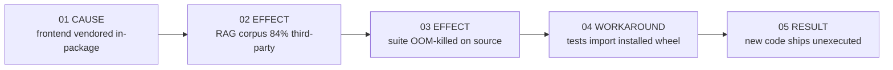

# Release Readiness Code Audit — Beagle 1.4.1 (feat/cpu-torch-index @ 625a03f)

**Date:** 2026-08-29
**Scope:** Code only. Strings and comments were excluded from defect analysis and
are cited only as evidence of intent.
**Verdict:** **NO-GO** — 2 critical, 8 high, 7 medium, 3 low.
**Remediation contract:** `plans/beagle-1.4.1-release-remediation.xml`

Every finding below was reproduced by running it. Claims that could not be
executed are labelled as read-only citations.

---

## Executive summary

Beagle's mature code is excellent. Its newest code is not, and the reason the
difference went unnoticed is that the test suite has never executed the source
tree.

Two defects block release. **D-01** crashes every DAG workflow at its first
node. **D-02** exposes unauthenticated workflow execution on `0.0.0.0`. Both are
present in the deployed artifact at `/opt/beagle/beagle_venv`, not only in the
working tree.

The infrastructural finding underneath them is **D-05**: `tests/conftest.py`
inserts the repository root into `sys.path` when the package lives under `src/`,
so all 3368 tests import the *installed* package. Pointed at the source tree,
the suite is OOM-killed by the kernel.

Beagle's own 391 Python modules produce **23 ruff findings** across 108 727
lines. The defects are not distributed. They cluster in `fault_recovery/`,
`frontends/webui/`, and `cli/commands/pi.py` — the code that no test covers and
no gate has run.

| Measure | Value |
| --- | ---: |
| Ruff findings, Beagle's own Python | 23 |
| Findings, full gate over `src/` | 27 504 |
| Tests covering `fault_recovery` | 0 |
| OOM kills running the suite on source | 2 |
| Vendored frontend inside the package | 459 MB |

---

## How the failure chain closes

The findings are not independent. One structural decision disables the gates
that would have caught the others.

```text
  ┌──────────────┐   ┌──────────────┐   ┌──────────────┐
  │ 01 CAUSE     │   │ 02 EFFECT    │   │ 03 EFFECT    │
  │ frontend     │──▶│ RAG corpus   │──▶│ suite OOM-   │
  │ vendored     │   │ 84% third-   │   │ killed on    │
  │ in-package   │   │ party        │   │ source       │
  └──────────────┘   └──────────────┘   └──────┬───────┘
                                               │
                     ┌──────────────┐   ┌──────▼───────┐
                     │ 05 RESULT    │   │ 04 WORKAROUND│
                     │ new code     │◀──│ tests import │
                     │ ships un-    │   │ installed    │
                     │ executed     │   │ wheel        │
                     └──────────────┘   └──────────────┘
```



Removing `frontends/` from the package restores the lint gate to a runnable
23-finding check and lets the suite run against the tree it validates.

---

## Software error list

Severity is likelihood × impact.

| ID | Sev | Risk | Defect | Evidence | Status |
| --- | --- | --- | --- | --- | --- |
| D-01 | Critical | Certain × Catastrophic | `await self._get_outbox()` raises an uncaught `AttributeError`; every workflow aborts at its first node | `core/autonomous_orchestrator.py:960` | CLOSED f221384 |
| D-02 | Critical | Likely × Catastrophic | Unauthenticated `POST /api/workflows/{id}/execute` bound to `0.0.0.0` by default | `frontends/webui/server.py:314,385-399,405`; `cli/commands/webui.py:25` | CLOSED f221384 |
| D-03 | High | Certain × Major | `json` used but never imported — `NameError` at runtime, 2 × `F821` | `fault_recovery/dlq.py:256,275` | CLOSED 25b63ab |
| D-04 | High | Certain × Major | Test suite OOM-killed against source; a production re-ingest daemon starts mid-run | `context/rag_staleness.py:540,563-575` | CLOSED d5cf526 |
| D-05 | High | Certain × Major | `conftest.py` adds the repo root, not `src/` — all tests import the installed wheel | `tests/conftest.py:17-22` | CLOSED d5cf526 |
| D-06 | High | Likely × Major | Daemon recurses instead of looping on error; replays the whole stream each time | `fault_recovery/reconciliation.py:302-308` | CLOSED 25b63ab |
| D-07 | High | Possible × Major | Redis client has no socket timeout; a hung Redis blocks the workflow | `fault_recovery/outbox.py:113` | CLOSED 25b63ab |
| D-08 | High | Likely × Major | Stream never trimmed; pending entries never reclaimed; shared consumer name breaks ordering | `fault_recovery/outbox.py:170,262-296` | CLOSED 25b63ab |
| D-09 | High | Certain × Major | Sandbox reports a WASM verdict it never computed | `fault_recovery/sandbox.py:122-129` | CLOSED 25b63ab |
| D-10 | High | Certain × Moderate | `[sandbox] mode` is inert — the config key does not exist | `fault_recovery/sandbox.py:41` | CLOSED fb684e3 |
| D-11 | High | Certain × Moderate | `beagle pi` does not exist; the command is never registered | `cli/commands/pi.py:22` vs `cli/cli.py:24-67` | CLOSED d04308d |
| D-12 | Medium | Certain × Moderate | `Argument(None)` for `list[str]` → `TypeError` on no-arg invocation | `cli/commands/pi.py:60,84` | CLOSED d04308d |
| D-13 | Medium | Certain × Minor | Source-checkout fallback paths off by one `.parent`; both branches unreachable | `cli/commands/pi.py:36,52` | CLOSED d04308d |
| D-14 | Medium | Possible × Moderate | Sentinel returns `False` where callers expect `None` | `core/autonomous_orchestrator.py:170-187` | CLOSED f221384 |
| D-15 | Medium | Possible × Moderate | `create_task` handle discarded; the run may be garbage-collected | `frontends/webui/server.py:337` | CLOSED b444319 |
| D-16 | Medium | Certain × Major | Zero tests reference the fault-recovery package | `tests/` | CLOSED 25b63ab |
| D-17 | Medium | Certain × Moderate | 10 mutual package cycles; `security` imports `runtime` at module scope | `security/firewall.py:19` | OPEN |
| D-18 | Medium | Certain × Major | Vendored frontend makes the lint gate unusable | `src/beagle/frontends/` | CLOSED |
| D-19 | Medium | Likely × Minor | `close()` closes only the calling thread's connection; descriptors leak | `fault_recovery/dlq.py:259`; `reconciliation.py:196`; `infrastructure/task_store.py:98` | CLOSED 25b63ab |
| D-20 | Low | Certain × Insignificant | 12 `BLE001` doctrine-floor findings; 23 ruff findings; 297 `type: ignore` | tree-wide | OPEN — see `scripts/check_quality_ratchet.py` |

Notes on the `Status` column:

- A `CLOSED <sha>` row names a commit that touches the file in that row's
  `Evidence` column, checked with `git log --oneline -- <path>`.
- **D-18** is `CLOSED` with no sha on purpose: the fix is a deletion of
  `src/beagle/frontends/` that a parallel session holds staged and
  uncommitted at the time of writing. Once that commit lands, replace the
  bare `CLOSED` with its sha. It is not `OPEN` — the tree no longer carries
  the directory and the lint gate no longer sees it.
- **D-17** is genuinely open: `security/firewall.py` still imports
  `beagle.runtime` at module scope.
- **D-20** is a ratchet, not a bug fix. It is tracked by
  `scripts/check_quality_ratchet.py`, whose `--report` mode prints the live
  count against the baseline for every metric.

### Reproduction evidence

**D-01** — `/opt/beagle/beagle_venv/bin/python3`, source tree on path:

```text
module _get_outbox coroutine?  False
DAGOrchestrator has _get_outbox: False
RAISED: AttributeError -> 'Probe' object has no attribute '_get_outbox'
```

Line 960 sits between the `except` ending at 954 and the `try` opening at 962,
so nothing catches it. `run()` wraps `_run_inner()` in `try/finally` with no
`except`, so the error leaves the public entry point.

**D-03**:

```text
$ ruff check --select F821 src/beagle/fault_recovery/
dlq.py:256:24: F821 Undefined name `json`
dlq.py:275:12: F821 Undefined name `json`

>>> q.enqueue("wf1","dag1","node1","circuit tripped", {"k":"v"})
ENQUEUE FAILED: NameError name 'json' is not defined
```

**D-04** — kernel log, two consecutive runs:

```text
Aug 29 09:50:29 mininas kernel: Memory cgroup out of memory: Killed process 1202599 (python3)
   total-vm:8610620588kB, anon-rss:1922904kB
Aug 29 10:00:46 mininas kernel: Memory cgroup out of memory: Killed process 1255992 (python3)
   total-vm:8609771664kB, anon-rss:1957992kB
```

The blocking thread is `beagle-rag-reingest-default`, inside
`cast_ingestion.py:1151 build_kuzu_graph`.

**D-05**:

```text
$ python3 -c "import beagle; print(beagle.__file__)"
/opt/beagle/beagle_venv/lib/python3.13/site-packages/beagle/__init__.py
```

**D-12** — typer 0.26.7: `TypeError: Value after * must be an iterable, not
NoneType`.

**D-18**: `qup check --no-cache src/` took over 55 minutes and returned 27 504
findings, walking 23 994 files — 391 Beagle Python, 15 442 vendored.

---

## Enterprise Linux baseline differences

The correctness invariants that cause outages are held consistently. Verified
absent tree-wide: bare `except:`, `datetime.utcnow`, string-interpolated SQL,
`pickle`, `eval`/`exec`, `hashlib.md5`/`sha1`, `verify=False`, hardcoded
secrets, world-writable modes. Verified present: `hmac.compare_digest`
(`webhooks.py:108`), JWT with `require` and `verify_exp` (`auth/jwt.py:23`),
`realpath`-based containment (`guardian/__init__.py:161-167`), explicit HTTP
timeouts on every path checked.

Three baseline gaps remain: the missing Redis socket timeout (D-07), the
unauthenticated network service (D-02), and the 12 blind-except findings against
the unsuppressable doctrine floor (D-20).

---

## Correction procedure

Full contract with commands, stop conditions and per-package acceptance:
`plans/beagle-1.4.1-release-remediation.xml`.

Behaviour of the release gate, as a logic block:

```text
release_ready := gates_restored ∧ blockers_clear ∧ recovery_sound

  where:
    gates_restored = tests import from src/ ∧ suite completes with no OOM
    blockers_clear = D-01 fixed ∧ D-02 fixed ∧ each has a test that
                     failed on the parent commit
    recovery_sound = D-03 ∧ D-06 ∧ D-07 ∧ D-08 ∧ D-09 ∧ D-10 ∧ D-19 fixed
                     ∧ tests/test_fault_recovery.py exists and passes
```

| Phase | Covers | Blocking | Approval gate | Real-world check |
| --- | --- | --- | --- | --- |
| WP-0 Restore the gates | D-04, D-05 | Yes | Baseline pass/fail count recorded | Suite completes, `oom-kill` count 0 |
| WP-1 Clear the blockers | D-01, D-02, D-14 | Yes | Two-person; one reviewer reproduces D-01 on the pre-fix commit | Workflow runs end to end; port unreachable from LAN |
| WP-2 Repair fault recovery | D-03, D-06 to D-10, D-19 | Yes | Every defect has a test that failed pre-fix | Kill the daemon mid-stream; `SIGSTOP` Redis, workflow still completes |
| WP-3 Plugin substrate | — | No | CLI starts with a broken plugin installed | `beagle --help` unaffected |
| WP-4 `beagle-plugin-pi` | D-11, D-12, D-13 | No | Bundle resolves in both editable and wheel installs | `beagle pi` runs with no argument |
| WP-5 `beagle-plugin-webui` | D-15 | No | No WP-1 auth test regresses in the move | Path-traversal guard still blocks |
| WP-6 Remove `frontends/` | D-18 | No | Both plugin CLIs work before removal | Gate under 100 findings, minutes not an hour |
| WP-7 Structural debt | D-17, D-20 | No | Each item merges independently | Import-direction test enforces layering |

Phase 0 is the phase that matters. Fixing `conftest.py` is a two-line change and
is worth more than any other item here: until the suite executes the source
tree, no fix below it can be verified.

---

## Closing

The audit found one process defect behind twenty code defects. Four subsystems
entered this codebase with no test, no passing gate, and in two cases without
ever being executed. `D-01` and `D-03` reached the deployed venv in that state.

The inline comments that record *why* a defect existed are the best thing in
this codebase — `autonomous_orchestrator.py:200-208` and
`tracking/database.py:20` are regression tests written in prose. D-01 is a
repeat of the failure mode documented at `:200`. A comment cannot fail a build.
Pair each of those with the test it implies, and this class of defect stops
recurring.
