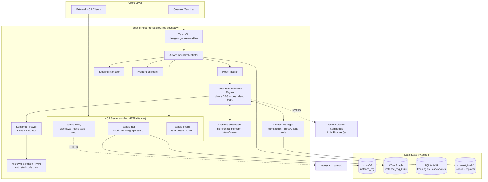
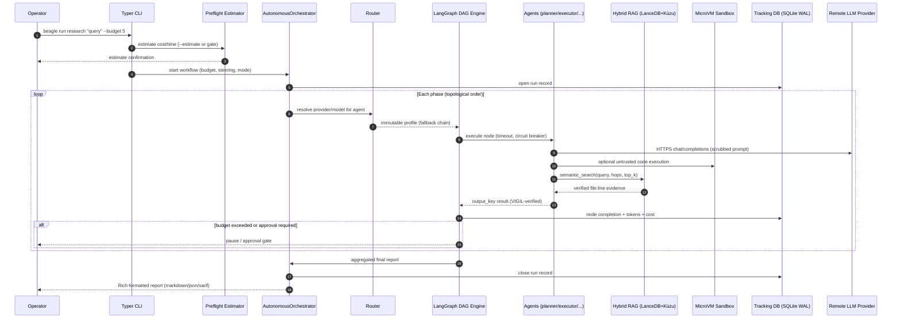
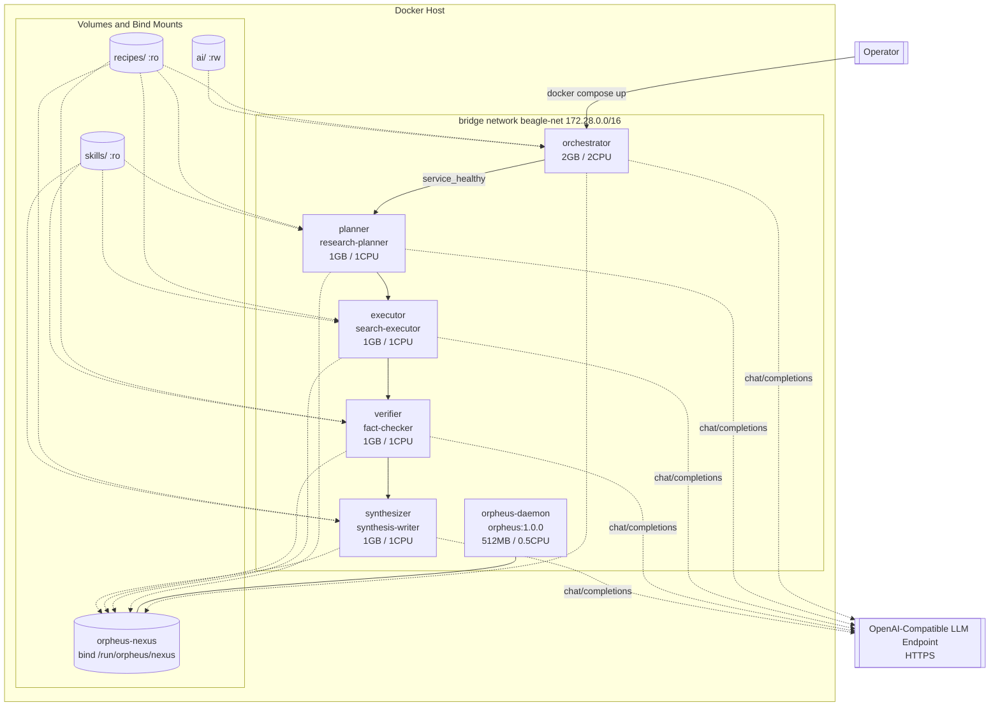

# Beagle — System Specification and Operations Manual

| Field | Value |
|---|---|
| **Document** | System Specification and Operations Manual |
| **System** | Beagle v1.3.0 (SSOT: `pyproject.toml [project].version`) |
| **Status** | Production / Stable (`Development Status :: 5 - Production/Stable`) |
| **Platform** | Python ≥ 3.12; Linux for production; Docker-capable hosts |
| **License** | Dual: free for non-commercial use; paid license for business use |
| **Audience** | Platform engineers, SREs, security reviewers, integrators |

## Executive Summary

Beagle is a domain-agnostic autonomous agentic workflow system. It executes
structured multi-phase work — research, audits, incident response,
development, security analysis — by coordinating specialized AI agents over a
phase DAG, backed by hybrid RAG: vector search (LanceDB + FAISS prefilter)
combined with graph traversal (Kùzu).

Business value rests on three pillars:

1. **Automation of knowledge work.** Ten built-in workflow templates (seeded
   into the canonical config root by `beagle config init`) turn a
   natural-language objective into a budget-capped multi-agent execution with
   verifiable `file:line` citations.
2. **Governed autonomy.** Every run carries cost budgets, node timeouts,
   circuit breakers, approval gates, read-only/read-write mode enforcement,
   and a tamper-evident audit trail.
3. **Ecosystem interoperability.** Capabilities are exposed as MCP tools so
   any MCP client can drive the engine; a signed A2A protocol with RBAC
   governs agent-to-agent communication.

The engine is provider-neutral: it speaks the OpenAI-compatible chat surface
and ships no model presets. Heavy inference runs on remote LLM providers; the
host performs orchestration and CPU-bound local embedding only.

## Technology Stack

| Layer | Technology | Version | Role |
|---|---|---|---|
| Language | Python | ≥ 3.12 | Typed implementation (`py.typed`) |
| Packaging | setuptools + wheel | ≥ 61.0 | `src/` layout, single wheel |
| Orchestration | LangGraph (+ sqlite checkpointer) | == 1.2.4 | Phase-DAG execution |
| LLM framework | LangChain / langchain-core | == 1.3.9 | Chat models, retrievers |
| Validation | Pydantic | ≥ 2.13.3 | Config, workflow, API schemas |
| MCP | mcp / fastmcp | 1.28.1 / 3.4.7 | Tool servers (RAG, utility, coord) |
| Vector store | LanceDB | == 0.30.2 | Semantic corpus index |
| Graph DB | Kùzu | == 0.11.3 | Code graph traversal (Cypher) |
| ANN prefilter | faiss-cpu | == 1.13.2 | Hybrid-RAG vector stage |
| Embeddings | sentence-transformers / torch CPU | ≥ 5.4 / 2.11.0 | Local embedding serving |
| CLI | Typer / Click / Rich | latest pins | `beagle`, `goose-workflow` |
| Security | google-re2, PyJWT, PyNaCl, casbin | pinned | Scrubbing, JWT, RBAC |
| Persistence | SQLite via aiosqlite | == 0.22.1 | Tracking DB, checkpoints |
| Observability | OpenTelemetry, structlog, prometheus_* | OTel ≥ 1.41 | Tracing, GenAI metrics |
| HTTP | httpx, aiohttp, tenacity | pinned | Transport, retries |
| Templating | Jinja2 | ≥ 3.1.6 | Prompt/style-guide rendering |
| Web search | ddgs | ≥ 9.0 | DuckDuckGo tool |

\* optional extra `[observability]`.

## 1. System Architecture

### 1.1 High-Level Design

Beagle is a layered monolithic engine with a DAG execution core and an
out-of-process MCP service surface.

- **Execution paradigm:** YAML phase DAGs compile to LangGraph state
  machines. Nodes are agents; state forks are structural-sharing (zero-copy).
- **Service paradigm:** three MCP servers isolate retrieval, general utility,
  and coordination. stdio is the default transport; streamable HTTP requires
  explicit opt-in plus Bearer tokens (fail-closed without them).
- **Trust boundary:** the host process is trusted. Untrusted code executes
  only in a MicroVM sandbox; if isolation is unavailable and fallback is not
  explicitly allowed, the payload is refused (deny-by-default).
- **Transport seam:** all outbound connections pass through one swappable
  layer (`beagle.core.transports`). Alternatives auto-detect but never
  auto-activate.

### 1.1.1 System Architecture Diagram

```text
┌──────────────────────────────────────────────────────────────┐
│ Client layer: operator terminal · external MCP clients       │
└───────────────────────────────┬──────────────────────────────┘
                                ▼
┌──────────────────────────────────────────────────────────────┐
│ Beagle host process (trusted boundary)                       │
│   Typer CLI -> AutonomousOrchestrator                        │
│     - Preflight estimator      - Steering manager            │
│     - Model router             - Workflow engine (LangGraph) │
│   Context manager (compaction · TurboQuant folds)            │
│   Memory subsystem (hierarchical · AutoDream)                │
│   MCP servers: beagle-rag · beagle-utility · beagle-coord    │
│   Semantic firewall + VIGIL -> MicroVM sandbox (KVM)         │
└───────────────────────────────┬──────────────────────────────┘
                                ▼
┌──────────────────────────────────────────────────────────────┐
│ Local state  ~/.beagle/                                      │
│   LanceDB instance_rag · Kùzu instance_rag_kuzu              │
│   SQLite tracking.db + checkpoints · context_folds/          │
└───────────────────────────────┬──────────────────────────────┘
                                ▼
     Remote OpenAI-compatible LLM endpoint(s) · web (DDG)
```



### 1.2 Core Modules and Components

Application code lives under `src/beagle/`; tests under `tests/`
(≈ 3,523 tests); operational scripts under `scripts/`.

| Module | Responsibility |
|---|---|
| `src/beagle/cli/` | Typer root app; flattened command groups |
| `src/beagle/core/` | Orchestrator, router, DAG graph, A2A, sandbox, loader |
| `src/beagle/bridges/` | A2A client/server, chat-model bridge, retrievers |
| `src/beagle/context/` | Token budget, compaction, folds, rehydration |
| `src/beagle/memory/` | Three-layer memory, tiering, AutoDream consolidation |
| `src/beagle/config/` | Typed schema, loader, env overrides, XDG roots |
| `src/beagle/security/` | Validation, firewall, scrubbing, VIGIL, AST guard |
| `src/beagle/auth/` | JWT, casbin RBAC, tenant isolation |
| `src/beagle/infrastructure/` | MCP servers, CAST ingest, hot-swap, audit log |
| `src/beagle/observability/` | Metrics SDK, tracing, Prometheus exporter |
| `src/beagle/lifecycle/` | Startup checks, graceful shutdown, restore |
| `src/beagle/tracking/` | SQLite-WAL run/event/cost database |
| `src/beagle/slo/` | Indicators, objectives, policy, tracker |
| `src/beagle/events/` | In-process event bus, file emitter |

Runtime *assets* (content read by code, not configuration) — `recipes/*.xml`,
`skills/*.xml`, `blocks/`, `prompts/*.md`, workflow YAMLs — all resolve from the
canonical config root (§ 2.2). Operators edit them under the config root; the
wheel ships no in-package copies.

## 2. Data and State Management

### 2.1 Data Models and Schemas

Structural data is typed with Pydantic models and frozen dataclasses.

| Domain | Schema location | Notes |
|---|---|---|
| Configuration | `config/schema.py` | Typed sections; AST-enforced registry |
| Workflow files | `core/workflow_schema.py` | Validated YAML field set |
| Graph state | `core/state.py` | Persistent map, fork-safe sharing |
| A2A messages | `core/a2a_types.py` | Signed envelopes, permissions |
| Tracking events | `tracking/models.py` | Runs, events, costs (SQLite) |
| Audit events | `infrastructure/audit_logger.py` | Hash-chained JSON records |

Workflow file contract (`name`, `version`, `mode`, `budget_usd`,
`enable_validation`, `phases[]`), each phase carrying `name`, `agent`,
`prompt_template`, `output_key`, `required`:

```yaml
name: research
mode: research          # selects READ_ONLY permission context
budget_usd: 5.0
enable_validation: true
phases:
  - name: search
    agent: search-executor
    prompt_template: |
      Research the following query. Query: {query} ...
    output_key: results
    required: true
```

### 2.2 Configuration Root and Asset Layout

The resolver `config/_config_path.py::find_config_root()` is the single
authority. Resolution order, each step gated on a *populated* directory:

1. `$BEAGLE_CONFIG_ROOT` environment override (ops/tests)
2. `~/.config/beagle` — platformdirs user config dir (default)
3. `<repo_root>/config` — legacy source-tree fallback
4. `~/.config/beagle` unpopulated — stable writable fallback;
   `beagle config init` seeds it from programmatic defaults

Canonical layout under the config root (recipes, agents, workflows,
metaprompts, and style guides live HERE, editable; never in `.beagle/`):

| Path under root | Contents |
|---|---|
| `beagle_core_config/` | `config.toml` (live SSOT), feature flags, auth/ |
| `coding_agent_config/` | `agents.toml`, `recipes/`, `workflows/`, blocks |
| `coding_agent_config/metaprompts/` | Workflow/metaprompt templates |
| `beagle_inference_config/` | `providers.toml`, model presets/fleet cards |
| `style_guides/guides/` | Doctrine TOML files (SSOT) |
| `plugins/<name>/`, `deployments/` | Per-plugin and per-deploy overrides |

Verified against this deployment: the live core file is
`~/.config/beagle/beagle_core_config/config.toml`; `~/.config/beagle/CORE_CONFIG.toml`
is a separate top-level artifact, not the loader target. Runtime *assets*
resolve through `find_recipes_dir()` / `find_metaprompts_dir()` /
`find_guides_dir()` — canonical config-root location only; the wheel ships no
in-package copies. Skills are the one exception: `skill_library` anchors at
`$WORKSPACE_ROOT/skills` (container images copy skills into `/app/skills`).

Two roots stay separate by design: configuration (`~/.config/beagle/`)
versus mutable runtime state (`~/.beagle/`, § 2.3). Never merge them.

### 2.3 Persistence Layer

| Store | Path | Technology | Contents |
|---|---|---|---|
| Config root | `~/.config/beagle/` | TOML/YAML | See § 2.2 |
| Runtime root | `~/.beagle/` | Mixed | All mutable state (below) |
| Tracking DB | `tracking.db` | SQLite WAL | Runs, events, costs |
| Checkpoints | `checkpoints/` | LangGraph SQLite | Resumable run state |
| Vector index | `instance_rag/` | LanceDB | Embedded corpus chunks |
| Graph index | `instance_rag_kuzu/` | Kùzu | Code dependency graph |
| Context folds | `context_folds/` | Files | Compressed context + sidecar |
| Coordination | `coord/` | Journals | fsync'd appends → archives |
| Replays | `replays/` | Files | Deterministic run recordings |

Paths shown relative to `~/.beagle/`. Overrides: `$BEAGLE_DATA_ROOT`, then
`[paths].data_root` in config.toml, then `$XDG_DATA_HOME/beagle`, then
`~/.beagle`.

Indexing is transactional: ingestion stages into `instance_rag.staging*`,
then atomically hot-swaps into the live directories while the server holds
no locks; rollback restores the prior snapshot.

### 2.3.1 Data / Control Flow Diagram — Workflow Run Lifecycle

```text
Operator
  │ beagle run <workflow> "<query>" --budget N
  ▼
Typer CLI ──► Preflight estimator ──► cost/time confirmation gate
  │
  ▼
AutonomousOrchestrator (opens run record in tracking.db)
  │
  ▼  per phase, topological order:
Router ──► immutable provider/model profile (fallback chain)
  │
  ▼
Agent node (timeout · circuit breaker)
  ├── HTTPS chat/completions ──► remote LLM provider
  ├── optional untrusted exec ──► MicroVM sandbox (deny-by-default)
  └── semantic_search(hops, top_k) ──► LanceDB vectors + Kùzu graph
        returns verified file:line evidence
  │
  ▼
VIGIL verify-before-commit ──► result stored under phase output_key
Tracking DB records tokens, cost; budget/approval gates may pause run
  │
  ▼
Final report aggregated ──► run record closed ──► operator output
```



## 3. Interfaces and Integration

### 3.1 Command-Line Interface

Entry points (both resolve to `beagle.cli.cli:main`): `beagle`,
`goose-workflow`.

| Command group | Purpose |
|---|---|
| `run` | Execute a workflow (budget/resume/mode/output controls) |
| `workflows` | List and inspect available workflow templates |
| `runs` | Inspect historical runs from the tracking DB |
| `system` | Health, diagnostics (`doctor`), feature flags |
| `render` | Render prompts/style guides without executing |
| `config` | Init/show/validate configuration; `config schema` |
| `checkpoint` | List and manage resumable checkpoints |
| `slo` | SLO objectives and indicator status |
| `coord` | Multi-instance roster status/watch |

Primary command reference:

```bash
# Plan first, then execute (cost-gated)
beagle run research "<objective>" --dry-run
beagle run research "<objective>" --budget 5.0

# Read-only audit intent; CI-friendly JSON output
beagle run audit "Find hardcoded secrets" \
  --headless -f json -o scan.json

# Resume an interrupted run from its checkpoint ID
beagle run develop "<task>" --resume <checkpoint-id>

# Global steering directive injected into every agent
beagle run deep-planning "<goal>" \
  --steering "Prefer stdlib-only changes"

# Installation diagnostics (exit 1 on failed required check)
beagle doctor [--json]

# Full typed configuration schema
beagle config schema
```

Key `run` options:

| Option | Default | Description |
|---|---|---|
| `--budget, -b` | 10.0 USD | Hard spend cap; stops the run when hit |
| `--resume` | — | Resume from a checkpoint ID |
| `--mode, -m` | YAML value | `audit`/`research` read-only; `develop` write |
| `--headless` | False | No interactive prompts (CI mode) |
| `--auto-approve` | False | Bypass human-in-the-loop gates (careful) |
| `-f, --output-format` | markdown | markdown / json / sarif / github-issues |
| `--dry-run` | False | Print plan (graph, agents, estimate) only |
| `--tui` | False | Reactive dashboard (optional textual extra) |

### 3.2 MCP Tool Surface

Default transport is stdio; HTTP requires opt-in plus Bearer tokens.

| Server | Representative tools |
|---|---|
| `beagle-rag` | `rag_search` (hops 1–3), ingest/hot-swap/rollback, status, health, metrics |
| `beagle-utility` | workflow run/route, code tools, web search, folds, validators |
| `beagle-coord` | Task queue create/monitor/cancel/schedule, roster |

All three serve any MCP client; correlation IDs instrument every call.

### 3.3 External Dependencies

| Dependency | Protocol | Purpose |
|---|---|---|
| OpenAI-compatible endpoint | HTTPS chat/completions | All inference; operator-set URL/key |
| Embedding service | HTTP (path auto-selected) | Corpus embeddings for RAG |
| DuckDuckGo (ddgs) | HTTPS | Web research tool |
| arXiv API | HTTPS | Paper search tool |
| Goose harness | subprocess/CLI | Optional `goose_cli` runtime |
| beagle-orpheus wheel | shm ring buffers | Proprietary transport; opt-in only |

## 4. Security and Access Control

### 4.1 Authentication and Authorization

| Mechanism | Implementation |
|---|---|
| MCP transport auth | `TokenVerifier`: Bearer, SHA-256 store, TTL 1 h |
| Fail-closed rule | HTTP transport with zero configured tokens refuses to serve |
| A2A protocol | PyNaCl signatures on inter-agent messages |
| RBAC | Role model + wildcard permissions; optional casbin enforcer |
| Tenant isolation | Per-tenant domain scoping on enforcement calls |
| Permission contexts | `DEFAULT_` vs `READ_ONLY_PERMISSION_CONTEXT` |
| Approval gates | `require_approval` phases pause for human consent |

**Permission-mode invariant (defect class W1 — treat as binding):**
workflow `mode` maps to a permission context. `research` and `audit`
select `READ_ONLY_PERMISSION_CONTEXT`; `develop` selects read-write. A
workflow file **without** `mode` does NOT select the read-only context —
that is a fail-open condition. Gate checks must reject any workflow file
lacking `mode`, and reject write-tool grants in read-only workflows.

Verified workflow inventory (canonical config root `~/.config/beagle`):

| Workflow | `mode` on disk |
|---|---|
| `research` | `research` |
| `verify` | `audit` |
| `develop`, `security`, `self-improvement` | `develop` |
| `audit` | `develop` (read-write despite the audit name — intentional?) |
| `incident`, `devops`, `db-migration`, `deep-planning` | **absent** |

The last two rows are open compliance findings: `audit.yaml` running with
write access, and four files selecting no explicit context. Remediation is
one-line-per-file plus the gate checks above; until landed, treat those
four workflows as potentially writable and review before unattended runs.

### 4.2 Secret Management

- No secrets ship in code. Resolution chain via `secrets_loader.py`:
  vault → environment → file, with TTL cache and rotation support.
- `${ENV}` expansion works inside `~/.config/beagle/**/*.toml`.
- Secret files live in the config root: `secrets.yaml`, `a2a_secret`,
  `audit_secret`. The audit-signing secret self-generates if absent.
- Output scrubbing is fail-closed: `scrub_secrets()` uses google-re2 for
  linear-time matching; if re2 cannot load, output is rejected, not passed
  through. Detects API keys, passwords, cloud keys, private keys,
  connection strings, SCM tokens.
- Client-facing errors are genericized and truncated; detail stays
  server-side.

### 4.3 Input Validation and Containment

| Control | Module | Behavior |
|---|---|---|
| Query validation | `validate_query` | Injection/shell-metachar patterns; LLM firewall option |
| Path containment | `validate_file_path` | Null-byte/`..`; `relative_to()`; symlinks |
| Untrusted execution | `core/sandbox.py` | MicroVM/KVM; refuse without isolation |
| Verify-before-commit | `security/vigil.py` | Tool outputs validated before state entry |
| Static guards | ast/binary/deserialization validators | Unsafe code and payloads blocked |
| Rate limiting | token bucket, per workflow/model | Burst support; auth-failure throttle |
| Audit trail | `audit_logger.py` | Hash-chained events, SQLite, verifier |

## 5. Observability and Telemetry

### 5.1 Logging and Correlation

Structured logging embeds a correlation ID in every record:

```text
%(asctime)s [%(name)s] [%(correlation_id)s] %(levelname)s: %(message)s
```

Controlled by `BEAGLE_LOG_LEVEL` and `BEAGLE_LOG_JSON`. Audit-relevant
events also flow to the hash-chained audit log and the event bus.

### 5.2 Metrics

| Surface | Metrics | Access |
|---|---|---|
| MCP servers | request totals, success/error, latency stats | `get_metrics()` tool |
| OTel GenAI instruments | token usage, duration, cost counters | OTLP export |
| Prometheus extra | same counters for scraping | exporter module |
| Cost governance | per-model/per-workflow spend vs budget | tracking DB, `runs` CLI |

Recommended SLO addition (defect-class W1 follow-up): count runs that
executed outside their intended permission mode; target zero.

### 5.3 Tracing and Health

- Tracing: OTel SDK init with OTLP span export; console fallback;
  `trace_async` decorator for instrumentation.
- Health: startup checks, per-server MCP `health_check` (LanceDB, Kùzu,
  embedding, cache, memory), container HEALTHCHECK directives, and
  `beagle doctor` aggregation (exit 1 on failure).
- SLOs: indicators tracked against objectives; surfaced via `beagle slo`.

## 6. Operational Runbook

### 6.1 Prerequisites

| Requirement | Minimum | Notes |
|---|---|---|
| Python | 3.12+ | Images use 3.13 |
| pip / uv | recent | Wheel or editable install |
| OS | Linux recommended | MicroVM sandbox targets Linux/KVM |
| Docker + Compose | v2 | Containerized deployment only |
| LLM endpoint | OpenAI-compatible | Operator-supplied URL + key |
| Goose binary | latest | Only for the `goose_cli` runtime |

### 6.2 Local Development Setup

```bash
# 1. Obtain and enter the repository
git clone <repository-url> beagle && cd beagle

# 2. Environment (Python >= 3.12)
python3 -m venv .venv && source .venv/bin/activate

# 3. Editable install with dev tooling
pip install -e ".[dev]"
# extras: observability, code_parsing, scraping, tui

# 4. Seed the config root from programmatic defaults
beagle config init

# 5. Set your provider in the live core config file
#    ~/.config/beagle/beagle_core_config/config.toml
#    [ollama_cloud]
#    endpoint = "https://your-endpoint.example"
#    api_key  = "${MY_PROVIDER_API_KEY}"
#    [goose]
#    default_model = "your-model-name"

# 6. Install local policy hooks (renders .agents/plugins templates)
python3 scripts/install_hooks.py

# 7. Verify the installation
beagle doctor

# 8. Quality gates (suite ≈ 3,523 tests)
pytest                          # asyncio_mode=auto
ruff check src tests            # E,F,I,W,UP,B; line-length 100
mypy src                        # zero-error gate
python3 scripts/check_hardcoded_defaults.py
python3 scripts/check_fail_closed.py
python3 scripts/check_config_model_drift.py
```

There is no hosted CI (no `.github/workflows`); gates run locally and via
the installed hooks. Extend these existing gates rather than adding
parallel scanners.

### 6.3 Environment Configuration

Environment variables take highest precedence.

| Variable | Default | Effect |
|---|---|---|
| `BEAGLE_BUDGET_USD` | config | Default spend cap override |
| `BEAGLE_CACHE_ENABLED` | true | Toggle response/file caches |
| `BEAGLE_LOG_LEVEL` / `BEAGLE_LOG_JSON` | config | Level; JSON logs |
| `BEAGLE_MEMORY_INDEX_TOKEN_BUDGET` | 2000 | Min clamp 500 |
| `BEAGLE_MEMORY_INDEX_PRUNE_STRATEGY` | config | Prune selector |
| `BEAGLE_POOL_WORKERS` | config | Worker-pool concurrency |
| `BEAGLE_PLANNING_TIMEOUT` | config | Planning node seconds |
| `BEAGLE_EXECUTION_TIMEOUT` | config | Execution node seconds |
| `BEAGLE_CONTEXT_*` | defaults | Ladder: warning, pre_compact, compact, hard_compact, critical |
| `BEAGLE_CONTEXT_WATCHDOG_SECONDS` | config | Watchdog interval |
| `GOOSE_AUTO_COMPACT_THRESHOLD` | config | Compaction trigger |
| `GOOSE_CONTEXT_MAX` | config | Max context tokens |
| `BEAGLE_KNOWLEDGE_DIR` | config | Knowledge/RAG dir override |
| `BEAGLE_MCP_TRANSPORT` | stdio | MCP transport selection |
| `BEAGLE_TRANSPORT` | http | Outbound connection seam |
| `BEAGLE_MCP_TOKEN` | unset | Bearer token; required for HTTP MCP |
| `BEAGLE_MCP_TOKEN_TTL` | 3600 s | 0 disables expiry |
| `BEAGLE_CONFIG_ROOT` | XDG dir | Config-root override (§ 2.2) |
| `BEAGLE_CONFIG_TOML` | derived | Direct config-file override |
| `BEAGLE_DATA_ROOT` | ~/.beagle | Runtime-state root override |
| `WORKSPACE_ROOT` | package dir | Asset/workspace anchor |
| `GOOSE_BIN`, `GOOSE_MODEL`, `GOOSE_PROVIDER`, `GOOSE_HOST` | config | Runtime overrides |
| `ORPHEUS_RING_DIR` | /run/orpheus/nexus | Optional shm transport |
| `ORPHEUS_INSTANCE`, `ORPHEUS_TIMEOUT_MS` | beagle-dev, 30000 | Ring naming, timeout |
| `WORKFLOW_ID`, `AGENT_TYPE` | default | Container knobs |

### 6.4 Production Deployment

No hosted CI exists; quality gates are the local scripts above. Deployment
is Docker Compose based.

### 6.4.1 Image Build

Assets under `src/beagle/infrastructure/`:

- `Dockerfile.base` — `python:3.13-slim`; hardened env (no bytecode,
  unbuffered, no pip cache); pinned Goose installer with SHA-256 check;
  non-root `agent` user (uid 1000); recipes/skills copied read-only.
- `Dockerfile.agent` — extends `beagle-base:latest`; parameterized by
  `AGENT_TYPE`; installs entrypoint and HEALTHCHECK.

```bash
# From repository root
docker build -f src/beagle/infrastructure/Dockerfile.base \
  -t beagle-base:latest .

docker build -f src/beagle/infrastructure/Dockerfile.agent \
  --build-arg AGENT_TYPE=planner \
  --build-arg SKILL_NAME=research-planner \
  -t beagle-agent-planner:1.3.0 .
```

### 6.4.2 Stack Topology (docker-compose.yml)

| Service | Image/build | Limits | Health grace |
|---|---|---|---|
| orpheus-daemon | `orpheus:1.0.0` pinned | 512 MB / 0.5 CPU | 15 s |
| orchestrator | build, type=orchestrator | 2 GB / 2.0 CPU | 60 s |
| planner | skill=research-planner | 1 GB / 1.0 CPU | 45 s |
| executor | skill=search-executor | 1 GB / 1.0 CPU | 45 s |
| verifier | skill=fact-checker | 1 GB / 1.0 CPU | 45 s |
| synthesizer | skill=synthesis-writer | 1 GB / 1.0 CPU | 45 s |

Shared traits: pinned tags, restart `unless-stopped`, json-file log
rotation, dependency ordering via `service_healthy`, bridge network
`172.28.0.0/16`, bind volume `/run/orpheus/nexus`, recipes/skills mounted
read-only.

### 6.4.3 Deployment / Infrastructure Diagram

```text
┌──────────────────── Docker host ────────────────────────────┐
│ bridge network beagle-net 172.28.0.0/16                     │
│                                                             │
│ orpheus-daemon <-- ring /run/orpheus/nexus                  │
│        ^ service_healthy chain                              │
│ orchestrator (2GB/2CPU)                                     │
│     -> planner (1GB) -> executor (1GB)                      │
│          -> verifier (1GB) -> synthesizer (1GB)             │
│                                                             │
│ bind mounts: recipes/:ro  skills/:ro  ai/:rw                │
└──────────────────────────┬──────────────────────────────────┘
                           ▼ HTTPS chat/completions
             OpenAI-compatible LLM endpoint
```



### 6.4.4 Bring-Up, Verification, Rollback

```bash
# Launch the stack (repository root)
docker compose -f src/beagle/infrastructure/docker-compose.yml up -d

# All services must reach healthy
docker compose -f src/beagle/infrastructure/docker-compose.yml ps

# Host-side verification of a native installation
beagle doctor && echo "OK"

# Teardown
docker compose -f src/beagle/infrastructure/docker-compose.yml down
```

Operational notes:

- **Version SSOT.** The version is written once, in `pyproject.toml`;
  `constants.PACKAGE_VERSION` derives it. The hook
  `scripts/hooks/no_hardcoded_version.py` blocks reintroduced literals.
- **Workflow permission gate.** Before deploying any workflow file, confirm
  it carries `mode` (§ 4.1). Extend `scripts/check_fail_closed.py` with the
  missing-mode and write-tool-in-read-only checks; do not write a second
  scanner.
- **RAG reindex safety.** Use staged hot-swap ingestion, never inline
  ingestion against a running server; roll back restores the prior
  LanceDB/Kùzu snapshot.
- **Checkpoint/restore.** Interrupted runs print a checkpoint ID; resume
  with `--resume`. Lifecycle handles graceful shutdown and restore.
- **Upgrades.** Rebuild the base image on dependency changes; bump
  `GOOSE_VERSION` together with its SHA-256 argument; keep compose image
  tags aligned with the release version.

---

*End of manual. Generated from static analysis of the v1.3.0 source tree:
`pyproject.toml`, `src/beagle/**`, `tests/**`, `docs/docs/**`, `scripts/**`,
and the live `~/.config/beagle` / `~/.beagle` state roots.*
